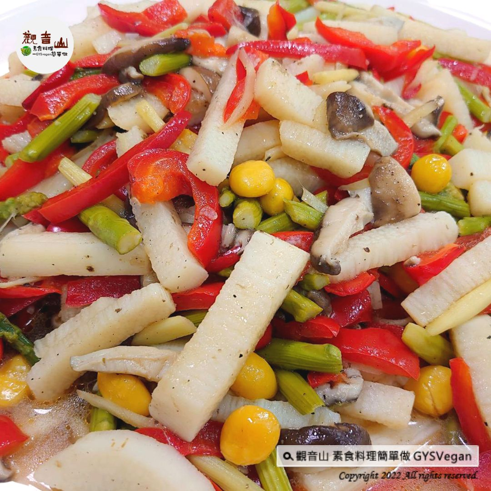

# 燴山藥彩蔬

## 📋 基本資訊 / Recipe Overview
- **料理名稱**：燴山藥彩蔬
- **原始標題**：家常料理｜燴山藥彩蔬｜全素
- **素食流派 / Diet**：全素 Vegan
- **料理分類 / Category**：中式料理
- **來源平台 / Source**：[觀音山 · 素食料理簡單做](https://vegan.gys.org.tw/braised-yam-and-vegetables20221223/)

## 📖 食譜圖文詳情 (中英雙語對照)

#家常料理 ✼燴山藥彩蔬✼全素
素食最佳養生料理，山藥、蘆筍、白果等新鮮食材拌炒，不僅具有高營養價值，更適合全家人一起享用，山藥細緻綿密、蘆筍白果清爽的口感，養生與美味同時兼具，快跟著觀音山主廚，一起素食料理簡單做吧！
​
❒食材及佐料〔Ingredients〕：(3人份)
▪️日本山藥 ​ 300克 ​ ​ ​ ​
▪️蘆筍 ​ 150克
▪️甜紅椒 ​ 1/2顆
▪️生香菇 ​ 2朵
▪️白果 ​ 少許
▪️白胡椒粉、香菇粉、鹽 、醬油 ​ 適量
​
❒烹飪步驟：
【刀工/前處理】
1.山藥切粗條狀3公分，泡在水裡，備用。
2.蘆筍切段3公分，甜紅椒切長條3公分，備用。
3.生香菇切片，備用。
4.白果可先汆燙，亦可不燙，備用。
​
​
【調理作法】
1.蘆筍、甜紅椒燙好備用。
2.冷鍋下油開火，生香菇先下去爆炒香後，放入山藥及白果拌炒，加少許醬油，炒至山藥快熟後， 再放入蘆筍及甜紅椒、鹽、香菇粉、白胡椒粉， 起鍋擺盤即可享用!
​
本食譜提供：澎湖觀音山蔬食館
​
​
✼慈悲的龍德上師 成立「觀音山蔬食館」提倡健康素食、慈悲護生，以”觀音山素食料理簡單做”的理念，提供多款素食食譜，讓您一學就會！
【recipe】​
The best vegetarian food for health preservation is stir-fried with fresh ingredients such as yam, asparagus, ginkgo, etc. It has not only high nutritional value but is also suitable for the whole family to enjoy together. Yam is meticulous, and asparagus and ginkgo are refreshing and delicious. Let’s make simple vegetarian dishes together!
❒Ingredients (3 servings)
■Japanese Yam ​ 300g ​ ​
■Asparagus ​ 150g
■Sweet red pepper ​ 1/2
■Raw shiitake mushrooms ​ 2 pcs
■Ginkgo fruit ​ a little
■White pepper powder, shiitake mushroom powder, salt, soy sauce , an appropriate amount
❒Instructions:
[Cutting/ PREP-Ahead]
1. Cut yam into thick strips of 3 cm, soak in water, and set aside.
2.Cut the asparagus into 3 cm sections, cut the sweet red pepper into 3 cm ​ ​ long strips, and set aside.
3. Slice raw shiitake mushrooms and set aside.
4. The ginkgo can be scalded with hot water first or not and set aside.
[Cooking Steps]
1. Asparagus and sweet red pepper scald with hot water for later use.
2. Put the oil in the cold pot and turn on the fire. After the raw shiitake mushrooms are fried, add the yam and ginkgo and stir fry, add a little soy sauce, and fry until the yam is almost cooked, then add asparagus, sweet red pepper, salt, mushroom powder, ​ white pepper powder, put on a plate and enjoy!
This recipe is provided by: Penghu Guanyinshan Green Restaurant
Compassionate #Longde master established “Guanyinshan Vegetable Food Restaurant” to promote healthy vegetarian food and humane protection of life and with the concept of “Guanyinshan Vegetarian Cuisine is simple to cook,” it provides a variety of vegetarian recipes for you to learn!
​
觀音山相關連結
➠
https://www.fazang.org/link/
​
​
▌觀音山近期活動 ▌
1月7日 三寶總集薈供法會
①登記「除障祿位」、「超薦蓮位」
►
https://bit.ly/3HXmCO7
②護持「薈供供品」供養三寶·愛心公益
►
mhttps://bit.ly/3zrdxY
​
​
—
♛歡迎轉載，請註明出處： 觀音山素食料理簡單做 GYSVegan 素食環保愛地球，健康營養無負擔，慈悲護生一起來~

---
*食譜歸檔時間：2026-08-20 · 來源：觀音山素食料理簡單做 (vegan.gys.org.tw)*