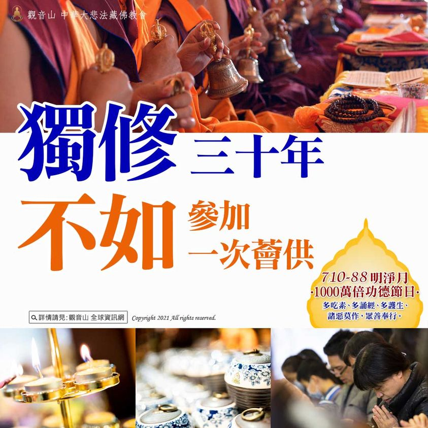

# 獨修三十年不如參加一次薈供

## 📋 基本資訊 / Recipe Overview
- **料理名稱**：獨修三十年不如參加一次薈供
- **原始標題**：獨修三十年不如參加一次薈供
- **素食流派 / Diet**：全素 Vegan
- **來源平台 / Source**：[觀音山 · 素食料理簡單做](https://vegan.gys.org.tw/solo20210816/)

## 📖 食譜圖文詳情 (中英雙語對照)

獨修三十年不如參加一次薈供
藏地修行的成就者曾云：「參加一次如法的薈供法會，所產生的功德與福德不亞於自己獨自修持三十年所獲得的功德與福德。」
一百位如法的修行人，大家同心同德，在同一個地方聚集一同修法，所產生的力量可說是非同凡響。如今網路發達，觀音山透過全球直播的方式舉辦法會，每場線上直播時都超過千人觀看，有時逾二千人。能同步參與者，累積的功德都是不可思議的無量。
觀音山的薈供法會，恭請慈悲 龍德上師主法薈供；數百處如法設供的薈供壇城；再加上僧團、海內外道場弟子共同修法；同時開放海內外全球善信法友數千人一起修法。這樣的薈供功德無比的廣大殊勝，每一位想要累積功德、福報的人都應該積極把握來參加。
▌怎麼參加觀音山舉辦的薈供累積功德呢？
方法一：
於薈供日，在家中於法會前準備素食供品，水果、飲料、餅乾、熟食…等皆可。家中無佛堂者，可先備辦好供品，同時，將照片傳回觀音山，跟著直播法會一起修法，將會恭請慈悲 龍德上師加持所有設薈供供養處，佛力加持必能呈祥，諸事順遂。
方法二：
同步參加全球直播的薈供法會，慈悲 龍德上師主法，全程線上提供字幕共同修法，再也不用擔心看不懂，不會修。學習密法真的不難！
方法三：
可於線上登記參加薈供法會，為自己、親朋好友祈福除障，尤其是最近令你煩惱的事；有所求的願望，可以更明確說明，尤為效驗！
──────────────
✨人天導師ー本師 釋迦牟尼佛薈供大法會
▌法會日期：8月21日(六)
▌法會時間：晚上7:30 (GMT+8)
▌觀音山法藏YouTube與官方Facebook同步直播：
https://bit.ly/2BB175Z
──────────────
◕登記「祈福迴向卡」積聚廣大福慧資糧
https://bit.ly/36R6JoY
◕護持「薈供供品」響應素食推廣計劃 廣結善緣
https://bit.ly/3wRkG0x
(登記至8月21日晚上7:00截止)
更多請見「觀音山 全球資訊網」
http://www.fazang.org/index.php?ID=92

---
*食譜歸檔時間：2026-08-20 · 來源：觀音山素食料理簡單做 (vegan.gys.org.tw)*