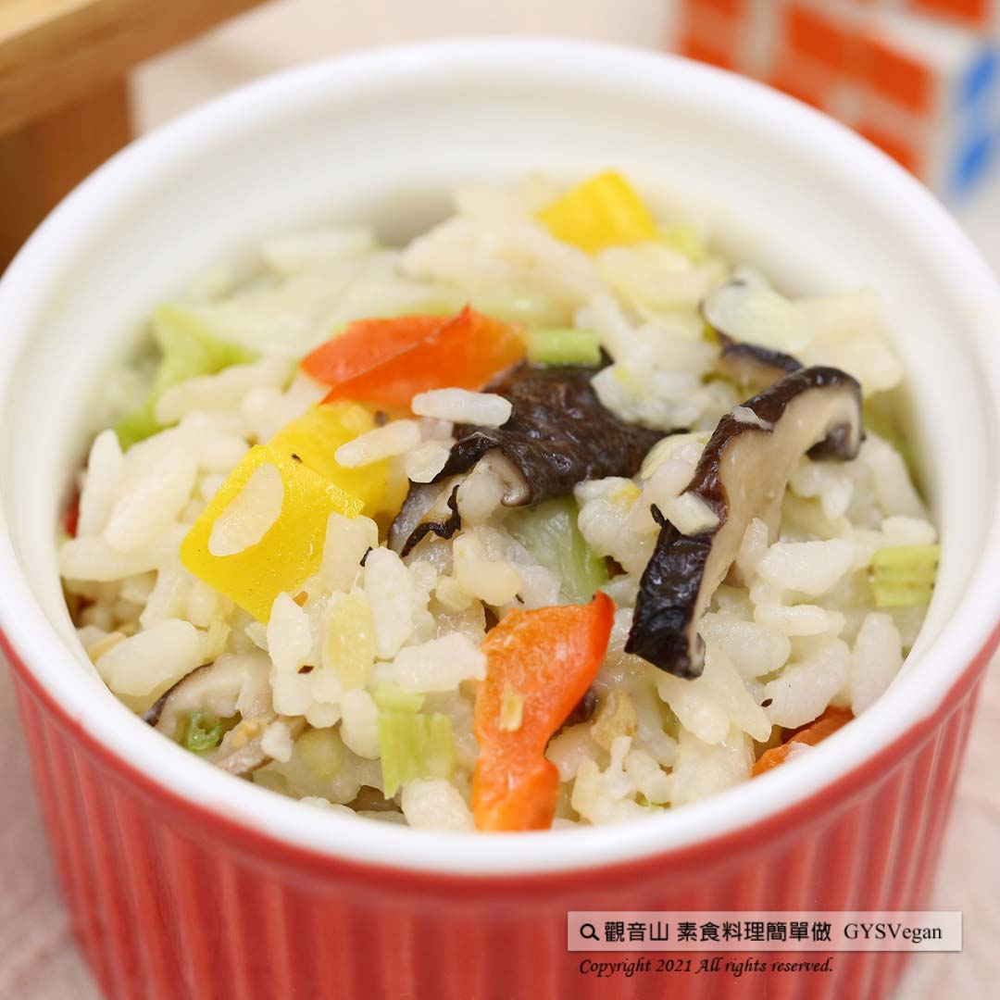

# 玉米濃湯燉飯

## 📋 基本資訊 / Recipe Overview
- **料理名稱**：玉米濃湯燉飯
- **原始標題**：玉米濃湯燉飯｜全素
- **素食流派 / Diet**：全素 Vegan
- **來源平台 / Source**：[觀音山 · 素食料理簡單做](https://vegan.gys.org.tw/stewed-rice20210827/)

## 📖 食譜圖文詳情 (中英雙語對照)

玉米濃湯的奶油香氣與濃郁口感，融入米飯之中，加入多種新鮮蔬菜拌炒，大人小孩都難以抵抗它的美味，讓你快速學會經典西式料理，快跟著觀音山主廚，一起素食料理簡單做吧！​
​
?食材及佐料〔Ingredients〕：(5人份)​
▪️玉米粒 ​ 100克​
▪️紅椒、黃椒 ​ 各70克​
▪️西芹 ​ 50克​
▪️乾香菇 ​ 20克​
▪️白飯 ​ 500克​
▪️市售濃湯粉 ​ 3包​
▪️油 ​ 適量​
​
?烹飪步驟：​
【刀工/前處理】​
1. 乾香菇泡軟後切絲，西芹、紅、黃椒切0.8公分丁。​
​
【調理作法】​
1. 將蔬菜料:香菇、西芹、紅、黃椒、玉米粒依序炒香。​
2. 加入適量的水、濃湯粉，攪拌均勻煮滾後，加入白飯拌炒均勻，中小火燉煮成濃稠狀即可。​
​
【特別說明】​
1.玉米粒可用新鮮或罐頭烹煮。​
​
??本食譜提供：台中 #觀音山蔬食館 主廚 淨雅​
​
​
✨慈悲的 龍德上師成立「觀音山蔬食館」提倡健康素食、慈悲護生，以”觀音山素食料理簡單做”的理念，提供多款素食食譜，讓您一學就會！?
​
​
★8月28日 地藏王菩薩節日：善惡業增長1億倍​
​
✨殊勝功德增長日✨​
觀音山邀請您於8月28日 響應素食、廣修供養、戒殺護生、誦經修法、行持諸種善行，獲福無量。​
​
​
【recipe】​
? The creamy aroma and condensed taste of chowder is melding into rice while a variety of fresh vegetables is adding another layer of tastes for this risotto. This recipe deserves everyone’s attention and it’s a hard to resist dish. It’s also a very nice kickstart for a classic western-style cuisine. Quickly follow the chef of Guanyinshan and let’s cook simple vegetarian ccuisin together.​
​
?Instructions: ​
【Cutting/PREP-Ahead】 ​
1. Soak dried shiitake mushrooms and shredded. Dice celery, red and yellow peppers into 0.8 cm. ​ ​
​
【Cooking steps】 ​
1. Saute all the vegetable ingredients: shiitake mushrooms, celery,  red and yellow peppers, and corn kernels in sequence. ​
2. Add appropriate amount of water and thick soup powder, stir evenly and bring to a boil. Then add in rice, stir evenly, and simmer over medium and low heat until coating.​
​
[Special instructions] ​
1. Both fresh-cut raw kernels or canned corn kernels works.​
​
??This recipe is provided by Chef Jing Ya, Taichung  Guanyinshan Green Restaurant
? 觀音山 素食料理簡單做 ?​
Facebook ｜好文按讚
http://www.facebook.com/GYSVegan​
Instagram ｜料理追蹤
http://www.instagram.com/gysvegan/​
Youtube ｜加入訂閱
https://reurl.cc/q8VEqy​
Telegram ｜頻道推薦
https://t.me/GYSVegan​
​
​
—​
? 歡迎轉載，請註明出處： 觀音山 素食料理簡單做 GYSVegan 素食環保愛地球，健康營養無負擔，慈悲護生一起來~?

---
*食譜歸檔時間：2026-08-20 · 來源：觀音山素食料理簡單做 (vegan.gys.org.tw)*