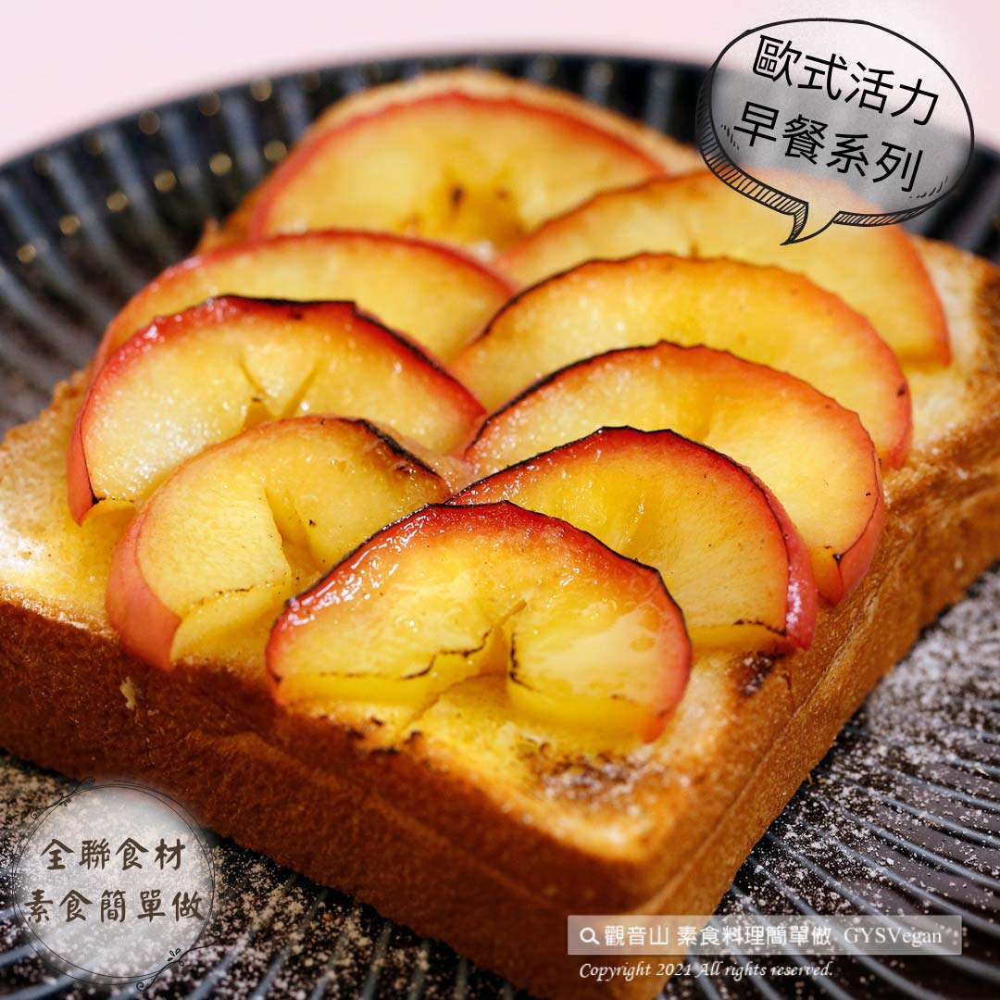

# 甜心蘋果厚片吐司

## 📋 基本資訊 / Recipe Overview
- **料理名稱**：甜心蘋果厚片吐司
- **原始標題**：甜心蘋果厚片吐司｜奶素
- **素食流派 / Diet**：奶素 Lacto-Vegetarian
- **來源平台 / Source**：[觀音山 · 素食料理簡單做](https://vegan.gys.org.tw/apple2021108/)

## 📖 食譜圖文詳情 (中英雙語對照)

療癒百分百的餐點，新鮮蘋果與金黃奶油交織的協奏曲，鋪在厚片上、撒上增添風味的肉桂粉，一口咬下扎實的口感，迴盪著酸甜果香與焦糖奶油香氣，提升您的味蕾極限，快跟著觀音山主廚，一起素食料理簡單做吧！​
​
◎食材及佐料〔Ingredients〕：(3人份)​
▪️蘋果 ​ 1-2顆​
▪️肉桂粉、砂糖、奶油 ​ 適量​
▪️厚片 ​ 3片​
​
◎烹飪步驟：​
【刀工/前處理】​
1. 蘋果切薄片。​
​
【調理作法】​
1.厚片切九宮格紋路。​
2.平底鍋加熱放入奶油融化後，放入蘋果片炒軟。​
3.厚片平均鋪滿蘋果，撒上砂糖、肉桂粉。​
4.烤箱180度預熱，放入厚片烤約5分鐘即可取出。​
​
【特別說明】​
1.全素者可用純素奶油替代。​
​
本食譜提供：台中觀音山蔬食館 ​
​
✨慈悲的龍德上師 成立「觀音山蔬食館」提倡健康素食、慈悲護生，以”觀音山素食料理簡單做”的理念，提供多款素食食譜，讓您一學就會！
★10月7日~12月4日 ​ 佛陀天降月：善惡業增長10億倍​
​
✨殊勝功德增長日✨​
觀音山邀請您於10月7日~12月4日，響應素食、廣修供養、戒殺護生、誦經修法、行持諸種善行，獲福無量。​
​
【recipe】​
​
The most soothing and stress-relieving meal is this sweet apple thick toast recipe. As fresh apples and golden butter meet each other, it’s just like a concerto in the mouth. Thin apple slices spreaded on thick toasts sprinkled with cinnamon powder to add flavor, each bite is rich and reverberating with sour sweet fruit and butter fragrance. This recipe develops your taste buds. Quickly follow the chef of Guanyin, let’s cook simple vegetarian dishes together! ​ ​
​
◎ Instructions: ​
【Cutting/PREP-Ahead】​
1. Cut the apple into thin slices.​
​
【Directions】​
1. Cutting a grid into the top of thick toast slices. (not to cut all the way through to the bottom)​
2. Heat a pan and melt butter, then add the apple slices to stir fry until soft. ​
3. Spread the softened apples evenly on thick toasts, and sprinkle with sugar and cinnamon powder. ​
4. Preheat the oven to 180 degrees, put in the thick toasts and bake for about 5 minutes, then take it out.​
​
​ [Special notes] ​
1. If you are vegan, butter can be substituted for vegan butter. ​ ​
This recipe is provided by #Guanyinshan Green Restaurant , Taichung.​
​
​
☆ 觀音山 素食料理簡單做 ☆
Facebook ｜好文按讚
http://www.facebook.com/GYSVegan​
Instagram ｜料理追蹤
http://www.instagram.com/gysvegan/​
Youtube ｜加入訂閱
https://reurl.cc/q8VEqy​
Telegram ｜頻道推薦
https://t.me/GYSVegan​
​
​
—​
歡迎轉載，請註明出處： 觀音山 素食料理簡單做 GYSVegan 素食環保愛地球，健康營養無負擔，慈悲護生一起來~

---
*食譜歸檔時間：2026-08-20 · 來源：觀音山素食料理簡單做 (vegan.gys.org.tw)*