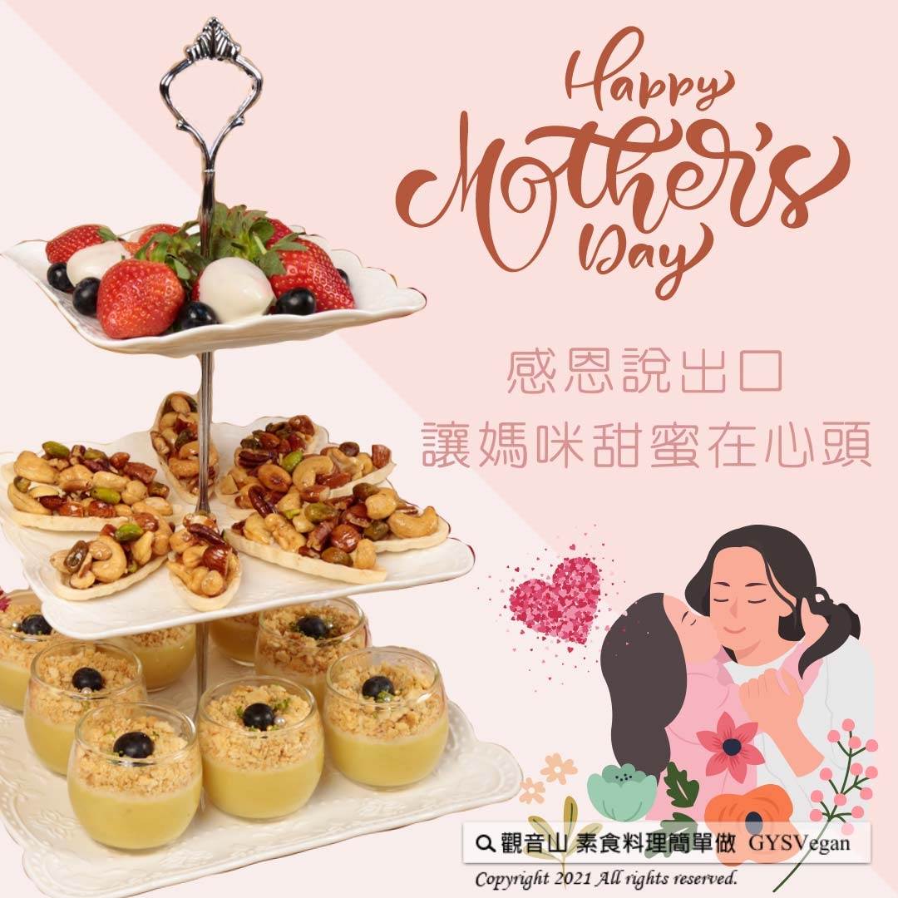

# 甜湯點心  母親節甜品

## 📋 基本資訊 / Recipe Overview
- **料理名稱**：甜湯點心  母親節甜品
- **原始標題**：Vegan 甜湯點心  母親節甜品｜全素
- **素食流派 / Diet**：全素 Vegan
- **來源平台 / Source**：[觀音山 · 素食料理簡單做](https://vegan.gys.org.tw/mothers-day20210507/)

## 📖 食譜圖文詳情 (中英雙語對照)

過幾天就是溫馨的母親節了，自己動手自製甜品，再跟媽媽說聲：「謝謝媽媽，您辛苦了！」
，感謝媽媽對我們無微不至的關愛。 把愛說出口，讓媽咪甜蜜在心頭！
觀音山素食料理提供三道零失敗-甜在心頭甜點，送給媽媽最甜蜜的母親節禮物!
?【甜心草莓】
?食材及佐料〔Ingredients〕：（10人份）
▪新鮮草莓150克
▪白巧克力磚150克
?製作步驟：
1.白巧克力切碎隔水加熱融化。
2.草莓洗淨擦乾，沾巧克力後冷藏， 等待凝固後即可享用！
【蜂蜜堅果舟】
?食材及佐料〔Ingredients〕：（10人份）
▪綜合堅果200克
▪蜂蜜適量
▪肉桂粉適量
▪船型餅乾
?製作步驟：
1.將堅果拌入適量的蜂蜜、肉桂粉。
2.將餡料鋪上船型餅乾即可。
?【檸檬塔】
?食材及佐料〔Ingredients〕：（10人份）
▪檸檬汁35cc
▪奶油15g
▪砂糖40g
▪玉米粉適量
▪檸檬碎皮少許
?製作步驟：
1.將檸檬皮、砂糖混合，搓揉出香氣。
2.奶油加熱融化，加入檸檬砂糖。
3.砂糖攪拌勻，完全融化後，拌入檸檬汁。
4.最後以適量的玉米粉水勾芡至濃稠狀，再將餡料填充入塔皮內，冷藏至凝固，完成！
【料理說明】
1.塔皮可以購買現成。
2.可使用純素白巧克力。
3.奶油可使用純素奶油。
??本食譜提供：台中 觀音山蔬食館 主廚 淨雅
⭐️慈悲的 龍德上師成立「觀音山蔬食館」提倡健康素食、慈悲護生，以”觀音山素食料理簡單做”的理念，提供多款素食食譜，讓您一學就會！?
​
【recipe】​
​? In a few days, it will be Mother’s Day. Mother is always the heart and soul of a family. Making desserts to express our gratitude and appreciation to thank her for her unconditional love and meticulous care. Guanyinshan Green Restaurant offers three zero-failure sweet dessert recipes for you to speak your love out aloud and let her feel the sweetness in her heart!
?【Strawberry Sweetheart】
?Ingredients : (For 10 people)
▪Fresh strawberries 150g
▪White chocolate 150g
?Instructions:
1. Chop white chocolate and melt chocolate in double boiler.
2. Wash and dry strawberries; dip them in melted chocolate & transfer dipped strawberries to refrigerator and let chocolate harden.
【Honey Nut Tart】
?Ingredients : (For 10 people)
▪Synthetic Nuts 200g
▪Honey, adequate amount
▪Cinnamon powder, adequate amount
▪Boat shape biscuits
?Instructions:
1. Stir the nuts with an appropriate amount of honey and a pinch of cinnamon powder.
2. Spread the fillings on the boat-shaped crust.
?【Lemon Tart】
?Ingredients : (For 10 people)
▪Lemon juice 35cc
▪Butter 15g
▪Granulated sugar 40g
▪Corn flour , adequate amount
▪Lemon zest , a little
? Instructions:
1. Mix lemon zest with sugar well until fragrant.
2. Melt butter, and add the lemon zest & sugar in step 1.
3. Well stir the melted butter with the lemon zest & sugar. When sugar is completely melted, add in lemon juice.
4. Finally, add a proper amount of cornstarch & water mixture to thicken it up; then pour the filling into the shell, refrigerate it until solidifies.
【Notes】
The tart shell is a store-bought.
??This recipe is provided by Chef Jing Ya, Guanyinshan Green Restaurant, Taichung.
? 觀音山 素食料理簡單做 Follow us?
Facebook ｜好文按讚 ➤
http://www.facebook.com/GYSVegan
Instagram ｜料理追蹤 ➤
http://www.instagram.com/gysvegan/
Youtube ｜加入訂閱 ➤
https://reurl.cc/q8VEqy
官方Blog​ ｜網站推薦 ➤
https://vegan.gys.org.tw/
—​
?  歡迎轉載，請註明出處： 觀音山素食料理簡單做GYSVegan 素食環保愛地球，健康營養無負擔，慈悲護生一起來~?

---
*食譜歸檔時間：2026-08-20 · 來源：觀音山素食料理簡單做 (vegan.gys.org.tw)*