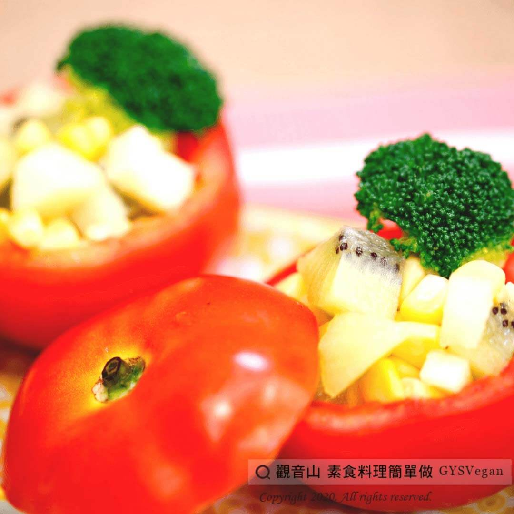

# 番茄沙拉盅

## 📋 基本資訊 / Recipe Overview
- **料理名稱**：番茄沙拉盅
- **原始標題**：番茄沙拉盅｜全素
- **素食流派 / Diet**：全素 Vegan
- **來源平台 / Source**：[觀音山 · 素食料理簡單做](https://vegan.gys.org.tw/%e7%95%aa%e8%8c%84%e6%b2%99%e6%8b%89%e7%9b%85%ef%bd%9c%e5%85%a8%e7%b4%a0/)

## 📖 食譜圖文詳情 (中英雙語對照)

蕃茄含豐富的茄紅素、維生素C和膳食纖維，抗氧化力強。?​
觀音山主廚所提供的這道「番茄沙拉盅」料理，在番茄裡放入奇異果?和蘋果?，以玉米粒?、花椰菜?增添豐富的色彩，淋上百香果的酸甜，是一道非常可口開胃的餐前點心?。​
趕快和家人分享，一起來製作這道健康又營養的簡單料理吧~~?‍?‍?‍?​
​
?準備食材與佐料：​
牛番茄2-3顆、百香果2-3顆、蘋果1顆、奇異果1顆、花椰菜2-3小朵、玉米粒1/4罐(約50克)、無蛋沙拉醬2大匙(約30ml)。​
​
?#素食料理簡單做，開始：​
1. 牛番茄洗淨上方切一小片、果肉挖空取出，製成中空番茄，備用。​
2. 蘋果、奇異果洗淨去皮切丁；花椰菜洗淨汆燙，備用。​
3. 百香果取汁與無蛋沙拉醬攪拌均勻，製成醬汁。​
4. 將玉米粒、蘋果、奇異果攪拌均勻後，放入挖空的牛番茄內。​
5. 放上花椰菜，再淋上百香果沙拉醬。​
​
這道簡單又美味的料理就完成了~?​
​
特別說明：​
1.挖掉的番茄果肉可以拿來煮番茄豆腐或番茄湯。​
2.番茄盅裡面的配料也可以依個人喜好調整。​
​
??本食譜提供：高雄 #觀音山蔬食團 主廚 樂熹​
​
✨慈悲的 龍德上師成立「觀音山蔬食館」提倡健康素食、慈悲護生，以”觀音山素食料理簡單做”的理念，提供多款素食食譜，讓您一學就會！?​
​
​
?觀音山 素食料理簡單做 ​ Follow us?​
Facebook ｜好文按讚
http://www.facebook.com/GYSVegan
​
Instagram ｜料理追蹤
http://www.instagram.com/gysvegan/​
Youtube ​ ​ ​ ｜加入訂閱
https://reurl.cc/q8VEqy​
Telegram ​ ｜頻道推薦
https://t.me/GYSVegan​
​
​
? 歡迎轉載，請註明出處： ​ ​ 觀音山 素食料理簡單做GYSVegan按讚、留言設定搶先看! 素食環保愛地球，健康營養無負擔，慈悲護生一起來~?

---
*食譜歸檔時間：2026-08-20 · 來源：觀音山素食料理簡單做 (vegan.gys.org.tw)*