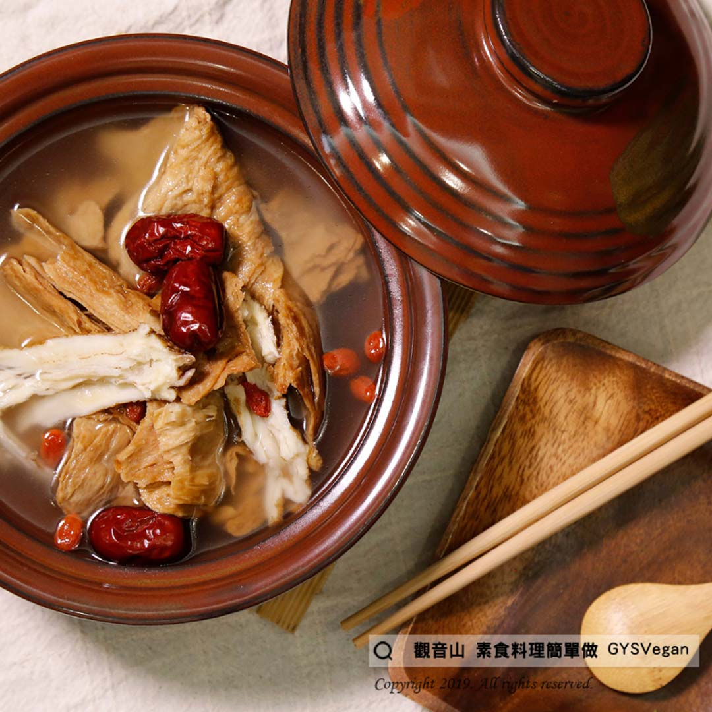

# 當歸大補湯與立冬補湯

## 📋 基本資訊 / Recipe Overview
- **料理名稱**：當歸大補湯與立冬補湯
- **原始標題**：當歸大補湯與立冬補湯｜全素
- **素食流派 / Diet**：全素 Vegan
- **料理分類 / Category**：湯品系列
- **來源平台 / Source**：[觀音山 · 素食料理簡單做](https://vegan.gys.org.tw/tonic-soup20201211/)

## 📖 食譜圖文詳情 (中英雙語對照)

#立冬✨當歸大補湯✨全素?​
​
11月8日是二十四節氣的「立冬」，象徵冬季節氣的起始。在這秋收冬續之際，民間習俗會在立冬日 #進補。​
​
觀音山蔬食館特別提供這道「素食冬令進補必備—當歸大補湯」食譜。​
「當歸」能補血養氣，打造紅潤好氣色；搭配紅棗、人參鬚、皮絲一同煲湯，滋補強身又祛寒。​
無論您有多忙， #30秒輕鬆學會，快來一起素食料理簡單做吧！​
​
?食材及佐料〔Ingredients〕：(4人份)​
▪皮絲 300g​
▪紅棗 8顆​
▪當歸 2片​
▪人參鬚 六錢​
▪鹽 5g​
​
?烹飪步驟：​
1. 將皮絲放入水中煮軟，洗淨切塊狀，備用。​
2. 紅棗洗淨備用​
3. 取一湯鍋，倒入4碗水煮開後，把所有材料全部放入，蓋上鍋蓋，等燒滾約5分鐘。​
4.加入鹽巴調味完成!!!​
​
??本食譜提供：台中 #觀音山蔬食館 主廚 樂卿​
?收藏完整食譜｜https://reurl.cc/pDKvXr​
​
​
✨慈悲的 龍德上師成立「觀音山蔬食館」提倡健康素食、慈悲護生，以”觀音山素食料理簡單做”的理念，提供多款素食食譜，讓您一學就會！?​
​
​
?觀音山 素食料理簡單做 Follow us?
Facebook ｜好文按讚
http://www.facebook.com/GYSVegan​
Instagram ｜料理追蹤
http://www.instagram.com/gysvegan/​
Youtube ｜加入訂閱
https://reurl.cc/q8VEqy​
Telegram ｜頻道推薦
https://t.me/GYSVegan​
​
​
—​
? 歡迎轉載，請註明出處： 觀音山 素食料理簡單做 GYSVegan 素食環保愛地球，健康營養無負擔，慈悲護生一起來~?

---
*食譜歸檔時間：2026-08-20 · 來源：觀音山素食料理簡單做 (vegan.gys.org.tw)*