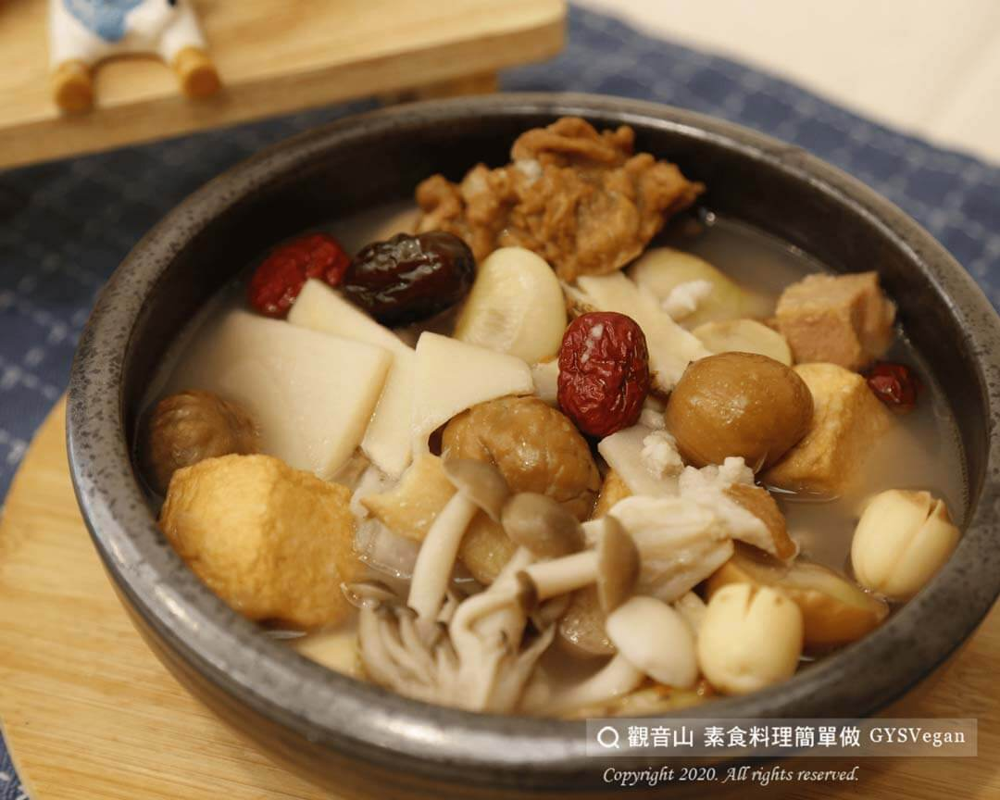

# 百匯煲湯

## 📋 基本資訊 / Recipe Overview
- **料理名稱**：百匯煲湯
- **原始標題**：百匯煲湯｜奶素
- **素食流派 / Diet**：奶素 Lacto-Vegetarian
- **來源平台 / Source**：[觀音山 · 素食料理簡單做](https://vegan.gys.org.tw/parkway-soup20201020/)

## 📖 食譜圖文詳情 (中英雙語對照)

觀音山蔬食館主廚提供這道超有料湯品『百匯煲湯』，添加紅棗、蓮子、山藥等多種養生食材，以慢火煨出豐富的營養，食材精華都熬煮於湯中，長輩或小孩也能吃得更健康?。​
麻油的香氣和菇類的鮮甜滋味絕配，實在是讓人喝了一碗再一碗，太滿足啦~~趕快一起來製作這道美味營養的湯品吧!​
​
準備食材與佐料：(6人份)​
蓮子15顆、鴻喜菇1把、栗子10粒、山藥150g、紅棗10粒、素魚豆腐8個、素牛蒡雞丁8個、薑母5片、麻油20ml、皇帝豆10個、水1000ml、味素適量、鹽適量。​
​
素食料理簡單做，開始：​
1. 鴻喜菇撥開洗淨；山藥去皮洗淨切片；薑母洗淨切片；栗子去外殼，備用。​
2. 鍋中加入麻油、薑，以中火爆香，再加入鴻喜菇拌炒，加入水，以中火悶煮10分鐘。​
3. 加入蓮子、栗子、紅棗，再悶煮10分鐘。​
4. 將山藥、素魚豆腐、素牛蒡雞丁、皇帝豆加入鍋中，再以中火悶煮10分鐘。​
5. 最後加入鹽、味素調味，即可。​
​
這道簡單又美味的料理就完成了~
​
☀️特別說明：​
山藥可依個人喜好切成塊狀，增加口感。​
​
本食譜提供：台中 觀音山蔬食館 主廚 嚴蓮​
​
✨慈悲的 龍德上師成立「觀音山蔬食館」提倡健康素食、慈悲護生，以”觀音山素食料理簡單做”的理念，提供多款素食食譜，讓您一學就會！
Baihui Soup｜Lacto-vegetarian
The chef of Guanyinshan Vegetable Restaurant provides this super rich soup, “Baihui Soup,” which is added with a variety of health-preserving ingredients such as red dates, lotus seeds, yams, etc., and is simmered over a slow fire to bring out rich nutrition. The essence of the ingredients is boiled in the soup. Older people Or children can also eat healthier.
The aroma of sesame oil and the sweet taste of mushrooms match perfectly. It makes you drink bowl after bowl. It’s so satisfying. Let’s make this delicious and nutritious soup together!
​
◎Prepare ingredients and condiments (serves six people)
Fifteen lotus seeds, one handful of Hongxi mushroom, ten chestnuts, 150g yam, ten red dates, eight vegetarian fish tofu, eight vegetarian burdock chicken, five slices of ginger, 20ml of sesame oil, ten emperor beans, 1000ml of water, MSG is remote, and salt is remote.
​
◎Vegetarian dishes are easy to make, start with:
1. Slice Hongxi mushrooms; peel and slice yam; slice ginger mother; peel chestnuts and set aside.
2. Add sesame oil and ginger to the pot, sauté over medium heat until fragrant, then add Hongxi mushrooms and stir-fry, water, and simmer over medium heat for 10 minutes.
3. Add lotus seeds, chestnuts, and red dates and simmer for 10 minutes.
4. Put the yam, vegetarian fish tofu, vegetarian burdock chicken, and emperor beans into the pot and simmer over medium heat for 10 minutes.
5. Finally, add salt and monosodium glutamate seasonings.
​
This is a simple and delicious dish~
​
Special Note:
The yam can be lumped according to personal preference, and the dosage can be increased.
​
​
觀音山 素食料理簡單做 ​ Follow us
Facebook ｜好文按讚
http://www.facebook.com/GYSVegan​
Instagram ｜料理追蹤
http://www.instagram.com/gysvegan/​
Youtube ​ ​ ​ ｜加入訂閱
https://reurl.cc/q8VEqy​
Telegram ​ ｜頻道推薦
https://t.me/GYSVegan​
​
​
歡迎轉載，請註明出處： ​ ​ 觀音山 素食料理簡單做GYSVegan按讚、留言設定搶先看! 素食環保愛地球，健康營養無負擔，慈悲護生一起來~

---
*食譜歸檔時間：2026-08-20 · 來源：觀音山素食料理簡單做 (vegan.gys.org.tw)*