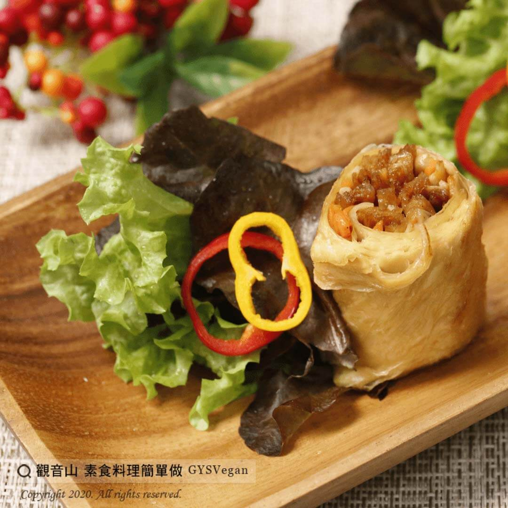

# 皮絲豆皮捲

## 📋 基本資訊 / Recipe Overview
- **料理名稱**：皮絲豆皮捲
- **原始標題**：皮絲豆皮捲｜全素
- **素食流派 / Diet**：全素 Vegan
- **料理分類 / Category**：家常料理
- **來源平台 / Source**：[觀音山 · 素食料理簡單做](https://vegan.gys.org.tw/%e7%9a%ae%e7%b5%b2%e8%b1%86%e7%9a%ae%e6%8d%b2%ef%bd%9c%e5%85%a8%e7%b4%a0/)

## 📖 食譜圖文詳情 (中英雙語對照)

金黃酥脆的香煎豆皮，捲入軟嫩油亮的皮絲?和鮮甜滑順的菇類，內餡飽滿多汁?，鹹香甘醇，讓人食指大動，您一定要來試試，這道大人小孩都無法抵抗的~皮絲豆皮捲?​
​
?食材與佐料：(4人份)​
皮絲250g、鮮香菇5朵、紅蘿蔔1條、金針菇1包、腐皮1大張、素蠔油10g、胡椒粉3g。​
​
?烹飪步驟：​
1. 皮絲、紅蘿蔔切絲；鮮香菇切片；金針菇切段，備用。​
2. 起油鍋，將皮絲、香菇、紅蘿蔔、金針菇一同拌炒。​
3. 加入素蠔油、胡椒粉調味，起鍋放涼備用。​
4. 準備腐皮，捲入炒好的香菇、紅蘿蔔、金針菇，製成豆皮捲。​
5. 將豆皮捲香煎約3分鐘，至表面呈金黃色，即可。​
​
這道簡單又美味的料理就完成了~?​
​
??本食譜提供：台中 #觀音山蔬食館 主廚 樂卿​
​
✨慈悲的 龍德上師成立「觀音山蔬食館」提倡健康素食、慈悲護生，以”觀音山素食料理簡單做”的理念，提供多款素食食譜，讓您一學就會！?​
​
​
?觀音山 素食料理簡單做 ​ Follow us?​
Facebook ｜好文按讚
http://www.facebook.com/GYSVegan​
Instagram ｜料理追蹤
http://www.instagram.com/gysvegan/​
Youtube ​ ​ ​ ｜加入訂閱
https://reurl.cc/q8VEqy​
Telegram ​ ｜頻道推薦
https://t.me/GYSVegan​
​
​
? 歡迎轉載，請註明出處： ​ ​ 觀音山 素食料理簡單做GYSVegan按讚、留言設定搶先看! 素食環保愛地球，健康營養無負擔，慈悲護生一起來~?

---
*食譜歸檔時間：2026-08-20 · 來源：觀音山素食料理簡單做 (vegan.gys.org.tw)*