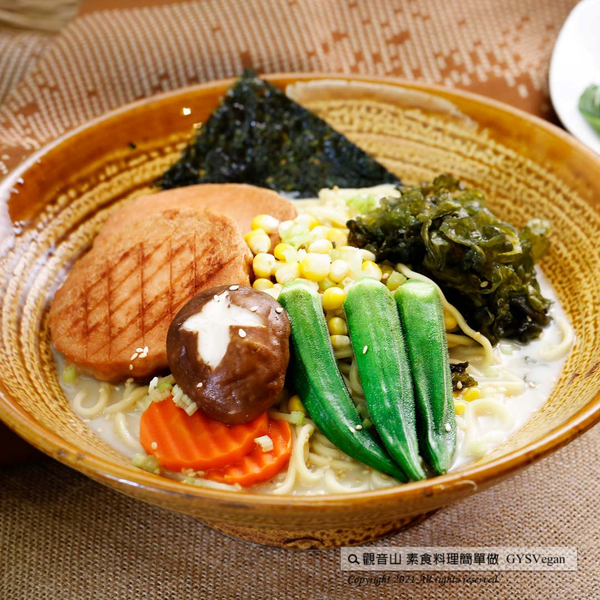

# 真素食豚骨拉麵

## 📋 基本資訊 / Recipe Overview
- **料理名稱**：真素食豚骨拉麵
- **原始標題**：日式料理｜真素食豚骨拉麵｜全素
- **素食流派 / Diet**：全素 Vegan
- **來源平台 / Source**：[觀音山 · 素食料理簡單做](https://vegan.gys.org.tw/vegetarian-pork-bones20211231/)

## 📖 食譜圖文詳情 (中英雙語對照)

完全以植物性食材熬製的湯頭，燕麥奶為湯底，巧妙的搭配味噌、豆腐乳調味，濃郁順口，讓你喝出健康與美味，Q彈的麵條、微焦的素火腿、超豐富的配料，提升你的味覺層次感，快跟著觀音山主廚，一起素食料理簡單做吧！​
​
?食材及佐料〔Ingredients〕：(1人份)​
▪️拉麵 ​ 1束 ​
▪️大鮮香菇 ​ 1朵​
▪️純素火腿 ​ 2片​
▪️秋葵 ​ 2支​
▪️雨來菇、玉米粒、芹菜、芝麻 ​ 適量​
▪️海苔 ​ 2片​
▪️味噌 ​ 1/2大匙​
▪️豆腐乳 ​ 10克​
▪️醬油 ​ 1大匙​
▪️燕麥奶 ​ 300克​
▪️水 ​ 200C.C​
​
?烹飪步驟：​
【刀工/前處理】​
1.鮮香菇表面切花。​
2.中芹切珠。​
​
【調理作法】​
1.取一鍋水汆燙香菇、秋葵、雨來菇備用。​
2.素火腿用油煎上色備用。​
3.製作湯底:將燕麥奶、水、味噌、醬油、豆腐乳攪拌至味噌完全融化，加熱煮滾備用。​
4.一鍋水煮拉麵至8分熟後撈起裝碗,，倒入湯底。​
5.依序擺上配菜:香菇、秋葵、雨來菇、素火腿、玉米粒、芹菜、芝麻、海苔。即可享用​
​
【特別說明】​
喜歡吃辣的朋友，可以加入適量的辣油增添風味。​
​
??本食譜提供：台中觀音山蔬食館​
​
​
✨慈悲的龍德上師 成立「觀音山蔬食館」提倡健康素食、慈悲護生，以”觀音山素食料理簡單做”的理念，提供多款素食食譜，讓您一學就會！?​
​
​
【recipe】​
​
? This broth is made from plant-based ingredients, with oat milk as the soup base. It is finely seasoned with miso and fermented tofu, which tastes rich and smooth. Springy noodles, topped with slightly burnt vegetarian ham, and other various ingredients, this recipe will definitely enhance your sense of taste. It’s not only healthy but also delicious. Follow the chef of Guanyinshan and make vegetarian dishes together! ​ ​
​
?Ingredients : （For 1 people）​
▪️A bunch of ramen ​ ​ ​
▪️A shiitake mushroom ​ ​
▪️Two pieces of vegetarian ham​
▪️Two okra ​
▪️Nostoc commune、Corn kernels、Celery、Sesame ​ ​ , adequate amount​
▪️Two pieces of ​ seaweed sheets​
▪️Miso ​ 1/2 tbsp​
▪️Fermented tofu ​ 10g​
▪️Soy sauce ​ 1 tbsp​
▪️Oat milk ​ 300g​
▪️Water ​ 200C.C​
​
?Instructions:​
【Cutting/ PREP-Ahead】​
1. Make Shiitake Hanagiri on the surface of fresh shiitake mushrooms. (Make an X ​ incisions on top of shiitake mushrooms)​
2. Cut the celery into beads. ​
​
【Cooking Steps】​
1. Blanch shiitake mushrooms, okra, and nostoc commune for later use.​
2. Fry the vegetarian ham until browned for later use. ​
3. Making the broth: Stir oat milk, water, miso, soy sauce, and fermented tofu until the miso is completely dissolved, and then bring to a boil for later use. ​
4. Bring a pot of water to a boil and cook the ramen to the hardness of medium well, drain, put it in a soup bowl, and pour over the broth. ​
5. Arrange the side dishes in order: Shiitake mushrooms, okra, nostoc commune vegetarian ham, corn kernels, celery, sesame, seaweed. Time to enjoy!​
​
【Special Notes】 ​
If you favor for hot sauce, chili oil is adaptable to this recipe.​
​
​
? 觀音山 素食料理簡單做 ? ​
◎Facebook ｜好文按讚​
http://www.facebook.com/GYSVegan​
​
◎lnstagram ｜料理追蹤​
http://www.instagram.com/gysvegan/​
​
◎Youtube ｜加入訂閱​
https://reurl.cc/q8VEqy​
​
◎Telegram ｜頻道推薦​
https://t.me/GYSVegan​
​
—​
?歡迎轉載，請註明出處： 觀音山 素食料理簡單做 GYSVegan 素食環保愛地球，健康營養無負擔，慈悲護生一起來~?

---
*食譜歸檔時間：2026-08-20 · 來源：觀音山素食料理簡單做 (vegan.gys.org.tw)*