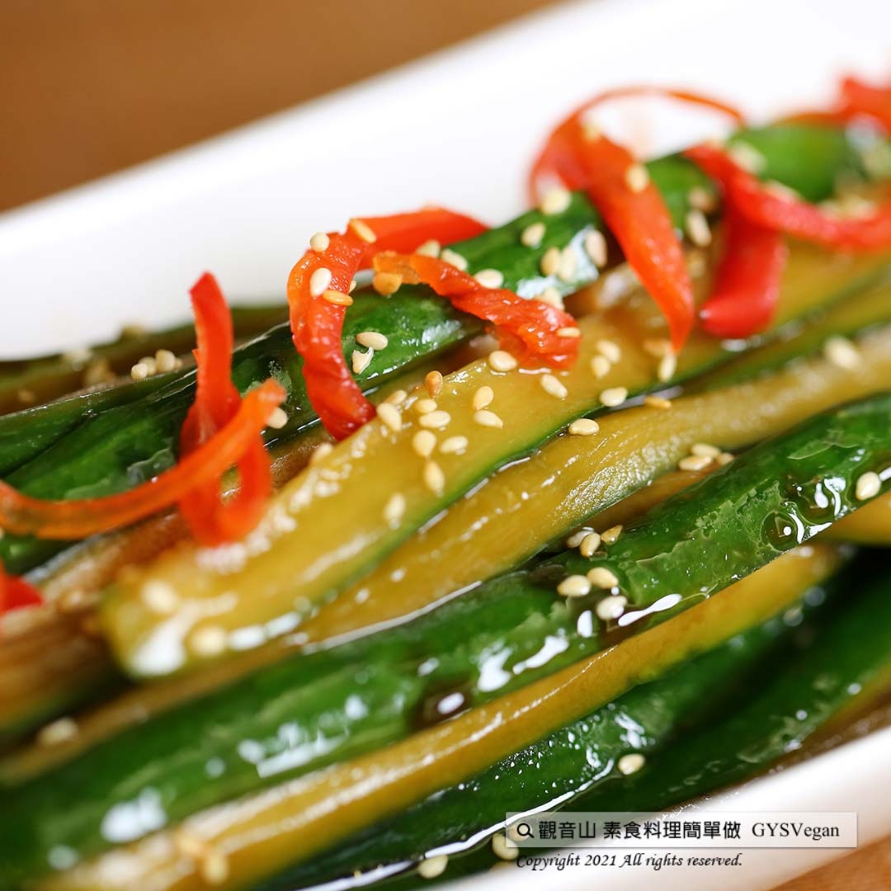

# 私房醃漬黃瓜條

## 📋 基本資訊 / Recipe Overview
- **料理名稱**：私房醃漬黃瓜條
- **原始標題**：私房醃漬黃瓜條｜全素
- **素食流派 / Diet**：全素 Vegan
- **來源平台 / Source**：[觀音山 · 素食料理簡單做](https://vegan.gys.org.tw/homemade-pickled-cucumber20210730/)

## 📖 食譜圖文詳情 (中英雙語對照)

清脆可口的小黃瓜，是夏天最棒的蔬菜之一，來一盤私房醃漬黃瓜條，讓你立即開胃，豐富的膳食纖維、維生素，提升全家免疫力，夏季低卡的輕食首選，快跟著觀音山主廚，一起素食料理簡單做吧！​
​
❒食材及佐料〔Ingredients〕：(5人份)​
▪小黃瓜 ​ 500克​
▪薑、辣椒 ​ 各50克​
▪白砂糖、花椒油 ​ 各30克​
▪烏醋、清醬油 ​ 各100C.C​
▪鹽 ​ 15克​
​
❒烹飪步驟：​
【刀工/前處理】​
1.將小黃瓜用飲用水洗淨，切條狀去籽備用。​
2.薑去皮切片。​
3.辣椒切斜片。​
​
【調理作法】​
1.小黃瓜加入鹽15克，抓醃均勻靜置一個小時，軟化後再將多餘的水倒掉。用飲用水洗去多餘的鹹度。
2.醃漬醬料:油爆香薑、辣椒，加入調味料:白砂糖、烏醋、清醬油，煮滾加入花椒油放涼備用。​
3.取一乾淨無水份的容器，將小黃瓜放入，再將醬料倒入醃漬即可。​
​
​
【特別說明】​
1.可依個人口味鹹淡喜好，調整辣椒和小黃瓜的量。
2.鹽巴15克用於抓醃黃瓜使用，非醃漬醬料使用。
3.用乾淨無水份的餐具，冷藏可保存一週。​
4.小黃瓜本身清熱解毒，吃多了也不會上火。
​
??本食譜提供：台中  觀音山蔬食館 主廚 淨雅​
​
​
✨慈悲的 龍德上師成立「觀音山蔬食館」提倡健康素食、慈悲護生，以”觀音山素食料理簡單做”的理念，提供多款素食食譜，讓您一學就會！
​
​
★8月1日 「明淨月．大日如來節日」：善惡業增長1000萬x1億倍​
​
✨殊勝功德增長日✨​
觀音山邀請您於8月1日 響應素食、廣修供養、戒殺護生、誦經修法、行持諸種善行，獲福無量。​
​
​
【recipe】​
​
The crisp and delicious cucumber is one of a summer essential. A plate of pickled cucumber could be served as a perfect appetizer. It is rich in dietary fiber and vitamins, and boost immune system of the whole family. It is a summer must-have low-calorie light food. Follow chef of Guanyinshan, let’s cook simple vegetarian dishes together! ​
​
❒ Instructions: ​
【Cutting/PRE- ahead】 ​
1. Wash the cucumber with drinking water, cut into strips and remove the seeds for later use. ​
2. Peel the ginger and slice it. ​
3. Cut the pepper into diagonal slices. ​ ​
​
【Cooking Steps】​
1. Add salt to the cucumbers, marinate them evenly and stand for an hour, then pour out the excess water. ​
2. Sauce: Saute ginger and chili; ​ add seasonings (white sugar, black vinegar, clear soy sauce); bring the mixture to a boil, and then add pepper oil. Let it cool for later use. ​
3. Take a clean and moisture-free container, put the cucumbers in, and then pour the sauce in. ​ ​
​
[Special notes] ​
1. Using a clean and moisture-free container, the pickled can be stored for up to a week in the fridge.​
2. Cucumber detoxifies your body and ensure you stay cool from inside. It won’t aggravate your body or increase body heat, even if you consume a lot. ​ ​
​
This recipe is provided by Chef Jing Ya, Taichung  ​ Guanyinshan Green Restaurant​
​
​
觀音山 素食料理簡單做 Follow us
Facebook ｜好文按讚
http://www.facebook.com/GYSVegan​
Instagram ｜料理追蹤
http://www.instagram.com/gysvegan/​
Youtube ​ ​ ​ ｜加入訂閱
https://reurl.cc/q8VEqy​
Telegram ​ ｜頻道推薦
https://t.me/GYSVegan​
​
​
歡迎轉載，請註明出處： ​ ​ 觀音山 素食料理簡單做 GYSVegan 素食環保愛地球，健康營養無負擔，慈悲護生一起來~​

---
*食譜歸檔時間：2026-08-20 · 來源：觀音山素食料理簡單做 (vegan.gys.org.tw)*