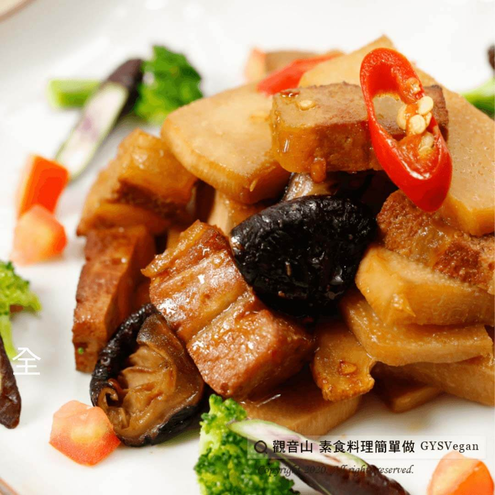

# 竹筍燒若

## 📋 基本資訊 / Recipe Overview
- **料理名稱**：竹筍燒若
- **原始標題**：竹筍燒若｜全素
- **素食流派 / Diet**：全素 Vegan
- **料理分類 / Category**：家常料理
- **來源平台 / Source**：[觀音山 · 素食料理簡單做](https://vegan.gys.org.tw/%e7%ab%b9%e7%ad%8d%e7%87%92%e8%8b%a5%ef%bd%9c%e5%85%a8%e7%b4%a0/)

## 📖 食譜圖文詳情 (中英雙語對照)

清甜鮮嫩的綠竹筍含大量纖維、蛋白質、醣類及維生素B1、B2、C，每年5～10月是主要產季。​
竹筍與素東坡若的搭配，煨煮出一道清爽下飯的家常料理，讓人食指大動、唇齒留香。​
快跟著觀音山主廚，一起素食料理簡單做吧！​
​
?食材及佐料〔Ingredients〕：(5人份)​
▪素東坡若 250克​
▪綠竹筍 2支​
▪乾香菇 10朵​
▪薑片 10片​
▪清醬油 3大匙​
▪糖 1大匙​
▪胡椒 少許​
▪黑醋 1大匙​
▪紅辣椒 1條​
▪水 150cc​
▪油 適量​
​
?烹飪步驟：​
1.將綠竹筍洗淨去殼切厚片備用。​
2.乾香菇先泡軟切十字，一朵切4等份。​
3.起油鍋，薑片爆香。​
4.依序放入乾香菇、素東坡若翻炒。​
5.再放入筍片、清醬油、黑醋、水、糖及胡椒。​
6.小火煮滾後，蓋上鍋蓋煨煮一下，若竹筍8兩重約煨煮8分鐘。​
7.起鍋前，擺上紅辣椒點綴即可。​
​
【特別說明】​
1.怕辣者，可不加辣椒。​
2.可用東坡若片替換。​
​
??本食譜提供：台中 #觀音山蔬食館 主廚 樂敏​
​
?慈悲的 龍德上師成立「觀音山蔬食館」提倡健康素食、慈悲護生，以”觀音山素食料理簡單做”的理念，提供多款素食食譜，讓您一學就會！?​
​
​
?觀音山 素食料理簡單做 ​ Follow us?​
Facebook ｜好文按讚
http://www.facebook.com/GYSVegan​
Instagram ｜料理追蹤
http://www.instagram.com/gysvegan/​
Youtube ​ ​ ​ ｜加入訂閱
https://reurl.cc/q8VEqy​
Telegram ​ ｜頻道推薦
https://t.me/GYSVegan​
​
​
? 歡迎轉載，請註明出處： ​ ​ 觀音山 素食料理簡單做GYSVegan按讚、留言設定搶先看! 素食環保愛地球，健康營養無負擔，慈悲護生一起來~?

---
*食譜歸檔時間：2026-08-20 · 來源：觀音山素食料理簡單做 (vegan.gys.org.tw)*