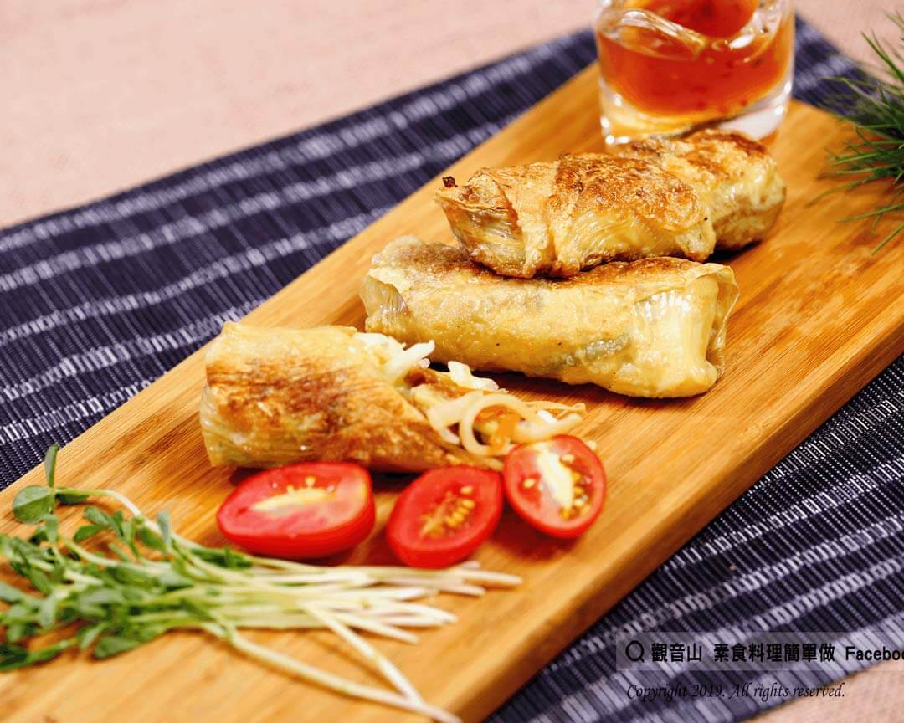

# 竹筍高麗菜捲

## 📋 基本資訊 / Recipe Overview
- **料理名稱**：竹筍高麗菜捲
- **原始標題**：竹筍高麗菜捲｜全素
- **素食流派 / Diet**：全素 Vegan
- **來源平台 / Source**：[觀音山 · 素食料理簡單做](https://vegan.gys.org.tw/%e7%ab%b9%e7%ad%8d%e9%ab%98%e9%ba%97%e8%8f%9c%e6%8d%b2%ef%bd%9c%e5%85%a8%e7%b4%a0/)

## 📖 食譜圖文詳情 (中英雙語對照)

豆製品是我們素食者的好朋友，富含植物性蛋白質及大豆異黃酮，也是素食者補充蛋白質不可或缺的食材。?​
​
這道竹筍高麗菜捲，內餡使用臺灣一年四季都出產的鮮甜竹筍及高麗菜，以金黃表面的豆皮包裹，口感酥脆不油膩。​
​
每一口都吃的到豆皮的香味和鮮甜飽滿的筍絲，搭配鹹甜的沾醬，真是令人滿足阿！別再等了?‍♀️~趕快一起來製作吧~?​
​
?準備食材與佐料(5人份)​
1.食材：新鮮竹筍絲2斤、高麗菜半顆、皮絲5克、芹菜2克、香菜2克、豆皮2大張、紅蘿蔔1克。​
2.佐料：素蠔油1大匙(15ml)、糖2克、鹽巴1克、胡椒粉2克、麵粉3克、香油1克、沙拉油少量、沙拉油3杯(炸油鍋用，約480ml)。​
​
?#素食料理簡單做，開始：​
​
?食材前置處理：​
1. 將皮絲泡軟切絲；紅蘿蔔切絲；竹筍切絲川燙3分鐘後，撈起瀝乾，備用。​
2. 高麗菜洗淨切絲，加鹽使高麗菜出水，靜置5分鐘，瀝乾備用。​
3. 香菜、芹菜洗淨切段；豆皮切成5人份，備用。?​
​
?食材烹煮開始：​
1. 沙拉油熱鍋，先將皮絲炒香，再拌炒竹筍絲、紅蘿蔔絲。​
2. 加入素蠔油、糖、鹽巴、胡椒粉調味，再放入芹菜、香菜拌炒，最後熄火倒入香油1克，盛起讓食材降溫，放冷備用。​
3. 將麵粉與少量的水攪拌均勻，製成麵粉糊，備用。​
4. 將豆皮攤平，放上炒好的食材，取適量皮絲、竹筍絲、高麗菜絲捲起來，以麵粉糊封住開口尾端。​
5. 捲好的豆皮卷以中火下油鍋，炸至表皮呈現金黃色，就完成囉~~?​
​
?可依個人喜好，搭配甜辣醬或是番茄醬加糖，沾醬享用，風味更佳喔​
​
?特別說明：​
1. 竹筍買回後連殼放在冷水鍋，煮沸後再撈起放涼，放入冰箱保存。這樣可以讓竹筍保持鮮甜喔！?​
2. 豆皮捲也可以選擇用煎的，將表皮煎到呈金黃色，即可起鍋。​
3. 如有剩下的豆皮捲，可冷凍保存。下次要吃的時候，先解凍後，用小火再轉中火炸到表皮呈金黃色，豆皮捲浮起來，即可起鍋。​
4. 油炸豆皮捲請使用中火，火太大容易使食材燒焦。​
5. 此食譜是5人份的參考份量，實際可依個人口味和人數調整。❤️​
​
?‍?本食譜提供：台中 #觀音山蔬食館 主廚 樂卿​
​
✨慈悲的 龍德上師成立「觀音山蔬食館」提倡健康素食、慈悲護生，以”觀音山素食料理簡單做”的理念，提供多款素食食譜，讓您一學就會！?​
​
​
?觀音山 素食料理簡單做 ​ Follow us?​
Facebook ｜好文按讚
http://www.facebook.com/GYSVegan​
Instagram ｜料理追蹤
http://www.instagram.com/gysvegan/​
Youtube ​ ​ ​ ｜加入訂閱
https://reurl.cc/q8VEqy​
Telegram ​ ｜頻道推薦
https://t.me/GYSVegan​
​
​
? 歡迎轉載，請註明出處： ​ ​ 觀音山 素食料理簡單做GYSVegan按讚、留言設定搶先看! 素食環保愛地球，健康營養無負擔，慈悲護生一起來~?

---
*食譜歸檔時間：2026-08-20 · 來源：觀音山素食料理簡單做 (vegan.gys.org.tw)*