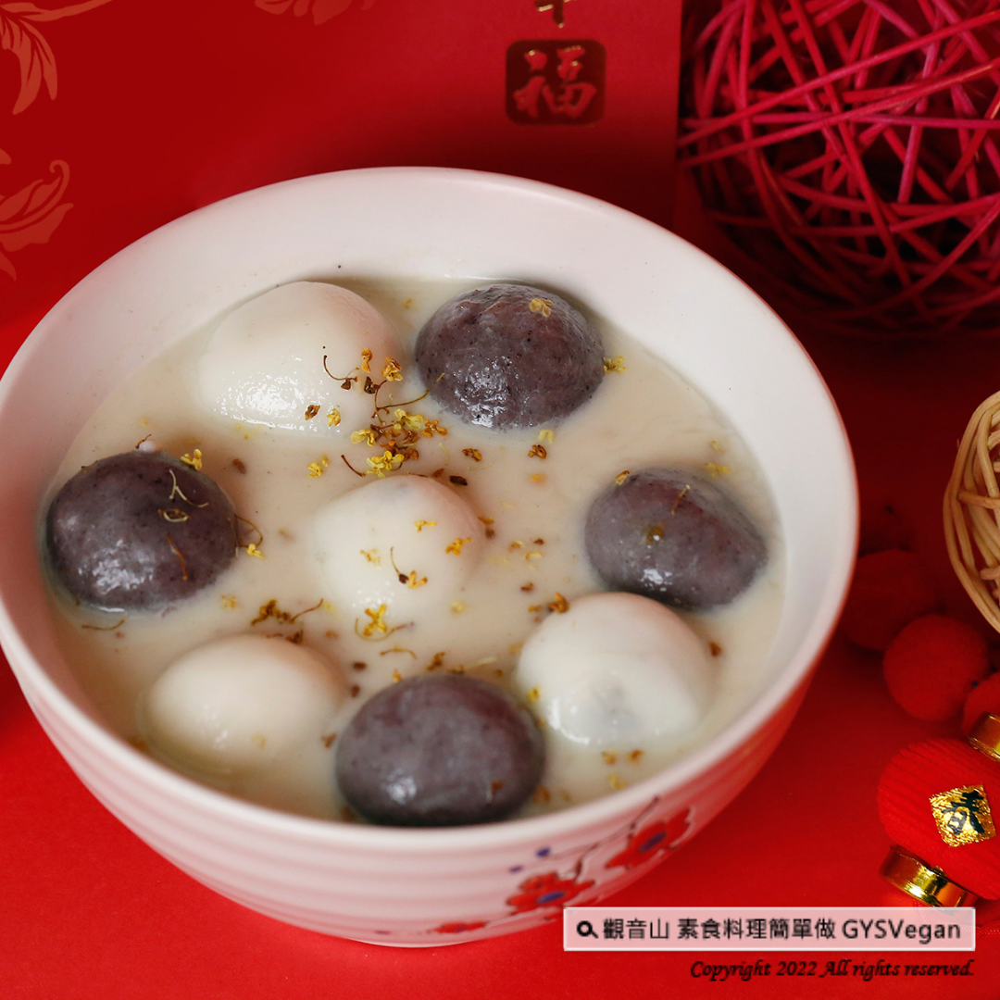

# 節慶料理 桂花燕麥奶元宵

## 📋 基本資訊 / Recipe Overview
- **料理名稱**：節慶料理 桂花燕麥奶元宵
- **原始標題**：節慶料理｜桂花燕麥奶元宵｜全素
- **素食流派 / Diet**：全素 Vegan
- **來源平台 / Source**：[觀音山 · 素食料理簡單做](https://vegan.gys.org.tw/osmanthus-oat-milk-yuanxio20220211/)

## 📖 食譜圖文詳情 (中英雙語對照)

下週就是元宵了，快來學會用時下最環保、高膳食纖維的燕麥奶，煮出一道喜氣的桂花燕麥奶元宵！快跟著觀音山主廚，一起素食料理簡單做！​
​
?食材及佐料〔Ingredients〕：（2人份）​
▪️微甜燕麥奶 ​ 500c.c​
▪️桂花 ​ 約1克 ​
▪️芝麻元宵 ​ 5顆 ​ ​ ​ ​ ​ ​
▪️花生元宵 ​ 5顆​
​
【調理作法】​
1.取一鍋水煮沸，將元宵煮熟備用。​
2.將燕麥奶倒入湯鍋中加熱至滾熄火，加入桂花浸泡1分鐘。​
3.將元宵放入碗中，加入桂花燕麥奶，即可享用。​
​
【特別說明】​
元宵口味可以依個人喜好調整。​
​
??本食譜提供：台中觀音山蔬食館​
​
✨慈悲的龍德上師 成立「觀音山蔬食館」提倡健康素食、慈悲護生，以”觀音山素食料理簡單做”的理念，提供多款素食食譜，讓您一學就會！?
​
​
【recipe】​
​
? Next week is the Lantern Festival! Come and have this most environmentally friendly yuanxio recipe for the festival. For the soup base, we use high dietary fiber oat milk and osmanthus to enhance scents. This goes incredibly smooth with yuanxio. Quickly follow the chef of Guanyinshan and make vegetarian dishes together!​
​
?Ingredients : (For 5 people)​
▪️Oat milk with light sugar ​ 500c.c​
▪️Osmanthus fragrans ​ 1g ​
▪️Five sesame tangyuan ​
▪️Five peanut tangyuan ​
​
【Cooking Steps】​
1. Bring a pot of water to a boil, and cook the yuanxio through and set aside.​
2. Pour the oat milk into a pot and bring it to a boil. Then, add in osmanthus and soak for 1 minute.​
3. Place the cooked yuanxio in a bowl, add osmanthus oat milk, and enjoy.​
​
【Special Notes】​
The flavor of yuanxio can be chosen according to personal preference.​
​
​
? 觀音山 素食料理簡單做 ?
◎Facebook ｜好文按讚​
http://www.facebook.com/GYSVegan​
​
◎lnstagram ｜料理追蹤​
http://www.instagram.com/gysvegan/​
​
◎Youtube ｜加入訂閱​
https://reurl.cc/q8VEqy​
​
◎Telegram ｜頻道推薦​
https://t.me/GYSVegan​
​
—​
?歡迎轉載，請註明出處： 觀音山 素食料理簡單做 GYSVegan 素食環保愛地球，健康營養無負擔，慈悲護生一起來~?​

---
*食譜歸檔時間：2026-08-20 · 來源：觀音山素食料理簡單做 (vegan.gys.org.tw)*