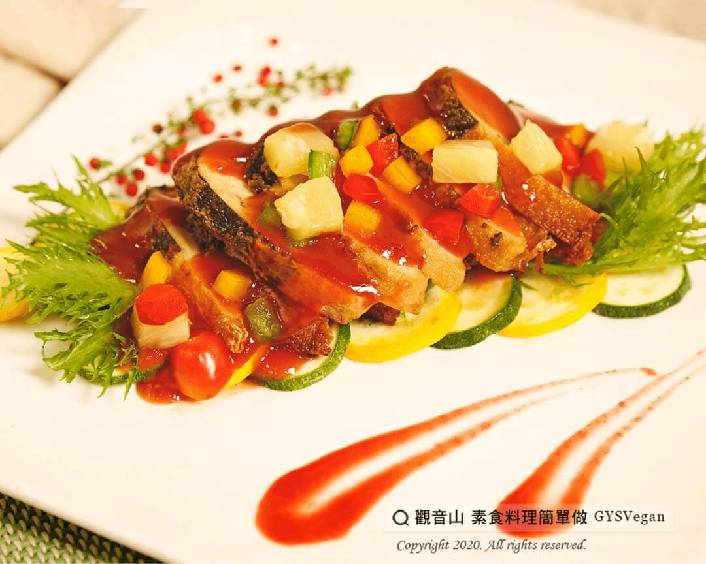

# 糖醋素于

## 📋 基本資訊 / Recipe Overview
- **料理名稱**：糖醋素于
- **原始標題**：糖醋素于｜蛋奶素
- **素食流派 / Diet**：奶素 Lacto-Vegetarian
- **料理分類 / Category**：家常料理
- **來源平台 / Source**：[觀音山 · 素食料理簡單做](https://vegan.gys.org.tw/%e7%b3%96%e9%86%8b%e7%b4%a0%e4%ba%8e%ef%bd%9c%e8%9b%8b%e5%a5%b6%e7%b4%a0/)

## 📖 食譜圖文詳情 (中英雙語對照)

糖醋醬汁酸甜開胃，搭配上素于、紅、黃、青椒片及鳳梨，層次豐富的口感，讓人白飯一碗接一碗，酸酸甜甜好滋味，是一道您不能不學會的家常料理。​
一起跟著「觀音山蔬食館」的主廚，素食料理簡單做吧！​
​
?食材及佐料〔Ingredients〕：（3人份）​
▪素魚6塊​
▪紅椒1/2顆​
▪黃椒1/2顆​
▪青椒1/2顆​
▪鳳梨片3片​
▪番茄醬150ml​
▪鳳梨罐頭汁50ml​
▪白醋15ml​
▪鹽少量​
​
?烹飪步驟：​
1.將紅椒、黃椒、青椒切方塊，鳳梨片切片6等份，備用。​
2.將所有調味料，倒入碗中攪拌，製成糖醋醬料，備用。​
3.熱油鍋放入素魚，香煎至微金黃色，切片擺盤。​
4.將紅、黃、青椒片、鳳梨片，放入鍋內翻炒，起鍋備用。​
5.將糖醋醬料倒入鍋內，待滾沸後起鍋。​
6.將素魚淋上糖醋醬料，放上紅、黃、青椒片、鳳梨片，擺盤完成！​
​
⭐️特別說明：​
1.此道料理之鳳梨片取自鳳梨罐頭。​
2.因鳳梨罐頭含有甜度跟鳳梨香味，因此不需要另外加糖喔!​
​
??本食譜提供：台中 #觀音山蔬食館 主廚 樂卿​
​
✨慈悲的 龍德上師成立「觀音山蔬食館」提倡健康素食、慈悲護生，以”觀音山素食料理簡單做”的理念，提供多款素食食譜，讓您一學就會！?​
​
​
?觀音山 素食料理簡單做 ​ Follow us?​
Facebook ｜好文按讚
http://www.facebook.com/GYSVegan​
Instagram ｜料理追蹤
http://www.instagram.com/gysvegan/​
Youtube ​ ​ ​ ｜加入訂閱
https://reurl.cc/q8VEqy​
Telegram ​ ｜頻道推薦
https://t.me/GYSVegan
​
​
​
? 歡迎轉載，請註明出處： ​ ​ 觀音山 素食料理簡單做GYSVegan按讚、留言設定搶先看! 素食環保愛地球，健康營養無負擔，慈悲護生一起來~?

---
*食譜歸檔時間：2026-08-20 · 來源：觀音山素食料理簡單做 (vegan.gys.org.tw)*