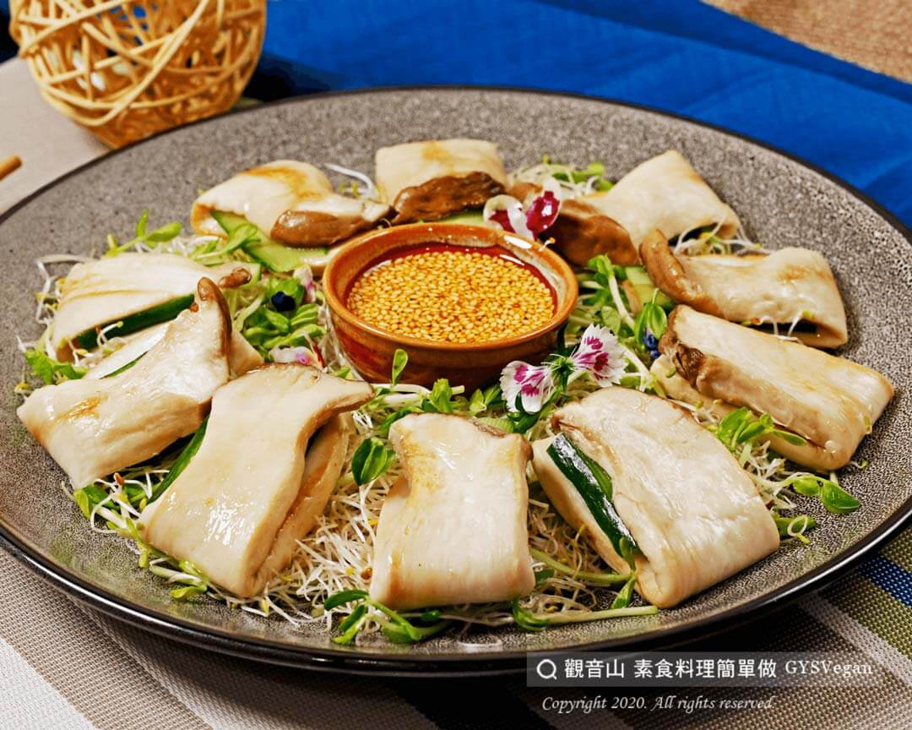

# 紅油素肉片

## 📋 基本資訊 / Recipe Overview
- **料理名稱**：紅油素肉片
- **原始標題**：紅油素肉片｜全素
- **素食流派 / Diet**：全素 Vegan
- **來源平台 / Source**：[觀音山 · 素食料理簡單做](https://vegan.gys.org.tw/%e7%b4%85%e6%b2%b9%e7%b4%a0%e8%82%89%e7%89%87%ef%bd%9c%e5%85%a8%e7%b4%a0/)

## 📖 食譜圖文詳情 (中英雙語對照)

細膩滑嫩的杏鮑菇，包裹著清翠鮮甜的小黃瓜，搭配烏醋酸甜、香麻辣油的醬汁，清爽又微麻的紅油素肉片，完全使用天然食材，健康又開胃，您一定要試試看！ ​
一起跟著「觀音山蔬食館」的主廚，素食料理簡單做吧！​
​
?食材及佐料〔Ingredients〕：（3人份）​
▪杏鮑菇 400g​
▪小黃瓜 1條​
▪白芝麻 2大匙​
▪水 10 c.c​
▪糖 0.5匙​
▪醋 0.5匙​
▪辣油2匙​
▪素蠔油2大匙​
▪香油1匙​
​
?烹飪步驟：​
1.杏鮑菇、小黃瓜切長片，備用。​
2.熱油鍋，將杏鮑菇片煎至略金色。​
3.將小黃瓜片夾入杏鮑菇片中。​
4.調味料全部攪拌後放入白芝麻，擺盤完成！​
​
??本食譜提供：台中 #觀音山蔬食館 主廚 樂卿​
​
✨慈悲的 龍德上師成立「觀音山蔬食館」提倡健康素食、慈悲護生，以”觀音山素食料理簡單做”的理念，提供多款素食食譜，讓您一學就會！?​
​
​
?觀音山 素食料理簡單做 ​ Follow us?​
Facebook ｜好文按讚
http://www.facebook.com/GYSVegan​
Instagram ｜料理追蹤
http://www.instagram.com/gysvegan/​
Youtube ​ ​ ​ ｜加入訂閱
https://reurl.cc/q8VEqy​
Telegram ​ ｜頻道推薦
https://t.me/GYSVegan​
​
​
? 歡迎轉載，請註明出處： ​ ​ 觀音山 素食料理簡單做GYSVegan按讚、留言設定搶先看! 素食環保愛地球，健康營養無負擔，慈悲護生一起來~?

---
*食譜歸檔時間：2026-08-20 · 來源：觀音山素食料理簡單做 (vegan.gys.org.tw)*