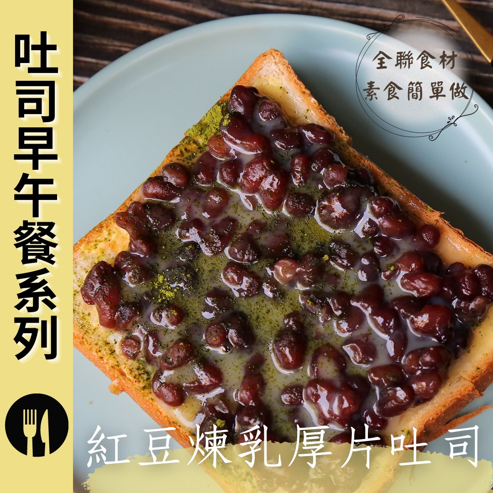

# 紅豆煉乳厚片吐司 │

## 📋 基本資訊 / Recipe Overview
- **料理名稱**：紅豆煉乳厚片吐司 │
- **原始標題**：紅豆煉乳厚片吐司 │奶素
- **素食流派 / Diet**：奶素 Lacto-Vegetarian
- **來源平台 / Source**：[觀音山 · 素食料理簡單做](https://vegan.gys.org.tw/red-bean-paste20210908/)

## 📖 食譜圖文詳情 (中英雙語對照)

早餐是一天最重要的時刻，為家人親手準備熱騰騰的手作厚片，一口咬下即品嘗到滿滿的紅豆香氣，搭配上香濃的煉乳與抹茶粉獨特的風味，用全聯食材 準備一道幸福早餐，快跟著觀音山主廚，一起素食料理簡單做吧！​
​
◎食材及佐料〔Ingredients〕：(3人份)​
▪️紅豆調理包 ​ 1包​
▪️煉乳、奶油、抹茶粉 ​ 適量​
▪️厚片 ​ 3片​
​
❖以上食材皆可在全聯福利中心 購得​
​
◎烹飪步驟：​
1.厚片切九宮格紋路。​
2.抹上奶油，平均鋪上紅豆。​
3.烤箱180度預熱，放入厚片烤約3-5分鐘。​
4.厚片取出後，淋上煉乳、撒上抹茶粉即可享用。​
​
本食譜提供：台中觀音山蔬食館 主廚 淨雅​
​
​
✨慈悲的龍德上師 成立「觀音山蔬食館」提倡健康素食、慈悲護生，以”觀音山素食料理簡單做”的理念，提供多款素食食譜，讓您一學就會！
​
​
【recipe】​
​
Breakfast is the most important meal of the day. Preparing a hot, home-made thick toast slice ​ for your family is a joy. The sweetness of red bean paste, paired with the unique flavor of condensed milk and matcha powder, making each bite just like a party in the mouth. All the ingredients you need can be found at# PX Mart. This breakfast brings you a sense of happiness for a kick-start of the day. Quickly follow the chef of Guanyinshan. Let’s make vegetarian dishes together!​
​
❖All the above ingredients can be purchased at # PX Mart​
​
◎Ingredients : （For 3 people）​
▪️A Red bean conditioning package ​
▪️Condensed milk、Vegan butter、Matcha powder ​ , adequate amount​
▪️Three thick toasts​
​
◎Instructions:​
1. Cutting a grid into the top of a slice thick toast. (not to cut all the way through to the bottom)​
2. Spread a layer of butter and spread red bean paste evenly.​
3. Preheat the oven to 180 degrees, put in thick toast slices and bake for about 3-5 minutes.​
4. After taking out the thick toast slices, pour over condensed milk and sprinkle some matcha powder. You’re all set.​
​
This recipe is provided by chef Jing Ya, Taichung Guanyinshan Green Restaurant
​
☆ 觀音山 素食料理簡單做 ☆ ​
Facebook ｜好文按讚
http://www.facebook.com/GYSVegan​
Instagram ｜料理追蹤
http://www.instagram.com/gysvegan/​
Youtube ｜加入訂閱
https://reurl.cc/q8VEqy​
Telegram ｜頻道推薦
https://t.me/GYSVegan​
​
​
—​
歡迎轉載，請註明出處： 觀音山 素食料理簡單做 GYSVegan 素食環保愛地球，健康營養無負擔，慈悲護生一起來~

---
*食譜歸檔時間：2026-08-20 · 來源：觀音山素食料理簡單做 (vegan.gys.org.tw)*