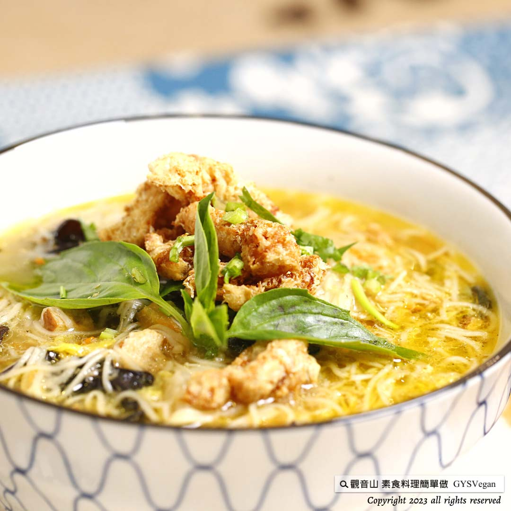

# 素排骨酥白麵線糊

## 📋 基本資訊 / Recipe Overview
- **料理名稱**：素排骨酥白麵線糊
- **原始標題**：傳統小吃｜素排骨酥白麵線糊｜全素
- **素食流派 / Diet**：全素 Vegan
- **料理分類 / Category**：主食種類
- **來源平台 / Source**：[觀音山 · 素食料理簡單做](https://vegan.gys.org.tw/noodle-paste20230217/)

## 📖 食譜圖文詳情 (中英雙語對照)

傳統小吃 ★ 素排骨酥白麵線糊 ★  全素
供佛後的白麵線，不知道怎麼變化嗎？趕緊學會「素排骨酥白麵線糊」，麵線糊軟嫩的口感、層次豐富的湯底，鋪上酥脆的素排骨酥，配著濃郁香氣的九層塔，吃出傳統小吃的新特色，快跟著觀音山主廚，一起素食料理簡單做吧！
​ ​
​ ​
🔲食材及佐料〔Ingredients〕：(5人份)
▪️白麵線 ​ ​ 3束
▪️乾香菇 ​ ​ 5朵
▪️金針菇 ​ ​ 1包
▪️大白菜 ​ ​ 300克
▪️水 ​ ​ ​ 約2400c.c.
▪️紅蘿蔔、黑木耳 ​ ​ 適量
▪️素排骨酥、香菜、九層塔、沙拉油 ​ ​ 適量
▪️鹽、砂糖、素沙茶、烏醋、香油、胡椒粉 ​ ​ 適量
​ ​
​ ​
🔲烹飪步驟：
【刀工/前處理】
1.白麵線剪成約3公分段，備用。
2.乾香菇泡水軟化，瀝乾水份，備用。
3.紅蘿蔔去皮刨絲。
4.金針菇去除蒂頭，剝成絲狀，切1/2段狀，備用。
5.大白菜洗淨切粗絲，備用。
6.黑木耳洗淨切絲，備用。
7.香菜、九層塔洗淨切成末，備用。
​ ​
【調理作法】
1.炒鍋加油加熱，倒入乾香菇炒香，加入水、紅蘿蔔、金針菇、大白菜、黑木耳，煮滾後調味:素沙茶、糖、胡椒粉，加入白麵線，煮滾後，調整濃稠度(可以視狀況多加水)，最後調味:鹽、烏醋、香油。
2.將麵線糊盛裝入碗中，擺上素排骨酥、香菜、九層塔即可享用。
​ ​
​ ​
本食譜提供：台中觀音山蔬食館
​ ​
​
▌慈悲的龍德上師 成立「觀音山蔬食館」提倡健康素食、慈悲護生，以”觀音山素食料理簡單做”的理念，提供多款素食食譜，讓您一學就會！
觀音山相關連結
➠
https://www.fazang.org/link/
​ ​
​
▌觀音山近期活動
3月8日 觀音薈供法會
✦登記「除障祿位 / 超薦蓮位」
https://bit.ly/3HXmCO7
✦護持「薈供供品」供養三寶
https://bit.ly/3bHzJ8H
​ ​
【recipe】
​
​ Do you know how to cook the white noodle in varied ways after worshiping Buddha? ​ Let’s quickly learn “vegetarian pork rib crispy white noodle paste”, the noodle paste has a soft and tender taste, a rich soup base, topped with crunchy vegetarian pork rib crisp, with a rich aroma of basil, eat new aspects of traditional snacks, follow quickly to Chef Guanyinshan, let’s make simple vegetarian dishes together!
​ ​
​ ​
​🔲 Ingredients and condiments [Ingredients]: (5 servings)
▪️White noodle thread ​ 3 bundles
▪️Dried shiitake mushrooms ​ 5 pcs
▪️ Flammulina velutipes 1 pack
▪️Chinese cabbage 300g
▪️Water about 2400c.c.
▪️Carrot, black fungus appropriate amount
▪️Vegetarian pork ribs, coriander, basil, salad oil approprate amount
▪️Salt, sugar, vegetarian barbecue sauce, black vinegar, sesame oil, pepper ​ ​ ​ ​ appropriate amount
​ ​
​ ​
🔲Cooking steps:
[Knife/Pretreatment]
1. Cut white noodle thread into about 3 cm sections and set aside.
2. Soak dried shiitake mushrooms in water to soften, drain and set aside.
3. Peel and grate carrots.
4. Remove the heads of Flammulina velutipes, peel them into filaments, cut them into 1/2 sections, and set aside.
5. Wash Chinese cabbage and cut into thick shreds, set aside.
6. Wash and shred black fungus, set aside.
7. Wash coriander and basil and cut into fine pieces, and set aside.
​ ​
[Prepared method]
1. Heat the frying pan with oil, pour in dried shiitake mushrooms, and sauté until fragrant, add water, carrots, enoki mushrooms, Chinese cabbage, and black fungus, after boiling add seasoning: vegetarian barbecue sauce, sugar, pepper, add white noodles, bring to a boil, ​ Adjust the consistency (you can add more water depending on the situation), and finally seasoning: salt, black vinegar, sesame oil.
2. Put the noodle paste into a bowl, put on the crispy pork ribs, coriander, and basil to enjoy.
​ ​
​ ​
This recipe is provided by: Taichung Guanyinshan Vegetable Restaurant
​
Compassionate Guru Longde established “Guanyinshan Vegetable Restaurant” to promote healthy vegetarian food and compassion and protect the living with the concept of “Guanyinshan Vegetarian Cuisine is Easy to Cook”, it provides a variety of vegetarian recipes for you to learn
​ ​
—
歡迎轉載，請註明出處： 觀音山素食料理簡單做 GYSVegan 素食環保愛地球，健康營養無負擔，慈悲護生一起來~

---
*食譜歸檔時間：2026-08-20 · 來源：觀音山素食料理簡單做 (vegan.gys.org.tw)*