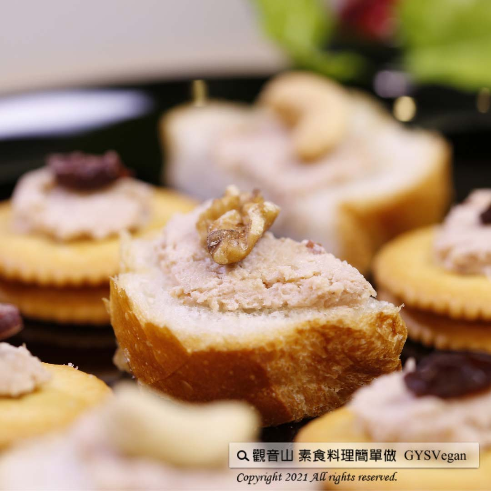

# 素火腿慕斯醬(素鵝肝醬)

## 📋 基本資訊 / Recipe Overview
- **料理名稱**：素火腿慕斯醬(素鵝肝醬)
- **原始標題**：素火腿慕斯醬(素鵝肝醬) ｜奶素
- **素食流派 / Diet**：奶素 Lacto-Vegetarian
- **來源平台 / Source**：[觀音山 · 素食料理簡單做](https://vegan.gys.org.tw/%e7%b4%a0%e7%81%ab%e8%85%bf%e6%85%95%e6%96%af%e9%86%ac%e7%b4%a0%e9%b5%9d%e8%82%9d%e9%86%ac-%e5%a5%b6%e7%b4%a0/)

## 📖 食譜圖文詳情 (中英雙語對照)

觀音山蔬食館主廚用純素食材，創造出比法國??三大珍貴美食之一鵝肝醬更美味的✨素食鵝肝醬✨‼️​
口感綿細柔滑，滋味香醇鮮美餘韻悠長，洋溢著濃郁的鹹香，非常迷人，再準備一些餅乾?和麵包?，你就會愛上這不可不嚐的珍饈~​
趕快告訴身邊的朋友們這道美味可口?、健康又愛護動物?♥️的法式料理，在家就能簡單製作~還在等什麼呢??​
​
?準備食材與佐料：​
素火腿150克、鮮奶油100ml、堅果30克、花生醬20克、黑胡椒粒適量、鹽適量、糖適量​
​
?＃素食料理簡單做，開始：​
1. 素火腿切片煎熟，待冷卻，備用。​
2. 將所有的食材放入食物調理機中，均勻攪碎。​
3. 再將混和的食材放入碗中，輕輕拌勻即可。​
​
這道簡單又美味的料理就完成了~~~?​
​
特別說明：​
醬料未食用完畢，可以冷藏保存。?​
​
?‍?本食譜提供：台中 #觀音山蔬食館 主廚 淨雅​
​
✨慈悲的 龍德上師成立「觀音山蔬食館」提倡健康素食、慈悲護生，以”觀音山素食料理簡單做”的理念，提供多款素食食譜，讓您一學就會！?​
​
​
?觀音山 素食料理簡單做 ​ Follow us?​
Facebook ｜好文按讚
http://www.facebook.com/GYSVegan​
Instagram ｜料理追蹤
http://www.instagram.com/gysvegan/​
Youtube ​ ​ ​ ｜加入訂閱
https://reurl.cc/q8VEqy​
Telegram ​ ｜頻道推薦
https://t.me/GYSVegan​
​
​
? 歡迎轉載，請註明出處： ​ ​ 觀音山 素食料理簡單做GYSVegan按讚、留言設定搶先看! 素食環保愛地球，健康營養無負擔，慈悲護生一起來~?

---
*食譜歸檔時間：2026-08-20 · 來源：觀音山素食料理簡單做 (vegan.gys.org.tw)*