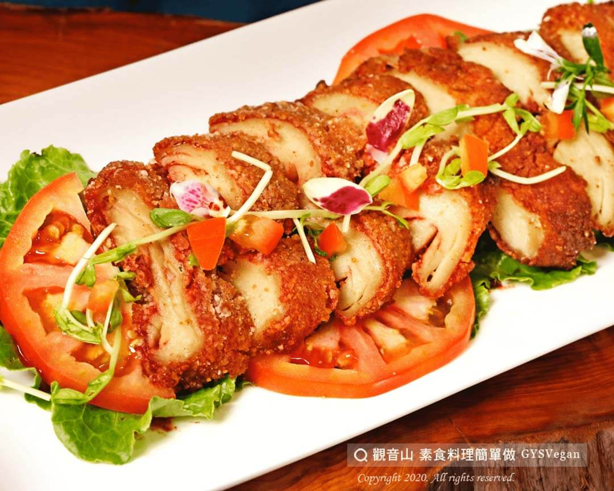

# 素紅槽燒肉

## 📋 基本資訊 / Recipe Overview
- **料理名稱**：素紅槽燒肉
- **原始標題**：素紅槽燒肉｜全素
- **素食流派 / Diet**：全素 Vegan
- **料理分類 / Category**：家常料理
- **來源平台 / Source**：[觀音山 · 素食料理簡單做](https://vegan.gys.org.tw/%e7%b4%a0%e7%b4%85%e6%a7%bd%e7%87%92%e8%82%89%ef%bd%9c%e5%85%a8%e7%b4%a0/)

## 📖 食譜圖文詳情 (中英雙語對照)

吃起來酥酥香香的素紅糟肉，表面紅紅的色澤就讓人看了食欲大增！
彷彿回到記憶中的古早味，以紅糟作為調味，醃製過後香氣裹上粉，炸成酥脆的幸福滋味。
快跟著觀音山主廚，一起素食料理簡單做吧！​
​
?食材及佐料〔Ingredients〕：(3人份)​
▪麵腸3條​
▪紅槽1大匙​
▪胡椒粉少許​
▪糖1湯匙​
▪麻油1湯匙​
▪地瓜粉100克​
​
?烹飪步驟：​
1.將麵腸切半。​
2.取胡椒粉、糖、麻油、紅槽攪拌後，將麵腸放入醃製，至少1個晚上。​
3.取出醃製麵腸，裹地瓜粉。​
4.放入油鍋油炸，約3分鐘後起鍋，擺盤完成！​
​
??本食譜提供：台中 #觀音山蔬食館 主廚 樂卿​​
​
✨慈悲的 龍德上師成立「觀音山蔬食館」提倡健康素食、慈悲護生，以”觀音山素食料理簡單做”的理念，提供多款素食食譜，讓您一學就會！?​
​
​
?觀音山 素食料理簡單做 ​ Follow us?​
Facebook ｜好文按讚
http://www.facebook.com/GYSVegan
​
Instagram ｜料理追蹤
http://www.instagram.com/gysvegan/​
Youtube ​ ​ ​ ｜加入訂閱
https://reurl.cc/q8VEqy
​
Telegram ​ ｜頻道推薦
https://t.me/GYSVegan​
​
​
? 歡迎轉載，請註明出處： ​ ​ 觀音山 素食料理簡單做GYSVegan按讚、留言設定搶先看! 素食環保愛地球，健康營養無負擔，慈悲護生一起來~?

---
*食譜歸檔時間：2026-08-20 · 來源：觀音山素食料理簡單做 (vegan.gys.org.tw)*