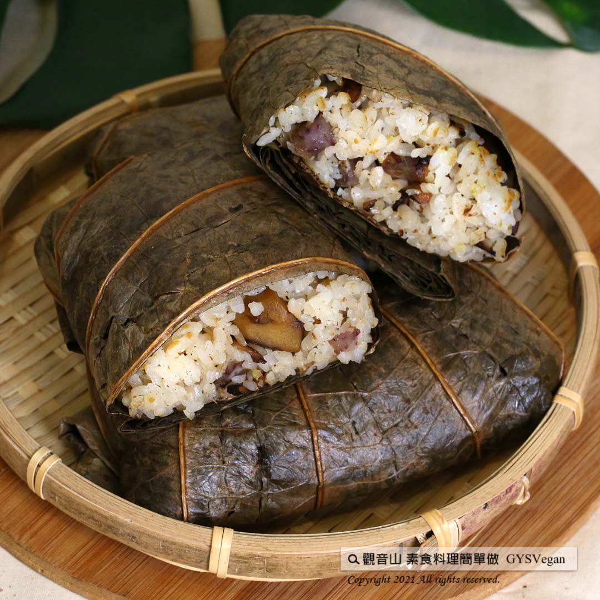

# 素荷葉蒸飯

## 📋 基本資訊 / Recipe Overview
- **料理名稱**：素荷葉蒸飯
- **原始標題**：電鍋料理｜素荷葉蒸飯｜全素
- **素食流派 / Diet**：全素 Vegan
- **料理分類 / Category**：主食種類 / 米麵主食 (Staple Food)
- **來源平台 / Source**：[觀音山 · 素食料理簡單做](https://vegan.gys.org.tw/37lotus-leaf20211029/)

## 📖 食譜圖文詳情 (中英雙語對照)

掀開荷葉，撲鼻而來的清香，將各種食材的精華保留在其中，「蒸」的很養生，入口的蒸飯充滿荷葉的香氣，一道米食「電鍋料理」輕鬆上手，讓家人吃到天然與健康，快跟著觀音山主廚，一起素食料理簡單做吧！​
​
?食材及佐料〔Ingredients〕：(3人份)​
▪️白飯 ​ 3碗 ​ ​ ​ ​ ​ ​
▪️芋頭 ​ 150克​
▪️乾香菇 ​ 20克​
▪️薑末 ​ 30克​
▪️素肉燥 ​ 適量​
▪️熟栗子 ​ 10顆​
▪️荷葉 ​ 3張​
▪️鹽、糖、胡椒粉 ​ 適量​
​
?烹飪步驟：​
1.芋頭洗淨切1公分丁，過油備用。​
2.乾香菇切絲爆香，荷葉泡軟後洗淨，備用。​
3.將白飯、芋頭、乾香菇、薑末、栗子、糖、鹽、胡椒粉、素肉燥，混和拌勻。​
4.用荷葉將做法3.的食材包起來。​
5.放入電鍋蒸大約20分鐘。​
6.起鍋擺盤即可享用！​
​
【特別說明】​
素肉燥是採買現成已調味。​
​
??本食譜提供：台中觀音山蔬食館 ​
​
✨慈悲的 龍德上師成立「觀音山蔬食館」提倡健康素食、慈悲護生，以”觀音山素食料理簡單做”的理念，提供多款素食食譜，讓您一學就會！?​
​
​
★10月7日~12月4日 ​ 佛陀天降月：善惡業增長10億倍​
​
✨殊勝功德增長日✨​
觀音山邀請您於10月7日~12月4日，響應素食、廣修供養、戒殺護生、誦經修法、行持諸種善行，獲福無量。​
​
【recipe】​
​
? Unwrapping the lotus leaves, tangy fragrance comes out right away. Steaming is ​ a very healthy cooking style. Lotus leaves keep the essence of various ingredients in it and its special aroma blended in rice. This is an easy rice cooker dish that the whole family can enjoy nutritious and healthy food. Quickly follow the chef of Guanyinshan, let’s cook simple vegetarian dishes together! ​ ​
?Ingredients : （For 3 people）​
▪️Three bowls of rice ​ ​ ​ ​ ​ ​ ​
▪️Taro ​ 150g​
▪️Dried shiitake mushrooms ​ 20g​
▪️Minced ginger ​ 30g​
▪️Dried vegetarian minced meat ​ ​ , adequate amount​
▪️Ten chestnuts ​ ​
▪️Three lotus leaves ​ ​
▪️Salt、Sugar、Pepper ​ , adequate amount​
​
?Instructions:​
【Cooking Steps】​
1. Wash the taro, cut into 1 cm dice, fry it and set aside. ​
2. Shred dried shiitake mushrooms and saute until fragrant, soak the lotus leaves to soften, wash, and set aside. ​
3. Mix rice, taro, dried shiitake mushrooms, minced ginger, chestnuts, sugar, salt, pepper, and dried vegetarian minced meat. ​
4. Wrap all the ingredients from step 3 in lotus leaves. ​
5. Put the stuffed lotus leaf wraps in a rice cooker and steam for about 20 minutes. ​
6. Garnish and enjoy! ​ ​
​
[Special notes] ​
This recipe uses ready-made and sseasoned vegetarian minced meat. ​
​
??This recipe is provided by #Guanyinshan Green Restaurant, Taichung.​
​
​
? 觀音山 素食料理簡單做 ​?
Facebook ｜好文按讚
http://www.facebook.com/GYSVegan​
Instagram ｜料理追蹤
http://www.instagram.com/gysvegan/​
Youtube ｜加入訂閱
https://reurl.cc/q8VEqy​
Telegram ｜頻道推薦
https://t.me/GYSVegan​
​
​
—​
?歡迎轉載，請註明出處： 觀音山 素食料理簡單做 GYSVegan 素食環保愛地球，健康營養無負擔，慈悲護生一起來~?

---
*食譜歸檔時間：2026-08-20 · 來源：觀音山素食料理簡單做 (vegan.gys.org.tw)*