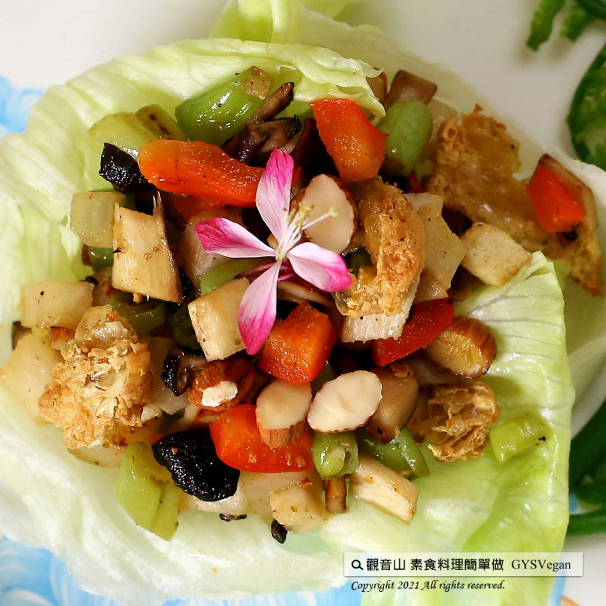

# 素萵苣蝦鬆

## 📋 基本資訊 / Recipe Overview
- **料理名稱**：素萵苣蝦鬆
- **原始標題**：素萵苣蝦鬆｜全素
- **素食流派 / Diet**：全素 Vegan
- **來源平台 / Source**：[觀音山 · 素食料理簡單做](https://vegan.gys.org.tw/shrimp-floss20210820/)

## 📖 食譜圖文詳情 (中英雙語對照)

萵苣的脆甜，包裹著豐富的食材，兼具營養與口感，入口咀嚼時，酥脆香鹹的各種風味在口中散開，繽紛的顏色很適合當宴客菜，快跟著觀音山主廚，一起素食料理簡單做吧！​
​
?食材及佐料〔Ingredients〕：(5人份)​
▪西生菜 ​ 1顆​
▪杏鮑菇 ​ 150克​
▪乾香菇 ​ 30克​
▪豆薯、四季豆、竹筍 ​ 各100克​
▪紅椒 ​ 50克​
▪豆包 ​ 2片 ​ ​
▪熟杏仁片 、孜然粉、鹽、糖 ​ 適量​
​
?烹飪步驟：​
【刀工/前處理】​
1. 杏鮑菇，切0.3公分丁，炸至金黃色，備用。​
2.豆薯去皮、四季豆川燙、竹筍水煮熟、乾香菇、紅椒、以上食材切0.3公分丁，備用。​
3.豆包2片，攤開後炸酥稍微捏碎。​
4.西生菜洗淨，泡冰水冰鎮約10分鐘後瀝乾，剝成大片狀，備用。​
​
【調理作法】​
1 .素蝦鬆製作：乾香菇爆香，加入杏鮑菇、四季豆、紅椒、竹筍拌炒，再加入豆薯略炒。​
2. 加入適量鹽、糖、孜然粉，拌炒均勻。​
3. 生菜2-3片重疊像碗狀，將素蝦鬆盛裝在生菜上，灑上杏仁片、豆包酥即可享用。​
​
​
??本食譜提供：台中  觀音山蔬食館 主廚 淨雅​
​
​
✨慈悲的 龍德上師成立「觀音山蔬食館」提倡健康素食、慈悲護生，以”觀音山素食料理簡單做”的理念，提供多款素食食譜，讓您一學就會！?
​
​
★8月21日 賢劫千佛節日：善惡業增長10萬倍​
​
✨殊勝功德增長日✨​
觀音山邀請您於8月21日 響應素食、廣修供養、戒殺護生、誦經修法、行持諸種善行，獲福無量。​
​
​
【recipe】​
​
? Lettuce is crisp and sweet, while wrapped in various ingredients, it’s nutritious and delicious. This vegetarian lettuces wraps is flavors and the fragrance spreads out in your mouth right away. It’s colorful colors makes it very suitable for putting on banquet menu too. Quickly follow the chef of Guanyinshan. Let’s cook simple vegetarian dish together.​
​
?Instructions:​
【Cutting/PREP-Ahead】​
1. Dice King oyster mushrooms into 0.3 cm, deep-fried until golden brown, set aside.​
2. Peel yam bean, blanch string beans, boil bamboo shoots in water, cut dried shiitake mushrooms, red peppers into 0.3 cm and set aside.​
3. Take 2 pieces of bean curd to spread out and fry them slightly. Then crush into small pieces.​
4. Wash lettuce, soak it in ice water for about 10 minutes, then drain it, peel it into large slices, and set aside.​
​
【Cooking Steps】​
1. Vegetarian wrap filling：Saute the dried shiitake mushrooms, add king oyster mushrooms, string beans, red pepper, bamboo shoots, stir fry, then add yam bean and stir-fry for a while.​
2. Add appropriate amount of salt, sugar and cumin powder, stir and fry evenly.​
3. Overlap 2-3 slices of lettuce into a bowl. Put the filling in the lettuce, sprinkle sliced almonds and crushed fried bean curd on it and enjoy.​
​
??This recipe is provided by chef Jing Ya, Taichung # ​ Guanyinshan Green Restaurant​
​
​
? 觀音山 素食料理簡單做 ?
Facebook ｜好文按讚
http://www.facebook.com/GYSVegan​
Instagram ｜料理追蹤
http://www.instagram.com/gysvegan/​
Youtube ｜加入訂閱
https://reurl.cc/q8VEqy​
Telegram ｜頻道推薦
https://t.me/GYSVegan​
​
​
—​
? 歡迎轉載，請註明出處： 觀音山 素食料理簡單做 GYSVegan 素食環保愛地球，健康營養無負擔，慈悲護生一起來~?

---
*食譜歸檔時間：2026-08-20 · 來源：觀音山素食料理簡單做 (vegan.gys.org.tw)*