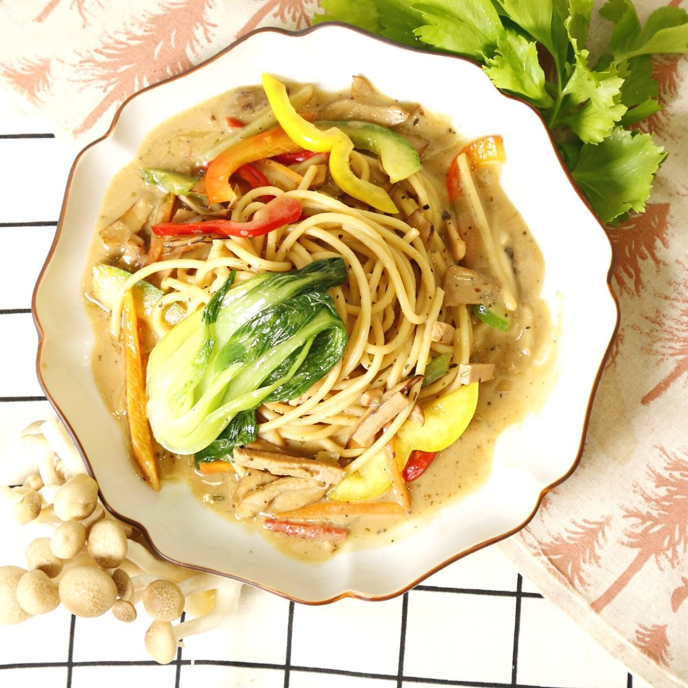

# 素起司時蔬義大利麵

## 📋 基本資訊 / Recipe Overview
- **料理名稱**：素起司時蔬義大利麵
- **原始標題**：義式料理 ｜素起司時蔬義大利麵｜全素
- **素食流派 / Diet**：全素 Vegan
- **料理分類 / Category**：主食種類 / 米麵主食 (Staple Food)
- **來源平台 / Source**：[觀音山 · 素食料理簡單做](https://vegan.gys.org.tw/vegetable-pasta20230331/)

## 📖 食譜圖文詳情 (中英雙語對照)

義式料理 ★素起司時蔬義大利麵★全素
豆腐乳與燕麥奶為醬底，搭配軟硬適中的義大利麵條，碰撞出絕妙的滋味；蔬菜、菇類豐盛的配料組合，傳統熟悉的香濃，意外融洽的口感，絕對讓你眼睛一亮，想要學會創意台式風味的異國料理嗎？快跟著觀音山主廚，一起素食料理簡單做吧！
​
​ ​
食材及佐料〔Ingredients〕：(5人份)
▪️義大利麵 ​ ​ ​ ​ 1包
▪️豆腐乳 ​ ​ ​ ​ 1.5顆
▪️甜椒 ​ ​ ​ ​ ​ ​ ​ ​ ​ ​ 2
▪️西洋芹 ​ ​ ​ ​ ​ ​ 3支
▪️素火腿 ​ ​ ​ ​ ​ 70克
▪️鮮香菇 ​ ​ ​ ​ 100克
▪️燕麥奶、水、沙拉油 ​ ​ 適量
▪️糖、鹽、粗黑胡椒粉、義式香草 ​ ​ 適量
​ ​
​
烹飪步驟：
【刀工/前處理】
1.義大利麵滾水加鹽，放入麵條煮約6-7分鐘(約8分熟)，瀝乾水分拌少許油放涼，備用。
2.豆腐乳加入少許水，拌勻成腐乳醬，備用。
3.甜椒去籽切條。
4.西洋芹去除粗纖維，切絲。
5.鮮香菇切片。
​
【調理作法】
1.炒鍋加熱倒入油，加入鮮香菇、素火腿炒香，加入西洋芹、甜椒略炒，加入調味料(粗黑胡椒粉、義式香草、腐乳醬)炒勻，倒入燕麥奶、水(燕麥奶:水=2:1)煮滾。
2.放入義大利麵拌勻略煮收汁，最後調味(糖 、鹽)即可
​
【特別說明】
1.可依喜好調整義大利麵、蔬菜種類。
​
​
本食譜提供：台中觀音山蔬食館
​
​ ​
​
▌慈悲的龍德上師 成立「觀音山蔬食館」提倡健康素食、慈悲護生，以”觀音山素食料理簡單做”的理念，提供多款素食食譜，讓您一學就會！
​
觀音山相關連結
➠
https://www.fazang.org/link/
​ ​
​
─────────────
3月31日 欣逢 苦行月．蓮師節日
★善惡業增長1000*10萬倍★
─────────────
▌觀音山近期活動
4月1日 三寶總集薈供法會
✦登記「除障祿位 / 超薦蓮位」
https://bit.ly/3HXmCO7
✦護持「薈供供品」供養三寶
https://bit.ly/3bHzJ8H
​ ​
Italian cuisine Vegetarian pasta with cheese and vegetables✦Vegetarian
Fermented bean curd and oat milk as the sauce base, paired with moderately soft and hard Italian noodles, collide with a wonderful taste; the rich ingredients combination of vegetables and mushrooms, the traditional and familiar fragrant flavor, and the unexpectedly harmonious taste will make your eyes dazzle ​ Liang, do you want to learn creative Taiwanese-style exotic cuisine? ​ Follow Chef Guanyinshan, and let’s create simple vegetarian dishes together!
​
​ ​
​ Ingredients and condiments [Ingredients]: (5 servings)
Pasta 1 pack
Tofu curd 1.5 pieces
Two bell peppers
Three stalks celery
Vegetarian ham 70g
Fresh shiitake mushrooms 100g
Oat milk, water, salad oil, the appropriate amount
Sugar, salt, coarse black pepper, Italian vanilla, the fair amount
​ ​
​
Cooking steps:
【Knife/Pretreatment】
1. Boil the pasta noodles with salt, put in the noodles, and cook for about 6-7 minutes (about 8 minutes cooked); drain the water and mix with a bit of oil, let cool, and set aside.
2. Add a little water to fermented bean curd, mix well to form fermented bean curd sauce, and set aside.
3. Deseeded bell pepper and cut into strips.
4. Remove the coarse fiber from the celery and shred it.
5. Sliced fresh shiitake mushrooms.
​
[conditioning method]
1. Heat the frying pan and pour in the oil. Add fresh mushrooms and vegetarian ham and sauté until fragrant; add celery and bell pepper and fry for a while; add seasonings (coarse black pepper, Italian herbs, fermented bean curd sauce) and stir well, pour in oat milk, Water (oat milk: water = 2:1) to boil.
2. Put in the pasta, mix well, cook for a while to collect the juice, and finally season (sugar, salt)
​
【Special Note】
1. You can adjust the types of pasta and vegetables according to your preferences.
​
​
This recipe is provided by: Taichung ​ ​ Guanyinshan Vegetable Restaurant
​ ​
—
歡迎轉載，請註明出處： 觀音山素食料理簡單做 GYSVegan 素食環保愛地球，健康營養無負擔，慈悲護生一起來~

---
*食譜歸檔時間：2026-08-20 · 來源：觀音山素食料理簡單做 (vegan.gys.org.tw)*