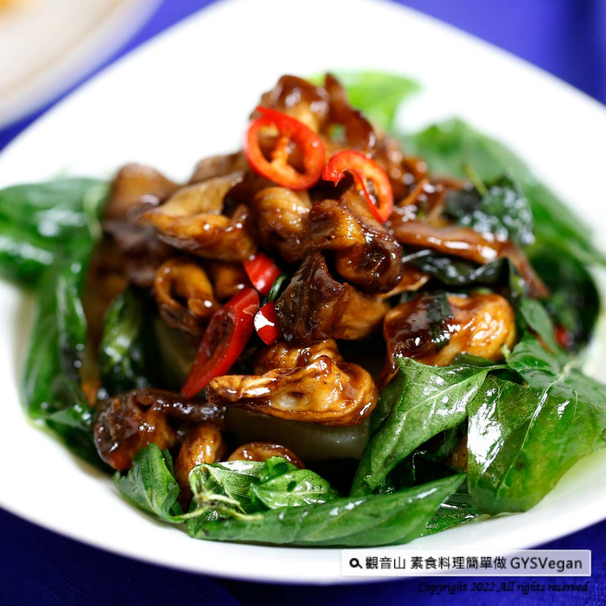

# 素食塔香三杯脆腸

## 📋 基本資訊
- **料理名稱**：素食塔香三杯脆腸
- **素食流派**：全素 Vegan
- **來源平台**：[觀音山 · 素食料理簡單做](https://vegan.gys.org.tw/three-cup-king-oyster-mushrooms20220114/)

## 📖 食譜圖文詳情 (中英雙語)

將杏鮑菇絲入鍋油炸，使其緊縮有彈性，混合老薑片、麻油、醬油、花椒粉快炒，口感香脆美味，每一口都充滿迷人的九層塔香氣，絕對令人驚豔！輕鬆掌握五星級蔬食料理，快跟著觀音山主廚，一起素食料理簡單做吧！​
​
◎食材及佐料〔Ingredients〕：(3人份)​
▪️杏鮑菇 ​ 4條 ​ ​ ​ ​ ​ ​
▪️老薑 ​ 1塊 ​ ​ ​ ​
▪️辣椒 ​ 1條 ​
▪️九層塔、麻油 ​ 適量 ​ ​ ​ ​
▪️醬油 ​ 1大匙 ​ ​ ​ ​ ​ ​
▪️糖 ​ 1小匙 ​ ​
▪️胡椒粉、花椒粉、油 ​ 適量​
▪️水 ​ 100c.c​
​
◎烹飪步驟：​
【刀工/前處理】​
1.杏鮑菇手撕成一條一條，水滾後放入杏鮑菇，燙15秒左右撈起。​
2.薑、辣椒切片。​
3.脆腸:牙籤串杏鮑菇（杏鮑菇繞8串）。​
​
【調理作法】​
1.脆腸(串好的杏鮑菇)入鍋油炸使其緊縮有彈性，顏色呈金黃色撈起後放涼，取下牙籤裝盤。​
2.開小火，倒入麻油爆香老薑片。​
3.放入脆腸(炸好的杏鮑菇)大火快炒，加入辣椒。​
4.炒香後加入醬油、糖、胡椒粉、花椒粉，快炒。​
5.加入100cc水，醬汁快收乾時，放入九層塔大火快炒，醬汁整個收乾後，裝盤即可享用!​
​
本食譜提供：台中觀音山蔬食館​
​
✨慈悲的龍德上師 成立「觀音山蔬食館」提倡健康素食、慈悲護生，以”觀音山素食料理簡單做”的理念，提供多款素食食譜，讓您一學就會！
​
​
【recipe】​
​
Fried & shredded king oyster mushrooms tastes crunchy and springy. The savory sauce mixed by old ginger, sesame oil, soy sauce, and pepper powder creates a very satisfying and flavorful tastes to the mushrooms. It’s crispy and delicious. Each bite is full of the fragrance of basil. Skip the restaurant and make your own classic Taiwanese home-style cooking at home. Follow the chef of Guanyinshan, and make vegetarian dishes together!​
​
◎Ingredients : (For 3 people)​
▪️Four king oyster mushrooms ​ ​ ​ ​ ​ ​
▪️A piece of ginger ​ ​ ​
▪️A chili ​
▪️Basil、Sesame oil ​ , adequate amount ​ ​ ​ ​ ​ ​
▪️Soy sauce ​ 1 tbsp ​ ​ ​ ​ ​ ​
▪️Sugar ​ 1tsp ​ ​
▪️Pepper、Pricklyash powder、Oil ​ , adequate amount ​ ​
▪️Water ​ 100c.c​
​
◎ Instructions:​
【Cutting/ PREP-Ahead】​
1. Tear the king oyster mushrooms into strips by hand, and blanch for about 15 seconds and drain.​
2. Slice ginger and chili.​
3. Crispy skewers: Thread king oyster mushrooms on skewers (around 8 skewer of king oyster mushrooms). ​
​
【Cooking Steps】​
1. Crispy skewers (stringed king oyster mushrooms): deep-fried in a pot until golden brown to make them crispy and springy. Set aside to cool & remove the skewers, and then place on a plate.​
2. Turn on a low heat, pour in the sesame oil and saute the ginger slices until fragrant.​
3. Put in the crispy skewers (fried king oyster mushrooms) and stir-fry quickly over high heat, add peppers.​
4. Add soy sauce, sugar, pepper powder, pepper powder and stir fry quickly.​
5. Add 100cc of water to cook. When the sauce is almost thicken and king oystery mushrooms glazed, put basil in and fry quickly. When the sauce is completely dry, it’s time to dish up and enjoy!​
​
This recipe is provided by: Chef Jing Ya, Taichung Guanyinshan Green Restaurant​
​
​
觀音山 素食料理簡單做
◎Facebook ｜好文按讚​
http://www.facebook.com/GYSVegan​
​
◎lnstagram ｜料理追蹤​
http://www.instagram.com/gysvegan/​
​
◎Youtube ｜加入訂閱​
https://reurl.cc/q8VEqy​
​
◎Telegram ｜頻道推薦​
https://t.me/GYSVegan​
​
—​
歡迎轉載，請註明出處： 觀音山 素食料理簡單做 GYSVegan 素食環保愛地球，健康營養無負擔，慈悲護生一起來~

---
*食譜歸檔時間：2026-08-20 · 來源：觀音山素食料理簡單做 (vegan.gys.org.tw)*