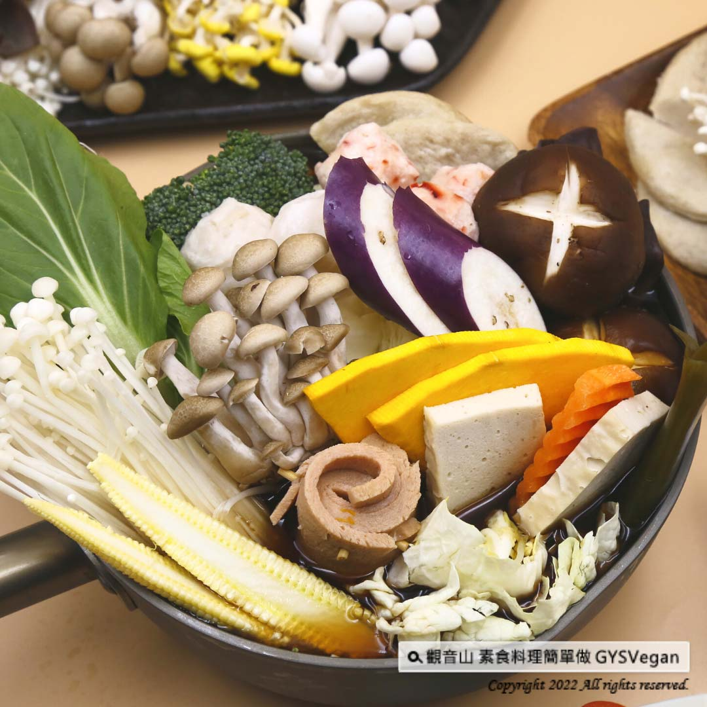

# 素食湯底系列 日式素食壽喜燒湯底

## 📋 基本資訊 / Recipe Overview
- **料理名稱**：素食湯底系列 日式素食壽喜燒湯底
- **原始標題**：素食湯底系列｜日式素食壽喜燒湯底 ｜全素
- **素食流派 / Diet**：全素 Vegan
- **料理分類 / Category**：湯品系列
- **來源平台 / Source**：[觀音山 · 素食料理簡單做](https://vegan.gys.org.tw/sukiyak20220228/)

## 📖 食譜圖文詳情 (中英雙語對照)

濃郁湯頭的壽喜燒，帶著濃濃昆布的香氣，暖心又暖胃，經由觀音山主廚絕佳的湯底調味，只要加入喜愛的火鍋食材，就能輕輕鬆鬆在家品嘗溫暖的鍋物，快跟著觀音山主廚，一起素食料理簡單做吧！​
​
?食材及佐料〔Ingredients〕：(2人份)​
▪️昆布或海帶 ​ 1 片​
▪️大鮮香菇 ​ 2朵 ​
▪️大白菜 ​ 200克​
▪️薄鹽醬油、味醂 ​ 各100cc​
▪️砂糖 ​ 20克​
▪️水 ​ 1200cc​
​
?烹飪步驟：​
【刀工/前處理】​
1.鮮香菇切片。​
2.大白菜切粗絲。​
​
【調理作法】​
1.鮮香菇不加油炒香，炒至上色，起鍋裝盤。​
2.鍋內加入大白菜、炒過的香菇、昆布、水、醬油、味醂及砂糖，煮滾。​
3.煮滾後轉中小火，煮約10分鐘，即可依序放入自己喜歡的火鍋食材。​
​
【特別說明】​
1.各品牌醬油鹹度不同，可依個人喜好調整醬油比例。​
2.湯底甜度可依個人喜好調整砂糖比例。​
​
??本食譜提供：台中觀音山蔬食館​
​
✨慈悲的 龍德上師成立「觀音山蔬食館」提倡健康素食、慈悲護生，以”觀音山素食料理簡單做”的理念，提供多款素食食譜，讓您一學就會！?​
【recipe】​
​
?The balancing sweetness and saltiness of this sukiyaki recipe could be your family favorite. The aroma of kelp blends in the sauce to cook with various ingredients. This one-pot wonder warms both your heart and stomach. Quickly follow the chef of Guanyinshan, let’s try this recipe together!
?Ingredients : （For 2 people）
▪️A piece of Kelp bud ​
▪️Two shiitake mushrooms ​
▪️Chinese cabbage ​ 200g​
▪️Lower sodium soy sauce、Mirin ​ 100cc​
▪️Sugar ​ 20g
▪️Water ​ 1200cc​
? Instructions:​
【Cutting/ PREP-Ahead】​
1. Slice fresh shiitake mushrooms.​
2. Cut the Chinese cabbage into thick shreds.​ ​
【Cooking Steps】​
1. Stir-fry sliced shiitake mushrooms without oil until fragrant and browned, and set aside.
2. Add Chinese cabbage, fried shiitake mushrooms, kelp, water, soy sauce, mirin and sugar to the pot, bring to a boil.​
3. After boiling, turn to medium-low heat and cook for about 10 minutes, then add your favorite hot pot ingredients.​ ​
【Special Notes】​
1. The saltiness of each brand of soy sauce is different, the proportion of soy sauce can be adjusted according to personal preference.​
2. The sweetness of the sauce can be adopted to your liking.​
??This recipe is provided by Taichung # Guanyinshan Vegetable Restaurant
​
​
? 觀音山 素食料理簡單做 ?​
◎Facebook ｜好文按讚​
http://www.facebook.com/GYSVegan​
​
◎lnstagram ｜料理追蹤​
http://www.instagram.com/gysvegan/​
​
◎Youtube ｜加入訂閱​
https://reurl.cc/q8VEqy​
​
◎Telegram ｜頻道推薦​
https://t.me/GYSVegan​
​
—​
?歡迎轉載，請註明出處： 觀音山 素食料理簡單做 GYSVegan 素食環保愛地球，健康營養無負擔，慈悲護生一起來~?

---
*食譜歸檔時間：2026-08-20 · 來源：觀音山素食料理簡單做 (vegan.gys.org.tw)*