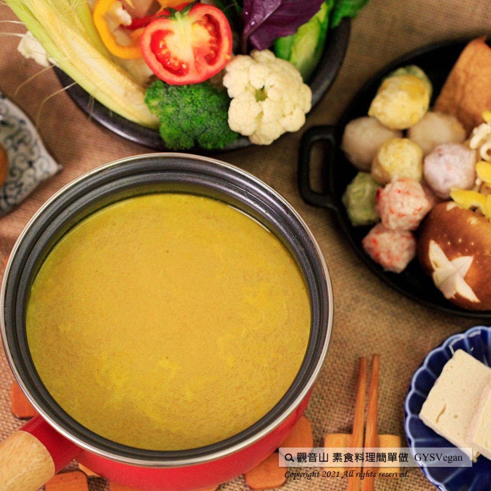

# 素食湯底系列 椰香咖哩鍋湯底 全素咖哩鍋湯底

## 📋 基本資訊 / Recipe Overview
- **料理名稱**：素食湯底系列 椰香咖哩鍋湯底 全素咖哩鍋湯底
- **原始標題**：素食湯底系列｜椰香咖哩鍋湯底 全素咖哩鍋湯底｜全素
- **素食流派 / Diet**：全素 Vegan
- **料理分類 / Category**：湯品系列
- **來源平台 / Source**：[觀音山 · 素食料理簡單做](https://vegan.gys.org.tw/coconut-curry-soup-base220516/)

## 📖 食譜圖文詳情 (中英雙語對照)

椰漿的香醇與滑順的咖哩香氣融合，光聞到味道就讓人食指大動，鮮甜的口感在唇齒之間停留，加入當令蔬菜等食材，就是一道滿滿南洋風味的料理，不需要熬煮即可快速完成，快跟著觀音山主廚，一起素食料理簡單做吧！​
​
◎食材及佐料〔Ingredients〕：(3人份)​
▪️咖哩塊 ​ 80克 ​
▪️水 ​ 1000cc ​ ​
▪️椰漿 ​ 1罐​
▪️全素奶油 ​ 適量​
▪️孜然粉 ​ 適量​
​
◎烹飪步驟：​
【調理作法】​
1.湯鍋加入水1000cc，煮沸後加入咖哩塊、椰漿，充分攪拌融化後煮滾。​
2.最後加入適量的奶油、孜然粉提味，椰香咖哩鍋湯底完成！可加入喜愛的火鍋食材烹煮。​
​
【特別說明】​
咖哩塊濃淡比例，可以依個人喜好調整。​
​
◎本食譜提供：台中 觀音山蔬食館​
​
✨慈悲的 龍德上師 成立「觀音山蔬食館」提倡健康素食、慈悲護生，以”觀音山素食料理簡單做”的理念，提供多款素食食譜，讓您一學就會！😊​
​
​
★5月16日 無量光佛節日：善惡業增長1百萬x 1萬倍​
​
✨殊勝功德增長日✨​
觀音山邀請您於今日響應素食、廣修供養、戒殺護生、誦經修法、行持諸種善行，獲福無量。​
​
​
「觀音山 社群」一鍵快速前往觀音山 官方相關連結！​
➠
https://www.fazang.org/link/​
​
​
【recipe】​
​
📖Mellow coconut milk combining with smooth taste of curry, the fragrance is really attempting. The fresh and sweet taste lingers between the lips and teeth. Just adding seasonal vegetables and other ingredients, it is a dish full of Nanyang flavor. Cooking can be done easily, follow the chef of Guanyinshan, and let’s cook simple vegetarian dishes together.​
​
◎Ingredients : （For 3 people）​
▪️Curry cubes ​ ​ 80g ​
▪️Water ​ 1000cc ​ ​
▪️A can of coconut Cream ​
▪️Vegan butter ​ ​ , adequate amount​
▪️Cumin powder ​ , adequate amount​
​
◎ Instructions:​
【Cutting/ PREP-Ahead】​
1. Add 1000cc of water to a tall pot, bring to a boil. Then, add in curry cubes and coconut milk, stir well to melt and bring to a boil.​
2. Finally, add an appropriate amount of butter and cumin powder to enhance the flavor. This coconut curry soup base is completed! You can add your favorite hot pot ingredients to cook along.​
​
【Special Notes】​
The thickness of curry in the soup can be adjusted according to personal preference.​
​
◎This recipe is provided by: Taichung Guanyinshan Green Restaurant​
​
​
🌱 觀音山 素食料理簡單做 🌱​
◎Facebook ｜好文按讚​
https://www.facebook.com/GYSVegan​
​
◎Instagram ｜料理追蹤​
https://www.instagram.com/gysvegan/​
​
◎Youtube ​ ​ ​ ｜加入訂閱​
https://reurl.cc/q8VEqy​
​
◎官方Blog ​ ​ ｜網站推薦​
https://vegan.gys.org.tw/​
​
​
—​
👑歡迎轉載，請註明出處： 觀音山 素食料理簡單做 GYSVegan 素食環保愛地球，健康營養無負擔，慈悲護生一起來~🥰

---
*食譜歸檔時間：2026-08-20 · 來源：觀音山素食料理簡單做 (vegan.gys.org.tw)*