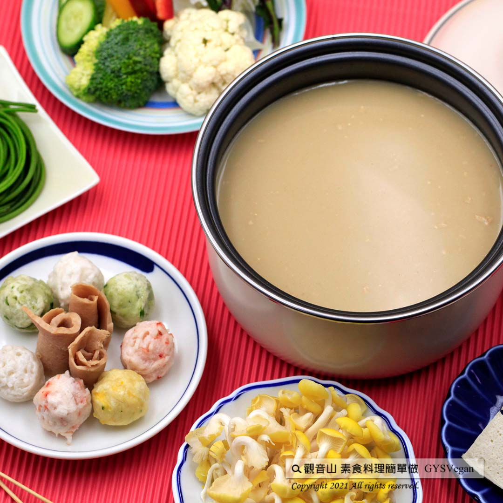

# 素食湯底系列 燕麥奶鍋湯底

## 📋 基本資訊 / Recipe Overview
- **料理名稱**：素食湯底系列 燕麥奶鍋湯底
- **原始標題**：素食湯底系列｜燕麥奶鍋湯底｜全素
- **素食流派 / Diet**：全素 Vegan
- **料理分類 / Category**：湯品系列
- **來源平台 / Source**：[觀音山 · 素食料理簡單做](https://vegan.gys.org.tw/oat-milk-soup-base20220506/)

## 📖 食譜圖文詳情 (中英雙語對照)

一年一度的母親節，表達對媽媽的愛，換你做飯給媽媽吃！燕麥奶有豐富膳食纖維、降膽固醇、友善環境等好處，加上蔬食館主廚精心調配，獨特香氣撲鼻、口感滑順，快速學會減碳愛地球的好料理，讓媽媽過個健康又溫馨的母親節，快跟著觀音山主廚，一起素食料理簡單做吧！​
​
◎食材及佐料〔Ingredients〕：(3人份)​
▪️燕麥奶 ​ 600cc​
▪️味噌 ​ 15克​
▪️豆腐乳 ​ 20克​
▪️醬油 ​ 30cc ​
▪️水或蔬菜高湯 ​ 400cc​
​
◎烹飪步驟：​
【調理作法】​
1.將味噌、豆腐乳、醬油、燕麥奶、水，混和拌勻，加熱煮滾，湯底完成！！​
​
【特別說明】​
喜歡吃辣的朋友，可以在湯底加入素食麻辣醬，或者是辣椒醬。​
​
◎本食譜提供：台中觀音山蔬食館​
​
✨慈悲的龍德上師 成立「觀音山蔬食館」提倡健康素食、慈悲護生，以”觀音山素食料理簡單做”的理念，提供多款素食食譜，讓您一學就會！😊​
​
​
「觀音山 社群樹」一鍵快速前往觀音山 官方相關連結！​
➠
https://www.fazang.org/link/​
​
​
【recipe】​
​
📖An annual holiday, #Mother’s Day, is coming. To express your love for your mother how about prepared a healthy meal for your mother! Oat milk is rich in dietary fiber, lowers cholesterol, and environmental friendly. Coupled with this dedicated recipe by the chef of the green restaurant, this soup owns a unique aroma and a smooth taste. Come and learn this good soup that reduce carbon and love the earth. Let your mother have a healthy and warm Mother’s Day. Follow the chef of Guanyinshan and cook simple vegetarian dishes together! ​
​
◎Ingredients : （For 3 people）​
▪️Oat milk ​ 600cc​
▪️Miso ​ 15g​
▪️Fermented tofu ​ ​ 20g​
▪️Soy sauce ​ 30cc ​
▪️Water or vegetable stock ​ 400cc​
​
◎ Instructions:​
【Cutting/ PREP-Ahead】​
1. Mix miso, fermented bean curd, soy sauce, oat milk, and water, heat and bring to a boil, the soup base is complete! ! ​
​
【Special Notes】​
If you fancy spicy food can add vegetarian Mala sauce or chili sauce to the soup base.​
​
◎This recipe is provided by: Taichung #Guanyinshan Green Restaurant​
​
​
🌱 觀音山 素食料理簡單做 🌱​
◎Facebook ｜好文按讚​
https://www.facebook.com/GYSVegan​
​
◎Instagram ｜料理追蹤​
https://www.instagram.com/gysvegan/​
​
◎Youtube ​ ​ ​ ｜加入訂閱​
https://reurl.cc/q8VEqy​
​
◎官方Blog ​ ​ ｜網站推薦​
https://vegan.gys.org.tw/​
​
​
—​
👑歡迎轉載，請註明出處： 觀音山 素食料理簡單做 GYSVegan 素食環保愛地球，健康營養無負擔，慈悲護生一起來~🥰

---
*食譜歸檔時間：2026-08-20 · 來源：觀音山素食料理簡單做 (vegan.gys.org.tw)*