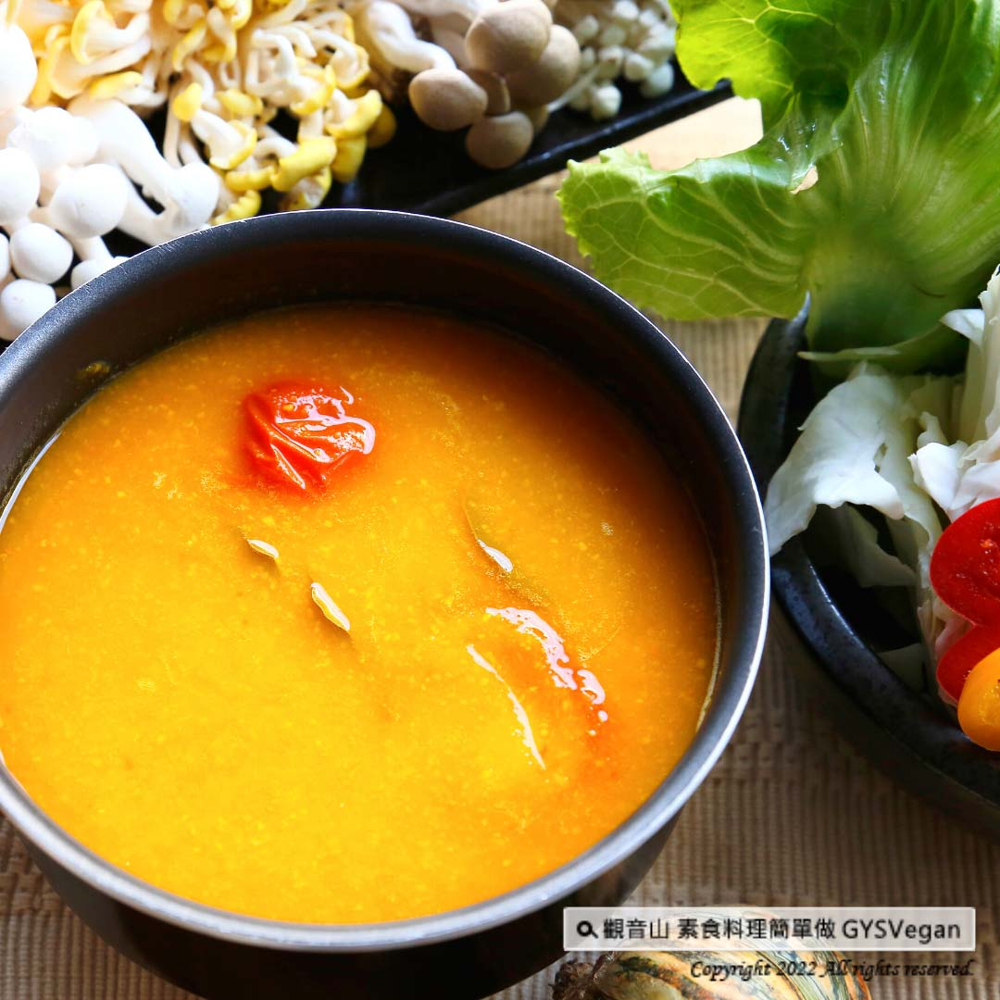

# 素食湯底系列 田園南瓜鍋湯底

## 📋 基本資訊 / Recipe Overview
- **料理名稱**：素食湯底系列 田園南瓜鍋湯底
- **原始標題**：素食湯底系列｜田園南瓜鍋湯底｜全素
- **素食流派 / Diet**：全素 Vegan
- **來源平台 / Source**：[觀音山 · 素食料理簡單做](https://vegan.gys.org.tw/pumpkin-soup-base20220311/)

## 📖 食譜圖文詳情 (中英雙語對照)

金黃色的湯頭，藏著抗氧化、高纖、低卡的超級食物—南瓜，濃密豐富的口感，讓你回味無窮，加入蔬菜及菇類等食材，絕對是養生最佳火鍋，快跟著觀音山主廚，一起素食料理簡單做吧！​
​
?食材及佐料〔Ingredients〕：(2-3人份)​
▪️南瓜 ​ 500克 ​
▪️蔬菜高湯或水 ​ 1000cc ​
▪️月桂葉 ​ 2片​
▪️牛番茄 ​ 1顆​
▪️鹽 ​ 適量​
▪️砂糖 ​ 適量 ​
​
?烹飪步驟：​
【刀工/前處理】​
1.南瓜去籽切塊蒸熟備用​
2.番茄切塊備用​
​
【調理作法】​
1.用果汁機將蒸熟的南瓜加入高湯，打勻。​
2.將做法1倒入湯鍋中，加入牛番茄、月桂葉，以中小火煮滾。用適量的鹽巴、砂糖調味，南瓜湯底即完成。​
​
??本食譜提供：台中觀音山蔬食館​
​
✨慈悲的 龍德上師成立「觀音山蔬食館」提倡健康素食、慈悲護生，以”觀音山素食料理簡單做”的理念，提供多款素食食譜，讓您一學就會！?​
​
​
★3月12日【神變節．蓮師成道紀念日、大成就者湯東佳波聖誕吉祥日】 善惡增長10萬X100倍​
​
✨殊勝功德增長日✨​
觀音山邀請您於3月12日響應素食、廣修供養、戒殺護生、誦經修法、行持諸種善行，獲福無量。​
​
​
【recipe】​
​
? This golden soup contains a super food with antioxidant, high fiber and low calorie-pumpkin. ​ It has a dense and rich taste which makes you have endless aftertastes. Adding vegetables, mushrooms and other ingredients is definitely the best hot pot soup base for health care. Follow Guanyinshan, let’s make vegetarian dishes together!​
​
?Ingredients : （For 2-3 people）​
▪️Pumpkin ​ 500g ​
▪️A beef tomato ​
▪️Salt ​ , adequate amount​
▪️Sugar ​ , adequate amount​
​
?Instructions:​
【Cutting/ PREP-Ahead】​
1. De-seed the pumpkin, cut into pieces and steam it for later use​
2. Tomato cut into pieces​
​
【Cooking Steps】​
1. Add the steamed pumpkin to the stock with a blender and process well.​
2. Pour step 1 into the soup pot, add beef tomatoes and bay leaves, bring to a boil over medium-low heat. Season with an appropriate amount of salt and sugar, and the pumpkin soup base is complete.​
​
??This recipe is provided by: TaichungGuanyinshan Green Restaurant​
​
​
? 觀音山 素食料理簡單做 ​?
◎Facebook ｜好文按讚​
http://www.facebook.com/GYSVegan​
​
◎lnstagram ｜料理追蹤​
http://www.instagram.com/gysvegan/​
​
◎Youtube ｜加入訂閱​
https://reurl.cc/q8VEqy​
​
◎Telegram ｜頻道推薦​
https://t.me/GYSVegan

---
*食譜歸檔時間：2026-08-20 · 來源：觀音山素食料理簡單做 (vegan.gys.org.tw)*