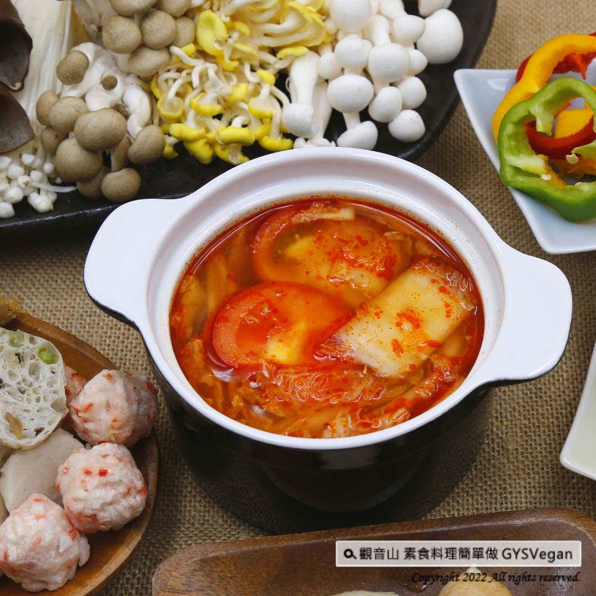

# 素食湯底系列 素食韓式泡菜鍋湯底

## 📋 基本資訊 / Recipe Overview
- **料理名稱**：素食湯底系列 素食韓式泡菜鍋湯底
- **原始標題**：素食湯底系列｜素食韓式泡菜鍋湯底｜全素
- **素食流派 / Diet**：全素 Vegan
- **料理分類 / Category**：湯品系列
- **來源平台 / Source**：[觀音山 · 素食料理簡單做](https://vegan.gys.org.tw/vegetarian-kimchi-pot-soup-base20220225/)

## 📖 食譜圖文詳情 (中英雙語對照)

想跟全家人一起共享韓式泡菜鍋嗎？酸、甜、鹽、辣的韓式泡菜豐富滋味，加入喜愛的火鍋食材與當季蔬果，開胃又下飯，熬出湯頭的自然鮮甜，快跟著觀音山主廚，一起素食料理簡單做吧！​
​
?食材及佐料〔Ingredients〕：(2人份)​
▪️全素韓式泡菜 ​ 200克 ​ ​
▪️水或蔬菜高湯 ​ 1200cc ​
▪️牛番茄 ​ 2顆​
▪️泰式冬蔭功醬 ​ 30克​
▪️砂糖、鹽 ​ 適量​
​
?烹飪步驟：​
【刀工/前處理】​
1.番茄切大塊。​
​
【調理作法】​
1.將泡菜、番茄、水、泰式冬蔭功醬放入鍋中，煮滾後，轉中小火繼續煮約10分鐘，最後試味道，加入適當的糖、鹽即完成湯底。​
2.加入喜歡的火鍋食材烹煮。​
​
【特別說明】​
1.泡菜醬汁也可以加入湯底中。​
2.泰式冬蔭功醬可以在超市、素料行採買。​
​
??本食譜提供：台中觀音山蔬食館​
​
✨慈悲的 龍德上師成立「觀音山蔬食館」提倡健康素食、慈悲護生，以”觀音山素食料理簡單做”的理念，提供多款素食食譜，讓您一學就會！?​
​
​
【recipe】​
​
?Wanna share a kimchi pot with the whole family? This sour, sweet, savory, and spicy Korean kimchi is a good choice! It’s rich in flavor, appetizing and delicious. By adding your favorite hot pot ingredients and seasonal vegetables, this recipe would be very hot for very one. Follow the chef of Guanyinshan to cook simple vegetarian dishes together!​
​
?Ingredients : （For 2 people）​
▪️Vegan Korean kimchi ​ 200g ​
▪️Water or vegetable stock ​ 1200cc ​
▪️Two beef tomatoes​
▪️Vegetarian tom yum paste ​ 30g​
▪️Sugar、Salt , adequate amount ​
​
?Instructions:​
【Cutting/ PREP-Ahead】​
1. Cut the tomato into large pieces. ​ ​
​
【Cooking Steps】​
1. Put kimchi, tomato, water and vegetarian tom yum paste in a pot, bring to a boil, turn to medium-low heat and continue to cook for about 10 minutes. Finally, taste and add appropriate sugar and salt to complete the soup base.​
2. Add your favorite hot pot ingredients to cook. ​ ​
​
【Special Notes】​
1. Kimchi sauce can also be added to the soup base.​
2. Vegetarian Tom Yum paste can be purchased in supermarkets and vegetarian shops.​
​
​
​
? 觀音山 素食料理簡單做 ?
◎Facebook ｜好文按讚​
http://www.facebook.com/GYSVegan​
​
◎lnstagram ｜料理追蹤​
http://www.instagram.com/gysvegan/​
​
◎Youtube ｜加入訂閱​
htt​ps://reurl.cc/q8VEqy
​
◎Telegram ｜頻道推薦​
https://t.me/GYSVegan
​

---
*食譜歸檔時間：2026-08-20 · 來源：觀音山素食料理簡單做 (vegan.gys.org.tw)*