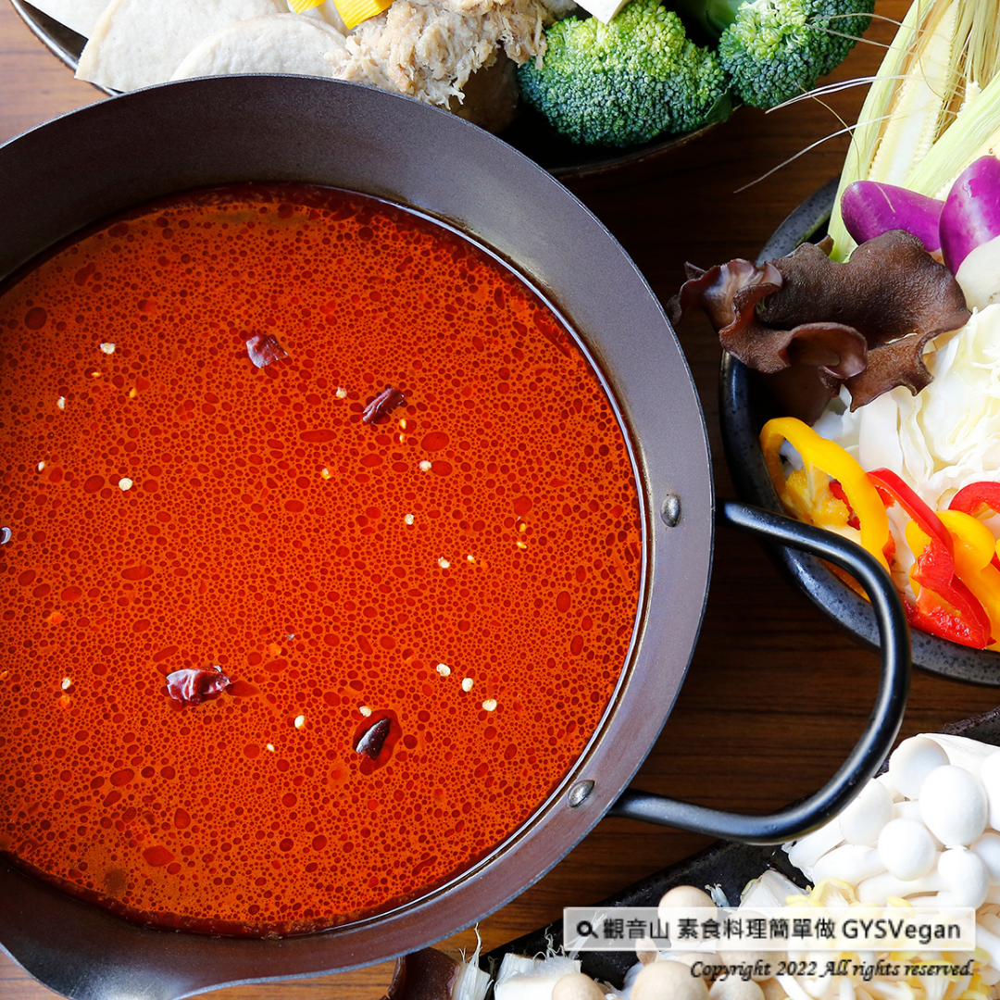

# 素食湯底系列 素食麻辣火鍋湯底

## 📋 基本資訊 / Recipe Overview
- **料理名稱**：素食湯底系列 素食麻辣火鍋湯底
- **原始標題**：素食湯底系列｜素食麻辣火鍋湯底｜全素
- **素食流派 / Diet**：全素 Vegan
- **來源平台 / Source**：[觀音山 · 素食料理簡單做](https://vegan.gys.org.tw/spicy-hot-pot20220314/)

## 📖 食譜圖文詳情 (中英雙語對照)

麻辣濃郁的湯底，吃得出中藥草的香氣，爽口、鮮香的湯底，一入口就感覺到溫暖，放入健康、喜愛的食材，現燙現吃的美味 !!一定要跟好朋友共享的零失敗料理。快跟著觀音山主廚，一起素食料理簡單做吧！​
​
食材及佐料〔Ingredients〕：(2人份)​
▪️水或蔬菜高湯 ​ 1500cc ​
▪️牛番茄 ​ 2顆​
▪️素食麻辣醬 ​ 30克​
▪️泰式冬蔭功醬 ​ 15克​
​
烹飪步驟：​
【刀工/前處理】​
1.牛番茄切大塊。​
​
【調理作法】​
1.湯鍋加入水、番茄、麻辣醬、冬蔭功醬，煮滾後轉中小火，繼續煮約10分鐘即可。​
​
【特別說明】​
辣度可以依個人喜好調整麻辣醬比例。​
​
本食譜提供：台中觀音山蔬食館​
​
✨慈悲的 龍德上師成立「觀音山蔬食館」提倡健康素食、慈悲護生，以”觀音山素食料理簡單做”的理念，提供多款素食食譜，讓您一學就會！?
​
★神變月2022年3月3日~4月1日：十萬善惡業緣增盛月​
​
✨殊勝功德增長日✨​
觀音山邀請您於2022年3月3日~4月1日響應素食、廣修供養、戒殺護生、誦經修法、行持諸種善行，獲福無量。​
【recipe】​
Alluring herbs aromatic spreads out in this spicy hot pot soup base recipe. It tastes fresh and heart-warming. By adding various healthy ingredients, this would be an unbeatable hot pot recipe to share with friends. Follow up and try vegetarian dishes with Chef of Guanyinshan. Let’s cook together!
▪️Water or vegetable stock ​ 1500cc ​
▪️Two beef tomatoes
▪️Vegetarian mala sauce ​ 30g​
▪️Vegetarian tom yum paste ​ 15g
?Instructions:​
【Cutting/ PREP-Ahead】​
1. Cut beef tomatoes into large pieces.​​​​
【cooking Steps】​
1. Put water, tomatoes, spicy sauce in a pot; add vegetarian Tom Yum paste, and bring to a boil. Then, turn to medium-low heat and continue to cook for about 10 minutes.​​​​
【Special Notes】​
The spiciness can be adjusted according to personal preference.
​
觀音山 素食料理簡單做
◎Facebook ｜好文按讚​
https://www.facebook.com/GYSVegan​
​
◎Instagram ｜料理追蹤​
https://www.instagram.com/gysvegan/​
​
◎Youtube ​ ​ ​ ｜加入訂閱​
https://reurl.cc/q8VEqy​
​
◎官方Blog ​ ​ ｜網站推薦​
https://vegan.gys.org.tw/​

---
*食譜歸檔時間：2026-08-20 · 來源：觀音山素食料理簡單做 (vegan.gys.org.tw)*