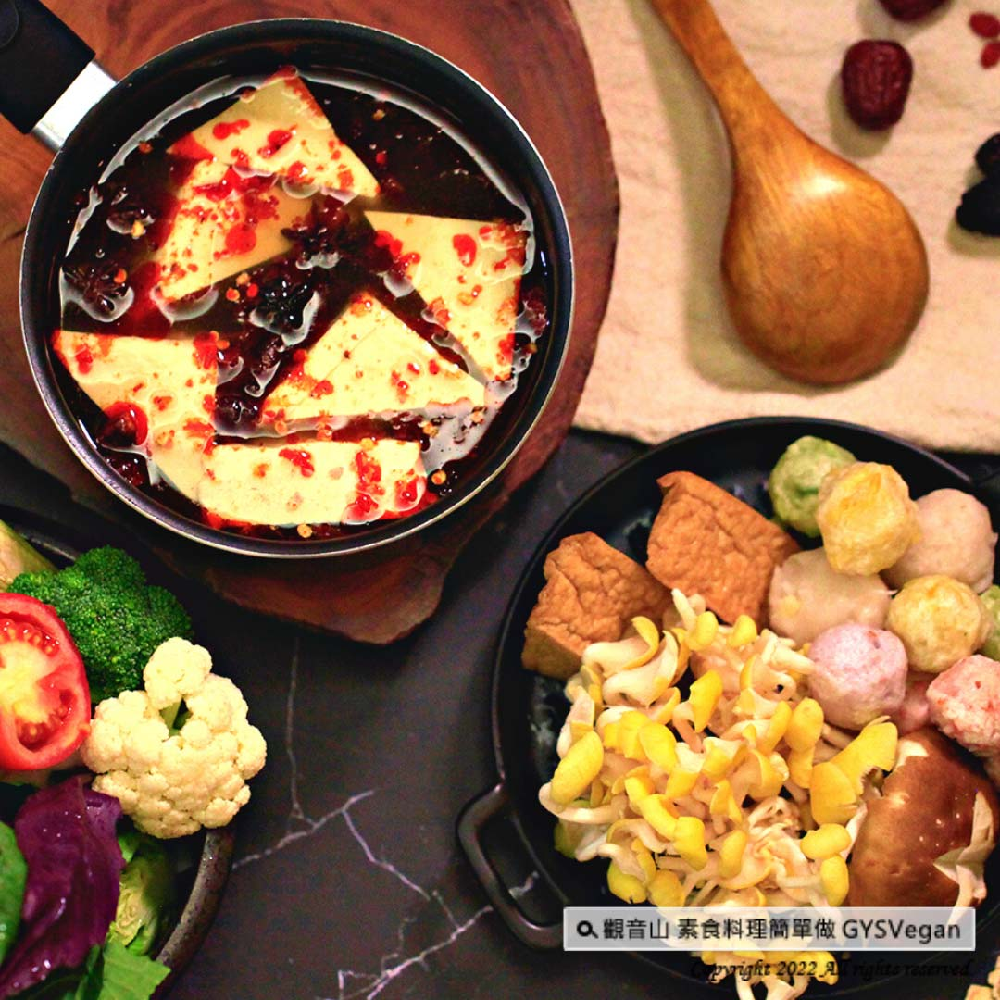

# 素食湯底系列 麻辣藥膳臭臭鍋湯底

## 📋 基本資訊 / Recipe Overview
- **料理名稱**：素食湯底系列 麻辣藥膳臭臭鍋湯底
- **原始標題**：素食湯底系列｜麻辣藥膳臭臭鍋湯底｜全素
- **素食流派 / Diet**：全素 Vegan
- **來源平台 / Source**：[觀音山 · 素食料理簡單做](https://vegan.gys.org.tw/spicy-stinky-tofu-pot20220527/)

## 📖 食譜圖文詳情 (中英雙語對照)

藥膳包的清香甘甜加上麻辣的口感，融入臭豆腐獨特的風味，加入菇類食材，絕對是最佳搭配，搭配喜歡的當季蔬菜，既享受又養生，快跟著觀音山主廚，一起素食料理簡單做吧！​
​
◎食材及佐料〔Ingredients〕：(3人份)​
▪️臭豆腐 ​ 400克 ​
▪️素肉骨茶藥包 ​ 1包​
▪️素食麻辣醬 ​ 適量​
▪️水 ​ 1500cc ​
▪️鹽、糖 ​ 適量​
​
◎烹飪步驟：​
【調理作法】​
1.湯鍋加入水1500cc、素肉骨茶藥包，煮滾後轉小火繼續煮約20分鐘。​
2.加入適量的麻辣醬、糖、鹽、臭豆腐，繼續煮約10分鐘。​
3.加入火鍋食材烹煮，即可享用！​
​
【特別說明】​
1.辣度可以依個人喜好增減麻辣醬。​
2.非常適合添加菇類食材。​
​
◎本食譜提供：台中 觀音山蔬食館​
​
✨慈悲的龍德上師 成立「觀音山蔬食館」提倡健康素食、慈悲護生，以”觀音山素食料理簡單做”的理念，提供多款素食食譜，讓您一學就會！🥰​
​
「觀音山 社群」一鍵快速前往觀音山 官方相關連結！​
➠
https://www.fazang.org/link/
​
​
▌觀音山近期活動 ▌​
春季保育放流—搶救梭子蟹、鱟、嘉鱲​
前往救護生命►
https://bit.ly/3rpDrIL​
​
【recipe】​
​
📖The fragrance with sweet and spicy taste of the herbal pack is a perfect match with stinky tofu. Just adding along mushrooms and other fresh vegetables, this recipe makes cooking as easy as pie!​
​
◎Ingredients : （For 3 people）​
▪️Stinky tofu ​ 400g ​
▪️A pack of vegetarian bak kut teh bao ​
▪️Vegetarian mala sauce ​ ​ , adequate amount​
▪️Water ​ 1500cc ​
▪️Salt、Sugar ​ ​ , adequate amount​
​
◎Instructions:​
【Cutting/ PREP-Ahead】​
1. Add 1500cc of water and vegetarian bak kut teh pack to a tall pot, bring to a boil, then turn to low heat and continue to simmer for about 20 minutes. ​
2. Add a suitable amount of vegetarian Mala sauce, sugar, salt, stinky tofu and continue to cook for another 10 minutes. ​
3. Add hot pot ingredients to cook along and enjoy! ​ ​
​
【Special notes】 ​
1. The spiciness can be adjusted to personal preference. ​
2. It is very tasty to add variety mushrooms. ​ ​
​
◎This recipe is provided by: Taichung # Guanyinshan Green Restaurant​
​
​
🌱 觀音山 素食料理簡單做 🌱​
◎Facebook ｜好文按讚​
https://www.facebook.com/GYSVegan​
​
◎Instagram ｜料理追蹤​
https://www.instagram.com/gysvegan/​
​
◎Youtube ​ ​ ​ ｜加入訂閱​
https://reurl.cc/q8VEqy​
​
◎官方Blog ​ ​ ｜網站推薦​
https://vegan.gys.org.tw/​
​
​
—​
👑歡迎轉載，請註明出處： 觀音山 素食料理簡單做 GYSVegan 素食環保愛地球，健康營養無負擔，慈悲護生一起來~😊

---
*食譜歸檔時間：2026-08-20 · 來源：觀音山素食料理簡單做 (vegan.gys.org.tw)*