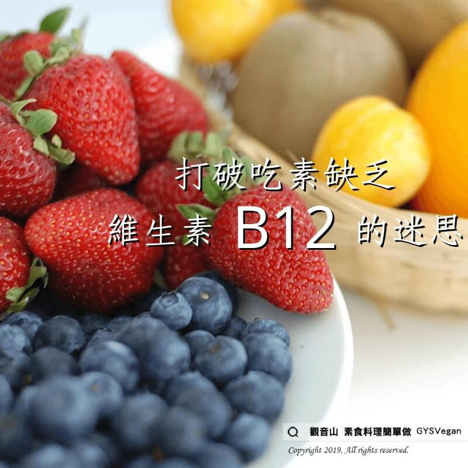

# 素食的迷思 打破吃素缺乏維生素B12的迷思

## 📋 基本資訊 / Recipe Overview
- **料理名稱**：素食的迷思 打破吃素缺乏維生素B12的迷思
- **原始標題**：【素食的迷思】打破吃素缺乏維生素B12的迷思
- **素食流派 / Diet**：全素 Vegan
- **來源平台 / Source**：[觀音山 · 素食料理簡單做](https://vegan.gys.org.tw/%e3%80%90%e7%b4%a0%e9%a3%9f%e7%9a%84%e8%bf%b7%e6%80%9d%e3%80%91%e6%89%93%e7%a0%b4%e5%90%83%e7%b4%a0%e7%bc%ba%e4%b9%8f%e7%b6%ad%e7%94%9f%e7%b4%a0b12%e7%9a%84%e8%bf%b7%e6%80%9d/)

## 📖 食譜圖文詳情 (中英雙語對照)

【#素食營養迷思】打破吃素缺乏維生素B12的迷思​
​
全世界研究維生素B12權威的專家?‍⚕—紐約西奈山醫院的Victor Herbert教授指出：​
「嚴格蔬食者?，縱使在沒有服用維生素B12維他命的情況下，B12缺乏症在他們身上幾乎看不到‼」​
​
此外，B12需要量很低(每日百萬分之一或二克)，可儲存3-5年，而且影響B12消化吸收的因素很複雜。​
​
臨床B12缺乏症多只見於接受胃腸切除術的病人。實在不放心的話，可額外補充「維他命B12」或「綜合維他命」即可。​
​
✨慈悲的 龍德上師成立「觀音山蔬食館」提倡健康素食、慈悲護生，以”觀音山素食料理簡單做”的理念，提供多款素食食譜，讓您一學就會！?​
​
​
?觀音山 素食料理簡單做 Follow us? ​
Facebook ｜好文按讚
http://www.facebook.com/GYSVegan
​
Instagram ｜料理追蹤
http://www.instagram.com/gysvegan/​
Youtube ｜加入訂閱
https://reurl.cc/q8VEqy
​
Telegram ｜頻道推薦
https://t.me/GYSVegan
​
​
​
—​
? 歡迎轉載，請註明出處： 觀音山 素食料理簡單做 GYSVegan 素食環保愛地球，健康營養無負擔，慈悲護生一起來~?

---
*食譜歸檔時間：2026-08-20 · 來源：觀音山素食料理簡單做 (vegan.gys.org.tw)*