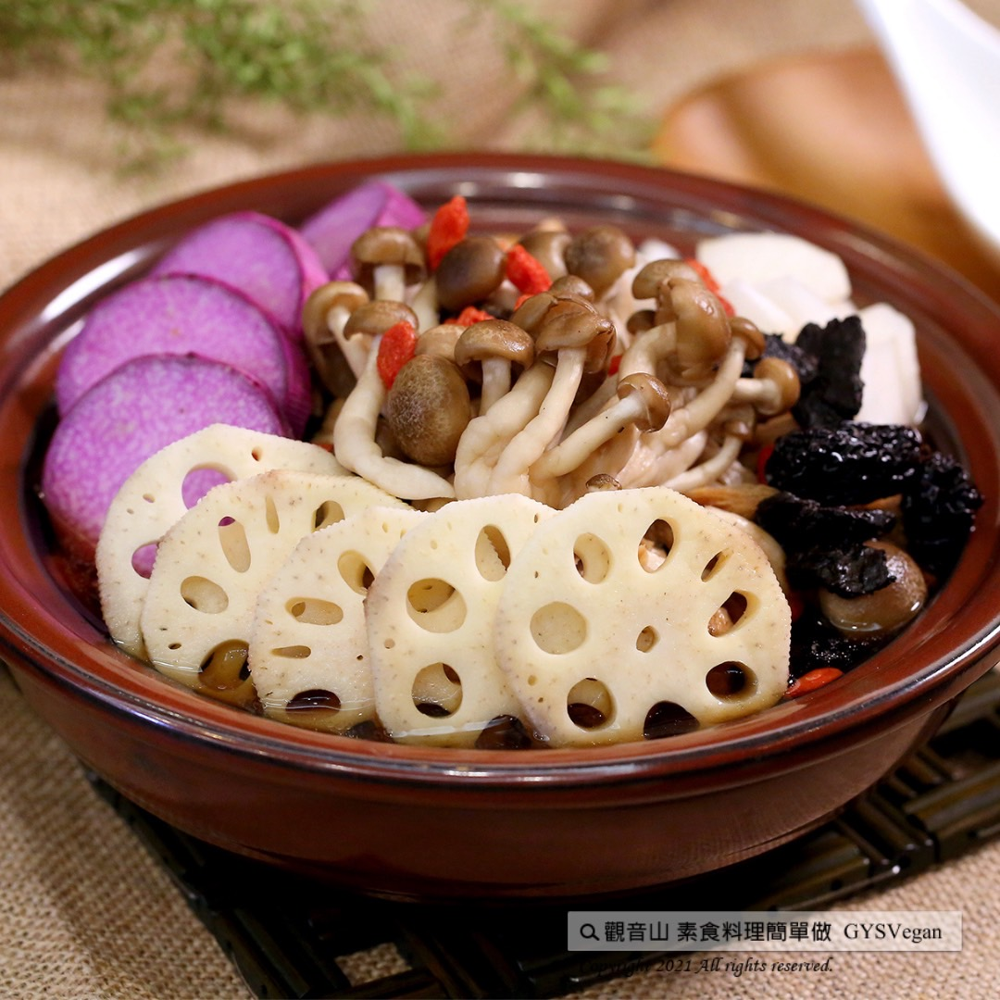

# 素食補肉骨茶湯

## 📋 基本資訊 / Recipe Overview
- **料理名稱**：素食補肉骨茶湯
- **原始標題**：電鍋料理｜素食補肉骨茶湯｜全素
- **素食流派 / Diet**：全素 Vegan
- **料理分類 / Category**：湯品系列
- **來源平台 / Source**：[觀音山 · 素食料理簡單做](https://vegan.gys.org.tw/soup20211105/)

## 📖 食譜圖文詳情 (中英雙語對照)

立冬最佳暖心食補「電鍋料理」，一口喝下滿滿的中藥清香，回甘的口感配上「溫補」的紫山藥、白蘿蔔、枸杞等食材，呈現出自然的味道就是最好的調味，補而不燥的素食湯頭，一年四季都合適，快速學會幫家人進補的好料理，快跟著觀音山主廚，一起素食料理簡單做吧！​
​
◎食材及佐料〔Ingredients〕：(5人份)​
▪️素肉骨茶包 ​ 1包 ​ ​ ​ ​ ​ ​
▪️皮絲(乾) 、鴻喜菇 ​ 各100克​
▪️紫山藥、蓮藕 ​ ​ 各70克​
▪️白蘿蔔 ​ 30克​
▪️枸杞、鹽、糖、素蠔油 適量​
​
◎烹飪步驟：​
【刀工/前處理】​
1.山藥去皮，切1公分厚片狀。​
2.蓮藕去皮，切0.5公分片。​
3.白蘿蔔切滾刀塊。​
4.皮絲泡軟川燙，洗淨備用。​
​
【調理作法】​
1.將所有食材放入湯鍋中，加水淹過食材。​
2.放入電鍋蒸約20-30分鐘。​
3.加入適當調味料即可享用。​
​
◎本食譜提供：台中觀音山蔬食館 ​
​
✨慈悲的 龍德上師成立「觀音山蔬食館」提倡健康素食、慈悲護生，以”觀音山素食料理簡單做”的理念，提供多款素食食譜，讓您一學就會！
​
​
★10月7日~12月4日 ​ 佛陀天降月：善惡業增長10億倍​
​
✨殊勝功德增長日✨​
觀音山邀請您於10月7日~12月4日，響應素食、廣修供養、戒殺護生、誦經修法、行持諸種善行，獲福無量。​
​
​
【recipe】​
​
(the Start of Winter) is the best time for this body-warming tonic soup, Bak Kut Teh. Just taking a sip of it, ​ this simple rice cooker cuisine would surprise you. The herbal fragrance spreads out right away with various vegetables’ slight sweetness. There are purple yam, white radish, wolfberry and other ingredients, providing a natural seasoning for the soup. It’s tonic but not causing dryness-heat. This vegetarian broth is even suitable all year round. Quickly learn to cook this for your family. Quickly follow the chef of Guanyinshan and make vegetarian dishes together!​
​
◎Ingredients : （For 5 people）​
▪️A pack of vegetarian bak kut teh bao ​ ​
▪️Dried tofu skin 、Brown beech mushroom ​ 100g​
▪️Yam、lotus root ​ ​ 70g​
▪️White radish ​ 30g​
▪️Wolfberry、Salt、Sugar、Vegetarian oyster soy sauce ​ , adequate amount​
​
◎Instructions:​
【Cutting/ PREP-Ahead】​
1. Peel the yam and cut into 1 cm slices.​
2. Peel the lotus root and cut into 0.5 cm slices.​
3. Roll cut white radish.​
4. Soaked dried tofu skin to soften and blanch, then wash and set aside.​
​
【Cooking Steps】​
1. Put all the ingredients into a soup pot and submerge them with water.​
2. Put the pot in a rice cooker and steam for about 20-30 minutes.​
3. Add appropriate seasonings and enjoy.​
​
◎This recipe is provided by Guanyinshan Green Restaurant, Taichung.​
​
◎ 觀音山 素食料理簡單做 ◎
Facebook ｜好文按讚
http://www.facebook.com/GYSVegan​
Instagram ｜料理追蹤
http://www.instagram.com/gysvegan/​
Youtube ｜加入訂閱
https://reurl.cc/q8VEqy​
Telegram ｜頻道推
https://t.me/GYSVegan​
​
​
—​
歡迎轉載，請註明出處： 觀音山 素食料理簡單做 GYSVegan 素食環保愛地球，健康營養無負擔，慈悲護生一起來~

---
*食譜歸檔時間：2026-08-20 · 來源：觀音山素食料理簡單做 (vegan.gys.org.tw)*