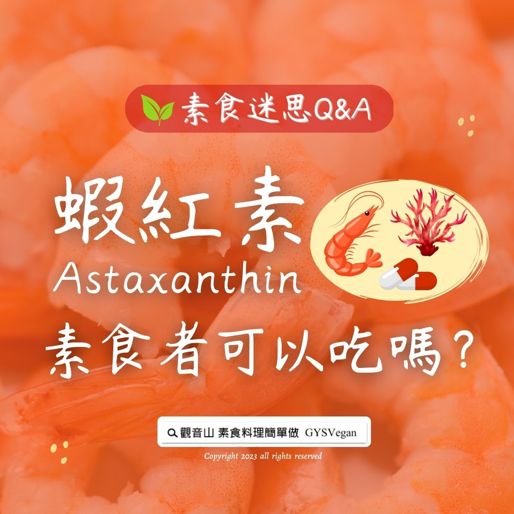

# 素食迷思 Q&A 「蝦紅素」，素食者可以吃嗎？

## 📋 基本資訊 / Recipe Overview
- **料理名稱**：素食迷思 Q&A 「蝦紅素」，素食者可以吃嗎？
- **原始標題**：素食迷思 Q&A｜「蝦紅素」，素食者可以吃嗎？
- **素食流派 / Diet**：全素 Vegan
- **來源平台 / Source**：[觀音山 · 素食料理簡單做](https://vegan.gys.org.tw/astaxanthin20230310/)

## 📖 食譜圖文詳情 (中英雙語對照)

素食迷思 Q&A｜「蝦紅素」，素食者可以吃嗎？
​
蝦紅素又稱為藻紅素、蝦青素，是一種類胡蘿蔔素，主要的來源是藻類，但由於是在蝦類中發現的物質，所以被翻譯為「蝦紅素」，實際上「蝦紅素」與「蝦」沒有關係，素食者是可以食用的。
​
近年的蝦紅素大多直接從紅球藻類所萃取，如果在選擇營養補充品時還是會擔心的話，可以確認其背後的成份，其來源是否為藻類。
​
​
​
▌慈悲的龍德上師 成立「觀音山蔬食館」提倡健康素食、慈悲護生，以”觀音山素食料理簡單做”的理念，提供多款素食食譜，讓您一學就會！
​
觀音山相關連結
➠
https://www.fazang.org/link/
​
─────────────
神變月 2023/2/21~3/21
（藏曆正月初一至三十日）
★十萬善惡業緣增盛月★
─────────────
▌觀音山近期活動
愛護海洋‧保育放流活動
https://www.fazang.org/liferelease/
您的護生善行，拯救億萬生靈！
​ ​
​
—
歡迎轉載，請註明出處： 觀音山素食料理簡單做 GYSVegan 素食環保愛地球，健康營養無負擔，慈悲護生一起來~

---
*食譜歸檔時間：2026-08-20 · 來源：觀音山素食料理簡單做 (vegan.gys.org.tw)*