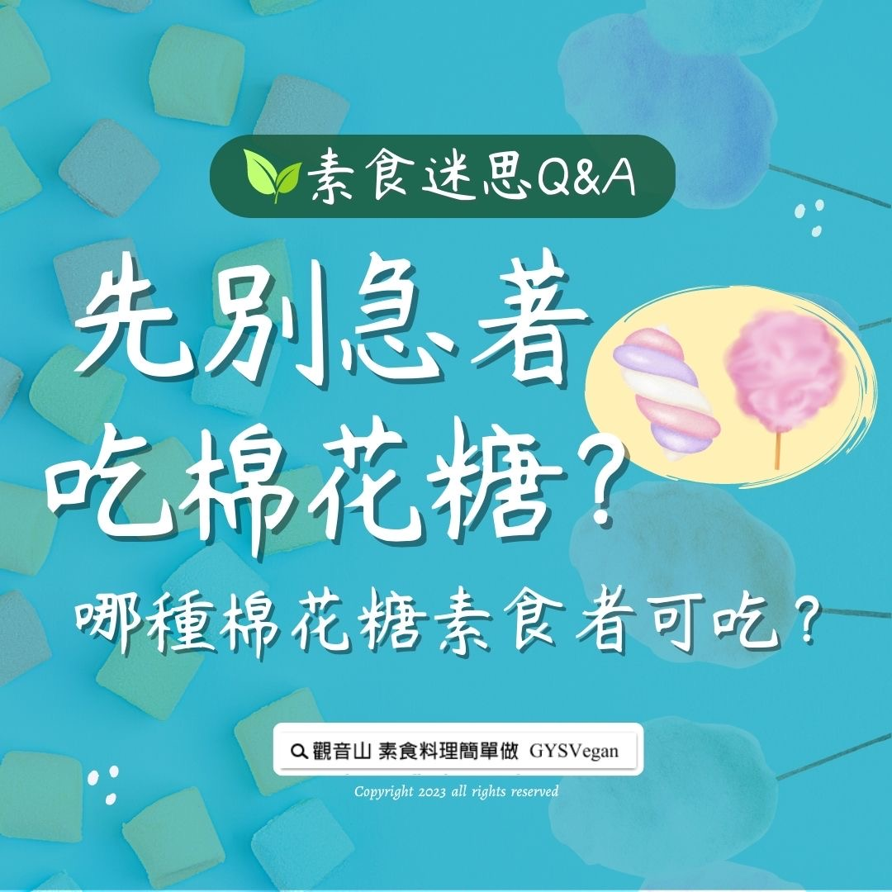

# 素食迷思 Q&A 先別急著吃棉花糖？哪種棉花糖素食者可吃？

## 📋 基本資訊 / Recipe Overview
- **料理名稱**：素食迷思 Q&A 先別急著吃棉花糖？哪種棉花糖素食者可吃？
- **原始標題**：素食迷思 Q&A｜先別急著吃棉花糖？哪種棉花糖素食者可吃？
- **素食流派 / Diet**：全素 Vegan
- **來源平台 / Source**：[觀音山 · 素食料理簡單做](https://vegan.gys.org.tw/marshmallow20230407/)

## 📖 食譜圖文詳情 (中英雙語對照)

素食迷思 Q&A｜先別急著吃棉花糖？哪種棉花糖素食者可吃？
​
一般市售的「棉花軟糖」，為了增加Q彈的口感，常會添加「明膠」在其中，明膠又稱為「吉利丁」、「魚膠」、「阿膠」，其來源是動物的骨頭、皮、筋所提煉，所以在購買棉花糖等相關食品時，一定要先確認成分標示是否有含「明膠」，如果有含「明膠」，就代表素食者不能食用。
​
而現場製作的「古早味棉花糖」原料是白砂糖，所以素食者是可以食用的。
​
一般常見添加「明膠」的食品有：優格、布丁、巧克力、果凍、冰淇淋、軟糖等，所以素食者在購買相關產品的時候，要多注意辨別，謹慎留意！
​
​
​
▌慈悲的龍德上師 成立「觀音山蔬食館」提倡健康素食、慈悲護生，以”觀音山素食料理簡單做”的理念，提供多款素食食譜，讓您一學就會！
​
觀音山相關連結
➠
https://www.fazang.org/link/
​
​
▌觀音山近期活動
─────────────
觀音山 2023母親節 搶救懷孕的海鱺媽媽 暨 春季 愛護海洋‧保育放流活動
https://www.fazang.org/liferelease/
您的護生善行，拯救億萬生靈！
─────────────
❶ 觀音山 2023春季保育放流
https://bit.ly/3InbEOQ
❷ 2023母親節 搶救懷孕的海鱺媽媽
https://bit.ly/3ucvUMa
​
​
​
—
歡迎轉載，請註明出處： 觀音山素食料理簡單做 GYSVegan 素食環保愛地球，健康營養無負擔，慈悲護生一起來~

---
*食譜歸檔時間：2026-08-20 · 來源：觀音山素食料理簡單做 (vegan.gys.org.tw)*