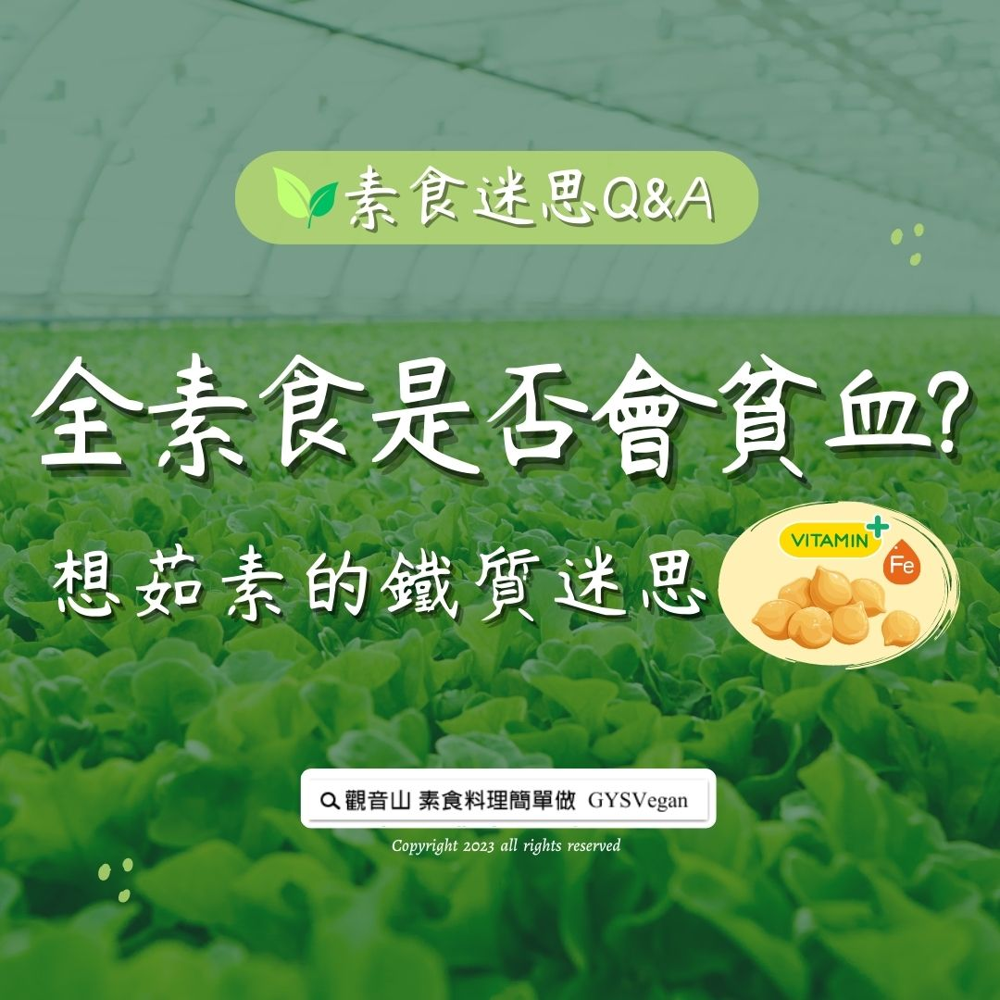

# 素食迷思 Q&A 全素食是否會貧血_ 想茹素的鐵質迷思

## 📋 基本資訊 / Recipe Overview
- **料理名稱**：素食迷思 Q&A 全素食是否會貧血_ 想茹素的鐵質迷思
- **原始標題**：素食迷思 Q&A｜全素食是否會貧血? 想茹素的鐵質迷思
- **素食流派 / Diet**：全素 Vegan
- **來源平台 / Source**：[觀音山 · 素食料理簡單做](https://vegan.gys.org.tw/anemia20230825/)

## 📖 食譜圖文詳情 (中英雙語對照)

素食迷思 Q&A｜全素食是否會貧血? 想茹素的鐵質迷思
​
答：許多人總會有茹素容易貧血的迷思，也認為茹素無法獲得人體所需的營養成分，但是事實並非如此！
​
根據衛生署食品衛生處資料顯示：素食者最佳的鐵質來源是「乾豆類」。
​
由於植物食品中含有大量的維生素C，而維生素C是一種重要的鐵質吸收劑，有助於鐵的吸收。研究顯示全素者的鐵質吸收力，比奶蛋素食者與非素食者還要高一些，因此全素者並不會貧血。
​
全世界研究B12最權威的專家Victor Herbert教授也指出：
「嚴格蔬食者，縱使在沒有服用B12維他命的情況下，B12缺乏症在他們身上幾乎看不到！」
​
因為維生素B12的真正來源並不是動物，而是植物上沾附的菌類，因為動物會吃到沾附菌類的植物，所以肉食裡才會有維生素B12。
​
那麼「蛋白質」呢？動物性食品蛋白質含量只有10-20%，但是植物性食物的蛋白質，含量都超過20%。因此，茹素並不會缺乏蛋白質。
​
最後是大家最關注的「鈣質」，根據衛生署食品衛生處資料顯示：植物性食物含有豐富的鈣質，而且吸收與牛奶相當甚至是高於牛奶。牛奶雖然是豐富鈣質的來源，但是否能預防骨質疏鬆仍備受質疑，原因是動物性蛋白質容易讓血液酸化，促使鈣質由骨骼游離進入血液，再由此流失。
​
綜合以上的資料來看，全素者不但不會缺乏鐵質，更能夠適切的補充人體所需的B12、蛋白質以及鈣質。
​
​
本文出處：用心生活 蔬食減碳 /法藏文化
​
​
▌慈悲的 #龍德上師 成立「觀音山蔬食館」提倡健康素食、慈悲護生，以”觀音山素食料理簡單做”的理念，提供多款素食食譜，讓您一學就會！😊
​
📣觀音山相關連結
➠
https://www.fazang.org/link/
​
​
▌觀音山近期活動
愛心公益贊普‧素食供品冥陽兩利
✦素食普桌開放登記中✦
─────────────────
【觀音山 2023年中元普度盂蘭盆法會】
▣ 超薦先亡‧報效親恩‧解冤釋結
https://www.fazang.org/UllambanaFestival
▣ 如何登記？量身打造屬於您的普度方案
https://www.fazang.org/ullambana
─────────────────
參贊普桌，與您結緣：
① 慈悲 龍德上師親自加持珍貴殊勝之「佛王米」。
② 《地藏三經》普度前行法會共15天，為您的普桌登記對象於佛前恭立「祈福迴向卡」。
​ ​
​
—
👑 歡迎轉載，請註明出處： #觀音山素食料理簡單做 GYSVegan 素食環保愛地球，健康營養無負擔，慈悲護生一起來~🥰

---
*食譜歸檔時間：2026-08-20 · 來源：觀音山素食料理簡單做 (vegan.gys.org.tw)*