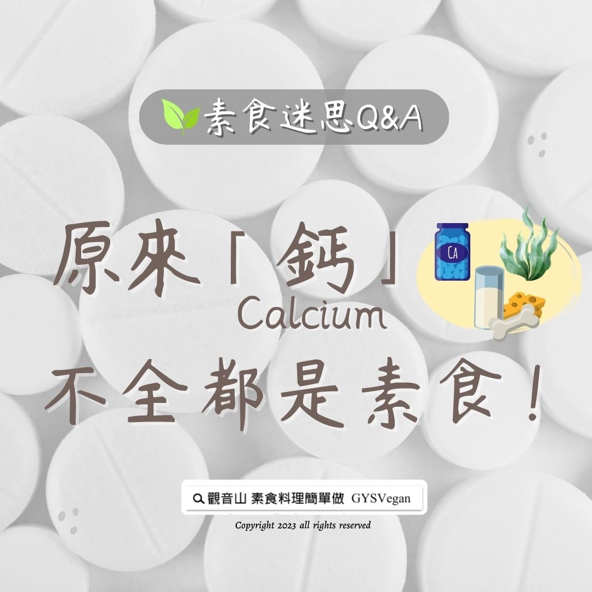

# 素食迷思 Q&A 原來鈣不全都是素食！

## 📋 基本資訊 / Recipe Overview
- **料理名稱**：素食迷思 Q&A 原來鈣不全都是素食！
- **原始標題**：素食迷思 Q&A｜原來鈣不全都是素食！
- **素食流派 / Diet**：全素 Vegan
- **來源平台 / Source**：[觀音山 · 素食料理簡單做](https://vegan.gys.org.tw/%e7%b4%a0%e9%a3%9f%e8%bf%b7%e6%80%9d-qa%ef%bd%9c%e5%8e%9f%e4%be%86%e9%88%a3%e4%b8%8d%e5%85%a8%e9%83%bd%e6%98%af%e7%b4%a0%e9%a3%9f%ef%bc%81/)

## 📖 食譜圖文詳情 (中英雙語對照)

素食迷思 Q&A｜原來鈣不全都是素食！
​
素食者或年長者，常會食用鈣片來補鈣，此時就需要辨別哪種鈣是素食者可以補充的。市面上鈣的來源很多，有素食也有葷食，以下列舉常見的幾種：
​
全素的鈣：海藻鈣、檸檬酸鈣、胺基酸螯合鈣
非全素的鈣：乳酸鈣(奶素)、碳酸鈣
​
素食者亦可透過攝取天然食物來補鈣，如毛豆、莧菜、芝麻、芥藍菜、地瓜葉…等等。
​
​
▌慈悲的 龍德上師 成立「觀音山蔬食館」提倡健康素食、慈悲護生，以”觀音山素食料理簡單做”的理念，提供多款素食食譜，讓您一學就會！
​
觀音山相關連結
➠
https://www.fazang.org/link/
​
​
▌觀音山近期活動
5月27日 釋迦牟尼佛‧如珍寶加持總集薈供法會
✦登記「除障祿位 / 超薦蓮位」
https://bit.ly/3HXmCO7
✦護持「薈供供品」供養三寶
https://bit.ly/3bHzJ8H
​ ​
​
—
歡迎轉載，請註明出處： 觀音山素食料理簡單做 GYSVegan 素食環保愛地球，健康營養無負擔，慈悲護生一起來~

---
*食譜歸檔時間：2026-08-20 · 來源：觀音山素食料理簡單做 (vegan.gys.org.tw)*