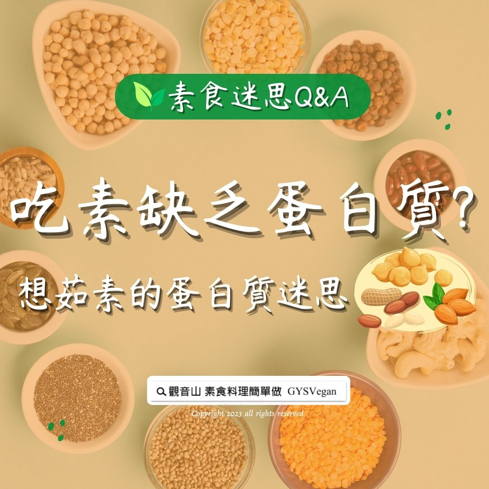

# 素食迷思 Q&A 吃素缺乏蛋白質_ 想茹素的蛋白質迷思

## 📋 基本資訊 / Recipe Overview
- **料理名稱**：素食迷思 Q&A 吃素缺乏蛋白質_ 想茹素的蛋白質迷思
- **原始標題**：素食迷思 Q&A｜吃素缺乏蛋白質? 想茹素的蛋白質迷思
- **素食流派 / Diet**：全素 Vegan
- **來源平台 / Source**：[觀音山 · 素食料理簡單做](https://vegan.gys.org.tw/%e7%b4%a0%e9%a3%9f%e8%bf%b7%e6%80%9d-qa%ef%bd%9c%e5%90%83%e7%b4%a0%e7%bc%ba%e4%b9%8f%e8%9b%8b%e7%99%bd%e8%b3%aa-%e6%83%b3%e8%8c%b9%e7%b4%a0%e7%9a%84%e8%9b%8b%e7%99%bd%e8%b3%aa%e8%bf%b7%e6%80%9d/)

## 📖 食譜圖文詳情 (中英雙語對照)

素食迷思 Q&A｜吃素缺乏蛋白質? 想茹素的蛋白質迷思
​
吃素不會缺乏蛋白質，只要選對食物並攝取足夠，素食者也可以攝取足夠的蛋白質。
​
素食中有非常多的種類能讓人們攝取「足夠」的蛋白質，並且「植物性蛋白質」能讓身體無負擔地補充高品質蛋白質。
​
動物性食品包括雞排、豬小排、牛肉條、鮑魚、蝦仁等，蛋白質含量只有10-20%。植物性食物則有許多蛋白質含量都超過20%。
​
例如：黑豆(37.1)、黃豆(36.8)、綠豆(22.9)、紅豆(21.3)、杏仁(31.0)、紫菜(28.4)、花生(25.6)…等。
​
素食者只要把握一個原則：攝取多樣性的原型食物，包含有大豆類、雜糧、堅果、蔬菜等就能得到優質蛋白質與健康。
​
部分資料來源：用心生活 蔬食減碳 /法藏文化
​
​
▌慈悲的 龍德上師 成立「觀音山蔬食館」提倡健康素食、慈悲護生，以”觀音山素食料理簡單做”的理念，提供多款素食食譜，讓您一學就會！
​
📣觀音山相關連結
➠
https://www.fazang.org/link/
​
​
▌觀音山近期活動
10月7日 三寶總集薈供法會
✦ ​ 登記「除障祿位、超薦蓮位」
https://bit.ly/3LyGQz3
✦ ​ 護持「薈供供品」廣結善緣
https://bit.ly/3LyGQz3
​ ​
​
—
歡迎轉載，請註明出處： 觀音山素食料理簡單做 GYSVegan 素食環保愛地球，健康營養無負擔，慈悲護生一起來~

---
*食譜歸檔時間：2026-08-20 · 來源：觀音山素食料理簡單做 (vegan.gys.org.tw)*