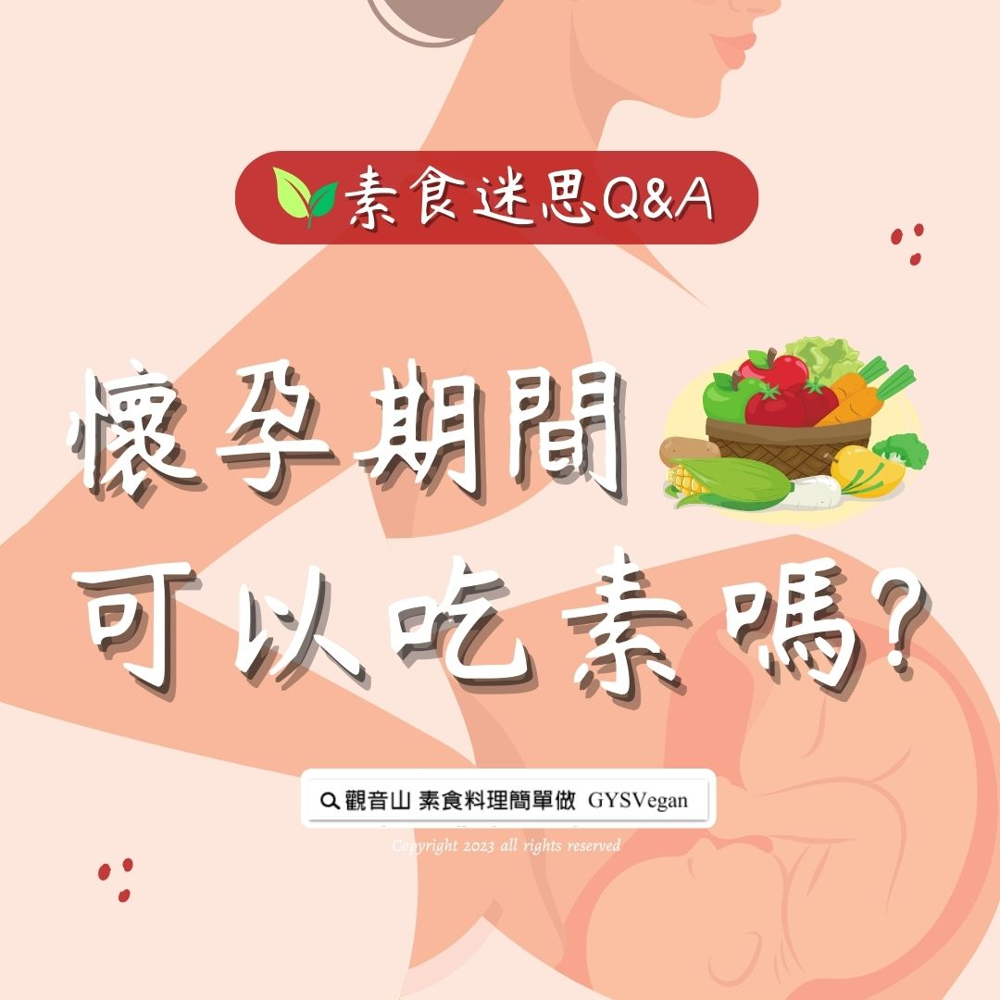

# 素食迷思 Q&A 懷孕期間可以吃素嗎_

## 📋 基本資訊 / Recipe Overview
- **料理名稱**：素食迷思 Q&A 懷孕期間可以吃素嗎_
- **原始標題**：素食迷思 Q&A｜懷孕期間可以吃素嗎?
- **素食流派 / Diet**：全素 Vegan
- **來源平台 / Source**：[觀音山 · 素食料理簡單做](https://vegan.gys.org.tw/can-i-be-vegetarian-during-pregnancy20231006/)

## 📖 食譜圖文詳情 (中英雙語對照)

素食迷思 Q&A｜懷孕期間可以吃素嗎?
​
不論是年輕人、銀髮族、孕婦都可以加入吃素的行列，都可以透過攝取蔬菜、堅果類食物、水果、豆類品來補充人體需要的營養，只要能掌握食素健康六大原則，人人都適合吃素。
​
健康六原則：蔬菜好夥伴、蛋白質要互補、補鈣怎能少、補鐵大作戰、B12不能缺、補鋅好氣色，大家如果能跟著吃素六大口訣，就能健康沒煩惱、安心顧營養。
​
最辛苦的孕婦也不用擔心茹素是否會影響胎兒的健康，因為一般食素所生的嬰兒睡眠較非素食的嬰兒平靜而熟睡，日常也較少鬧情緒，身體發育良好。
​
香港中醫師葉榮坤花了二十多年觀察研究，發現父母長期食素所生的嬰兒較非食素所生的嬰兒強壯、聰明活潑、性格溫馴⋯·，除此之外，美國加州羅馬琳達省做過一次兒童智力測驗，發現智力最高的兒童都是來自素食家庭。
​
最偉大的科學家愛因斯坦也曾言：「沒有什麼能像推廣素食那樣增進人類的健康，並增加對地球生命的生存機會，我認為素食所產生性情上的改變,對人類都有相當好的利益，所以素食對人類是很吉祥的。」
​
吃素不只環保救地球，也能讓動物免於恐懼、死亡，當大家一起齊心吃素救護動物，我們的生活將會更吉祥、更美好。讓眾生遠離恐懼、怖畏，這個世界就會因我們的一念善念，而有更多更正向的改變。
​
出處：用心生活 蔬食減碳
​
​
▌慈悲的 龍德上師 成立「觀音山蔬食館」提倡健康素食、慈悲護生，以”觀音山素食料理簡單做”的理念，提供多款素食食譜，讓您一學就會！
​
📣觀音山相關連結
➠
https://www.fazang.org/link/
​
​
▌觀音山近期活動
─────────────
五大善行 愛滿人間
▸
https://bit.ly/463BG69
─────────────
第一善行：助老憐幼慈悲行
第二善行：蔬食環保救地球
第三善行：百萬善書菩提行
第四善行：尊重生命救生靈
第五善行：萬盞光明祈平安
​
10月15日～11月13日藏曆佛陀天降月，每天都是十億倍功德增長日，敬邀大家一同響應五大善行活動，將小愛集合為大愛，匯聚大眾的善心，溫暖社會的每一個角落。
​ ​
​
—
歡迎轉載，請註明出處： 觀音山素食料理簡單做 GYSVegan 素食環保愛地球，健康營養無負擔，慈悲護生一起來~

---
*食譜歸檔時間：2026-08-20 · 來源：觀音山素食料理簡單做 (vegan.gys.org.tw)*