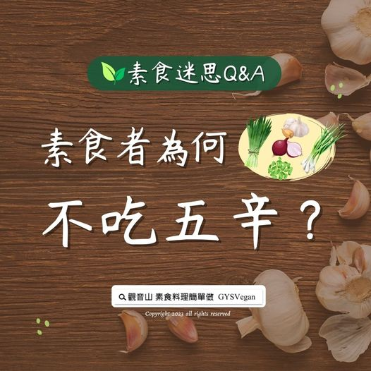

# 素食迷思 Q&A 素食者為何不吃五辛？

## 📋 基本資訊 / Recipe Overview
- **料理名稱**：素食迷思 Q&A 素食者為何不吃五辛？
- **原始標題**：素食迷思 Q&A｜素食者為何不吃五辛？
- **素食流派 / Diet**：全素 Vegan
- **來源平台 / Source**：[觀音山 · 素食料理簡單做](https://vegan.gys.org.tw/veganqa230909/)

## 📖 食譜圖文詳情 (中英雙語對照)

答：很多人無法理解為何五辛(蔥、蒜、韭菜、薤、興渠)屬於葷食，其實這咎因於五辛會散發出極臭的辛辣氣味，也容易刺激傷害我們的胃壁。
​
五辛因含有硫化物等黃色臭油質，容易散發特殊的滲透性臭味及辛辣氣味，此外，五辛的化學結構上具催淫增欲的作用，容易影響一個人的心性。
根據香港食品安全中心研究指出，蒜頭和洋蔥經過高溫烹煮後會產生「丙烯醯胺」，丙烯醯胺是經過高溫煮過而生的致癌物，含量最高的是櫛瓜，接下來分別是蒜頭和洋蔥。
反觀為何薑及辣椒不列為葷食呢？這是因為薑、辣椒本身具有驅寒保暖的作用，不論是燉補、炒菜，添加一些可以去腥提味，而且我們食用後也不會產生辛臭味。因此，食用薑及辣椒對我們的身體無刺激性，當然也不會影響我們修行的心性平和狀態。
​
本文出處：用心生活 蔬食減碳 /法藏文化
▌慈悲的 #龍德上師 成立「觀音山蔬食館」提倡健康素食、慈悲護生，以”觀音山素食料理簡單做”的理念，提供多款素食食譜，讓您一學就會！
​
觀音山相關連結
➠
https://www.fazang.org/link/
​
▌觀音山近期活動
9月9日人天導師 本師 釋迦牟尼佛薈供大法會─聚福圓滿‧福慧充盈
✦ 登記「除障祿位、超薦蓮位」▸
https://bit.ly/43z72QO
✦ 護持「薈供供品」廣結善緣▸
https://bit.ly/3WVPLyZ

---
*食譜歸檔時間：2026-08-20 · 來源：觀音山素食料理簡單做 (vegan.gys.org.tw)*