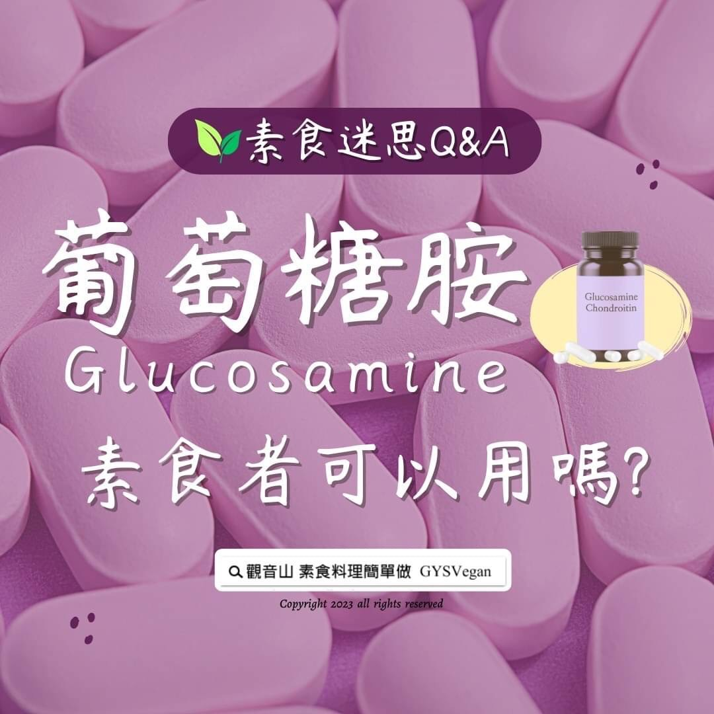

# 素食迷思 Q&A 葡萄糖胺素食者可以用嗎？

## 📋 基本資訊 / Recipe Overview
- **料理名稱**：素食迷思 Q&A 葡萄糖胺素食者可以用嗎？
- **原始標題**：素食迷思 Q&A｜葡萄糖胺素食者可以用嗎？
- **素食流派 / Diet**：全素 Vegan
- **來源平台 / Source**：[觀音山 · 素食料理簡單做](https://vegan.gys.org.tw/glucosamine20230630/)

## 📖 食譜圖文詳情 (中英雙語對照)

#素食迷思 Q&A｜葡萄糖胺素食者可以用嗎？
​
「葡萄糖胺」是人體關節組織中的重要成分之一，又稱為胺基葡萄糖，與關節潤滑和軟骨健康有關，人體可自行生成並提供關節保護。普遍認為隨著年齡增長，體內葡萄糖胺的合成速度比不上消耗速度，所以需要額外補充，以幫助修復軟骨，潤滑關節。
​
葡萄糖胺是一種小的胺基醣類，在大自然中甲殼類動物的殼含量豐富，故大多數產品由蝦、螃蟹及龍蝦等萃取而來，所以屬於葷食。
​
近年有許多「素食葡萄糖胺」產品推出，素食者可以有所選擇，亦可攝取富含葡萄糖胺的天然食物，如木耳、山藥、海帶、海藻等，由人體自行合成。
​
市售的葡萄糖胺大部分都是「複方」成分以及為了考慮產品的儲存安定性與服用的方便性等，多數產品的製造過程可能會添加一些安定劑等成分，此類成分可能源自於動物性，所以在購買相關產品時，一定要詢問藥師，產品的成分是否為全素。
​
​
▌慈悲的 #龍德上師 成立「觀音山蔬食館」提倡健康素食、慈悲護生，以”觀音山素食料理簡單做”的理念，提供多款素食食譜，讓您一學就會！😊
​
📣觀音山相關連結
➠
https://www.fazang.org/link/
​
​
▌觀音山近期活動
💎7月19日 釋迦牟尼佛‧如珍寶加持總集薈供法會
✦ 登記「超薦蓮位、除障祿位」
https://bit.ly/3bH7Z46
✦ 護持「薈供供品」推廣素食愛心公益
https://bit.ly/3bHzJ8H
(登記至7月19日晚上7:00截止)
​ ​
​
—
👑 歡迎轉載，請註明出處： #觀音山素食料理簡單做 GYSVegan 素食環保愛地球，健康營養無負擔，慈悲護生一起來~🥰

---
*食譜歸檔時間：2026-08-20 · 來源：觀音山素食料理簡單做 (vegan.gys.org.tw)*