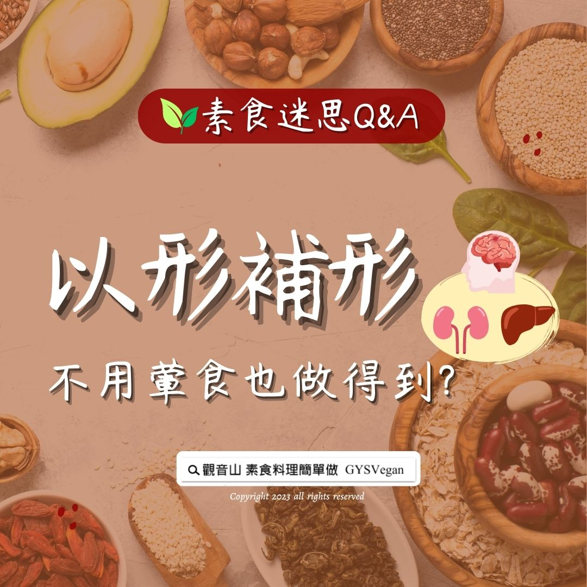

# 素食迷思 Q&A 食補以形補形，不用葷食也做得到？

## 📋 基本資訊 / Recipe Overview
- **料理名稱**：素食迷思 Q&A 食補以形補形，不用葷食也做得到？
- **原始標題**：素食迷思 Q&A｜食補以形補形，不用葷食也做得到？
- **素食流派 / Diet**：全素 Vegan
- **來源平台 / Source**：[觀音山 · 素食料理簡單做](https://vegan.gys.org.tw/vegetarian-myth20230728/)

## 📖 食譜圖文詳情 (中英雙語對照)

素食迷思 Q&A｜食補以形補形，不用葷食也做得到？
​
吃腰子補腎 ? 吃肝補肝 ? 「以形補形」是一種傳統飲食概念，以形狀相似的食物，來補充人體器官的營養。現今食物多樣化，且替代性食物多，以營養學的角度來看，「補對了營養素」，身體才有足夠能量運作。
​
在營養學的理論基礎下，介紹幾種「植物性」以形補形的食材：
​
ㄧ、核桃補腦
核桃富含不飽和脂肪酸，其中的次亞麻油酸可轉換為DHA；礦物質鎂，有利於大腦的神經傳導系統；卵磷脂對消除大腦疲勞亦有不錯的效果。
​
二、番茄補心
番茄有豐富的茄紅素、β胡蘿蔔素，抗氧化能力高，能提升體內的高密度脂蛋白（好的膽固醇），對心血管有保護作用。
​
三、酪梨護子宮
酪梨是很好的葉酸來源，對懷孕中母親與胎兒皆有益處，富含的單元不飽和脂肪酸與維生素E，可以強化子宮內膜與平衡雌激素，是很好的養生食材。
​
素食者只要把握低油、低鹽、低糖，高纖維質的飲食觀念，不用殘害終結動物的生命來滋補自己的身體，無需葷食以形補形，也能讓人體各部的營養均衡，吃得更健康。
​
​
▌慈悲的 龍德上師 成立「觀音山蔬食館」提倡健康素食、慈悲護生，以”觀音山素食料理簡單做”的理念，提供多款素食食譜，讓您一學就會！😊
​
觀音山相關連結
➠https://www.fazang.org/link/
​
​
▌觀音山近期活動
愛心公益贊普‧素食供品冥陽兩利
✦素食普桌開放登記中✦
─────────────────
【觀音山 2023年中元普度盂蘭盆法會】
▣ 超薦先亡‧報效親恩‧解冤釋結
https://www.fazang.org/UllambanaFestival
▣ 如何登記？量身打造屬於您的普度方案
https://www.fazang.org/ullambana
─────────────────
參贊普桌，與您結緣：
① 慈悲 龍德上師親自加持珍貴殊勝之「佛王米」。
② 《地藏三經》普度前行法會共15天，為您的普桌登記對象於佛前恭立「祈福迴向卡」。
​ ​
​
—
歡迎轉載，請註明出處： 觀音山素食料理簡單做 GYSVegan 素食環保愛地球，健康營養無負擔，慈悲護生一起來~

---
*食譜歸檔時間：2026-08-20 · 來源：觀音山素食料理簡單做 (vegan.gys.org.tw)*