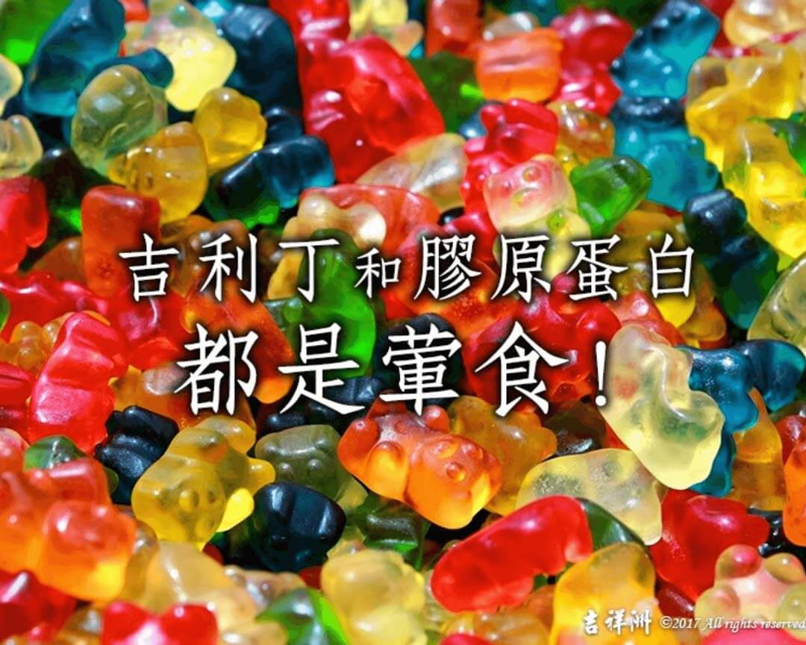

# 素食迷思Q&A   「吉利丁」和「膠原蛋白」都是葷食!

## 📋 基本資訊 / Recipe Overview
- **料理名稱**：素食迷思Q&A   「吉利丁」和「膠原蛋白」都是葷食!
- **原始標題**：【素食迷思Q&A 】 「吉利丁」和「膠原蛋白」都是葷食!
- **素食流派 / Diet**：全素 Vegan
- **來源平台 / Source**：[觀音山 · 素食料理簡單做](https://vegan.gys.org.tw/gelatin20201213-2/)

## 📖 食譜圖文詳情 (中英雙語對照)

【素食迷思小陷阱 】 「吉利丁」和「膠原蛋白」都是葷食!​
​
素食者吃甜品，小心誤食到葷食品!!!
市面上所售的軟糖、果凍、優酪、發酵乳、杏仁豆腐…等，只要添加「吉利丁」及「膠原蛋白」，就是葷食❗️
但由於往往沒標示清楚是動物膠，素食者很可能沒留意就吃下肚。
​
? 吉利丁：​
就是明膠，又稱魚膠（從英文「Gelatine」譯音而來）​
是以動物皮、骨內的蛋白質(即膠原)製成，帶淺黃色透明，無味的膠質，主要成分為蛋白質，利用動物的皮、筋或骨骼內的膠質提煉而成。​
​
​ ? 膠原蛋白：​
已被廣泛加在各種食品或化妝保養品中的，跟吉利丁也是相同的物質成分，將膠原蛋白的組織結構破壞打鬆散，加工後即成為吉利丁。​
​
​ ?目前市面上提到的膠原蛋白共有十八種，編號從一至十八號。​
一般指的膠原蛋白，「不論吃的或塗抹的」常指第一號或第五號，都提煉自魚類水產的骨頭或皮、豬皮或牛皮、骨頭等部分，屬蛋白質類。
​
​ ?其實不用再有膠原蛋白的迷思，覺得要透過食用膠原蛋白來補充，讓自己皮膚光亮有彈性等。​
​
?實際上，膠原蛋白分子量大，不可能直接被人體吸收，並運送至皮膚。膠原蛋白必須被分解為胜肽，再分解成胺基酸，才能被人體吸收。
所以，吃膠原蛋白再多也不能直接作用於肌膚，而膠原蛋白分解所產生的胜肽和胺基酸，從日常飲食便能輕鬆補充​
​
✅建議可多食用南瓜和蘆筍，都會產生優質的蛋白質喔!☺️​
​
✨慈悲的 龍德上師成立「觀音山蔬食館」提倡健康素食、慈悲護生，以”觀音山素食料理簡單做”的理念，提供多款素食食譜，讓您一學就會！?
​
​
?觀音山 素食料理簡單做 ?​
Facebook ｜好文按讚
http://www.facebook.com/GYSVegan
​
Instagram ｜料理追蹤
http://www.instagram.com/gysvegan/​
Youtube ｜加入訂閱
https://reurl.cc/q8VEqy​
Telegram ｜頻道推薦
https://t.me/GYSVegan​
​
​
—​
? 歡迎轉載，請註明出處： 觀音山 素食料理簡單做 GYSVegan 素食環保愛地球，健康營養無負擔，慈悲護生一起來~?​

---
*食譜歸檔時間：2026-08-20 · 來源：觀音山素食料理簡單做 (vegan.gys.org.tw)*