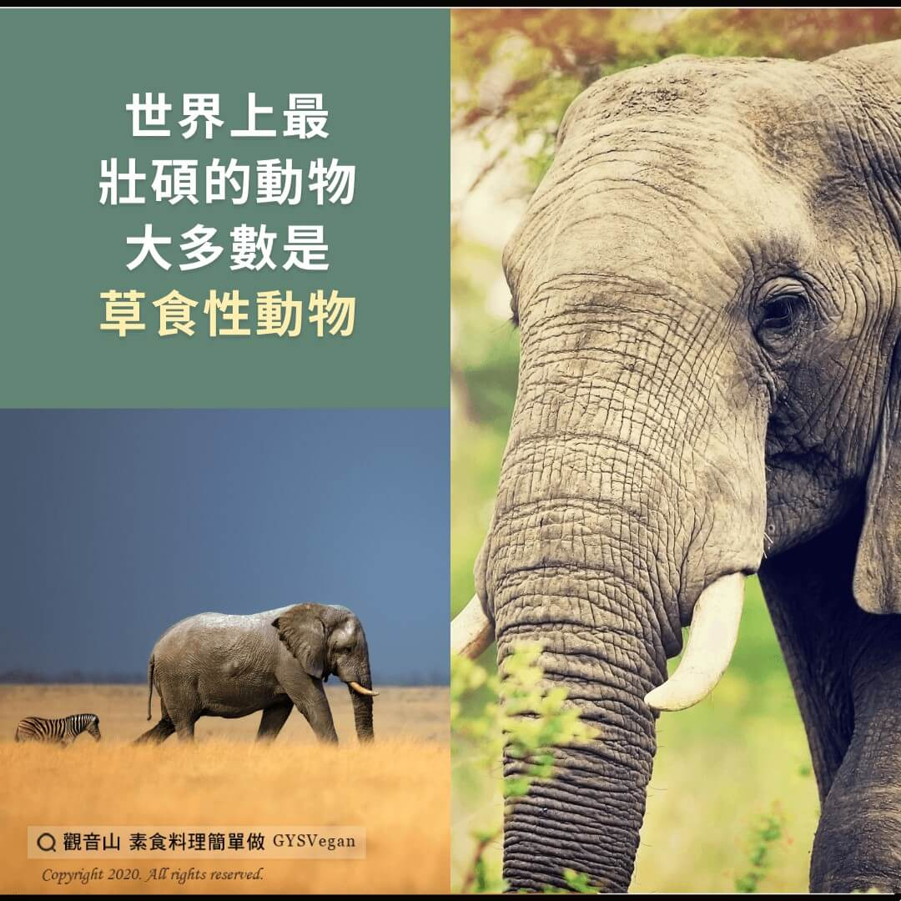

# 素食迷思Q＆A 吃素也可以很強壯

## 📋 基本資訊 / Recipe Overview
- **料理名稱**：素食迷思Q＆A 吃素也可以很強壯
- **原始標題**：【素食迷思Q＆A】吃素也可以很強壯
- **素食流派 / Diet**：全素 Vegan
- **來源平台 / Source**：[觀音山 · 素食料理簡單做](https://vegan.gys.org.tw/strong20201205/)

## 📖 食譜圖文詳情 (中英雙語對照)

有人問我：『你不吃肉，為什麼還可以壯得像頭牛？』?​
我回答說：『你見過牛吃肉嗎？』​
—Patrik Baboumian，世界舉重紀錄保持者​
​
運動營養學的最大謬誤，就是我們必須進食某種肉類來攝取動物蛋白質，以為這樣可以變得更強壯，讓運動表現更出色?，但這並不是真的！​
​
進食牛排或漢堡內的肉排，所攝取到的蛋白質，其實來自於牛所食用的草?，所有蛋白質源自於植物。有一項大型的研究指出：素食者不但能攝取足夠蛋白質，甚至比其所需要的高出七成??。​
​
世界上最壯碩的動物中，大多數是草食性動物，比如大象?、犀牛?、馬?和大猩猩?。牠們僅食用植物就可以獲取充足的蛋白質，生長出大塊肌肉，並維持良好的健康狀態。​
​
?資料來源：茹素的力量《The Game Changers》​
​
✨慈悲的 龍德上師成立「觀音山蔬食館」提倡健康素食、慈悲護生，以”觀音山素食料理簡單做”的理念，提供多款素食食譜，讓您一學就會！?​
​
​
?觀音山 素食料理簡單做 Follow us?​
Facebook ｜好文按讚
http://www.facebook.com/GYSVegan​
Instagram ｜料理追蹤
http://www.instagram.com/gysvegan/​
Youtube ​ ​ ​ ｜加入訂閱
https://reurl.cc/q8VEqy​
Telegram ​ ｜頻道推薦
https://t.me/GYSVegan​
​
​
?歡迎轉載，請註明出處： ​ ​ 觀音山 素食料理簡單做 GYSVegan 素食環保愛地球，健康營養無負擔，慈悲護生一起來~?

---
*食譜歸檔時間：2026-08-20 · 來源：觀音山素食料理簡單做 (vegan.gys.org.tw)*