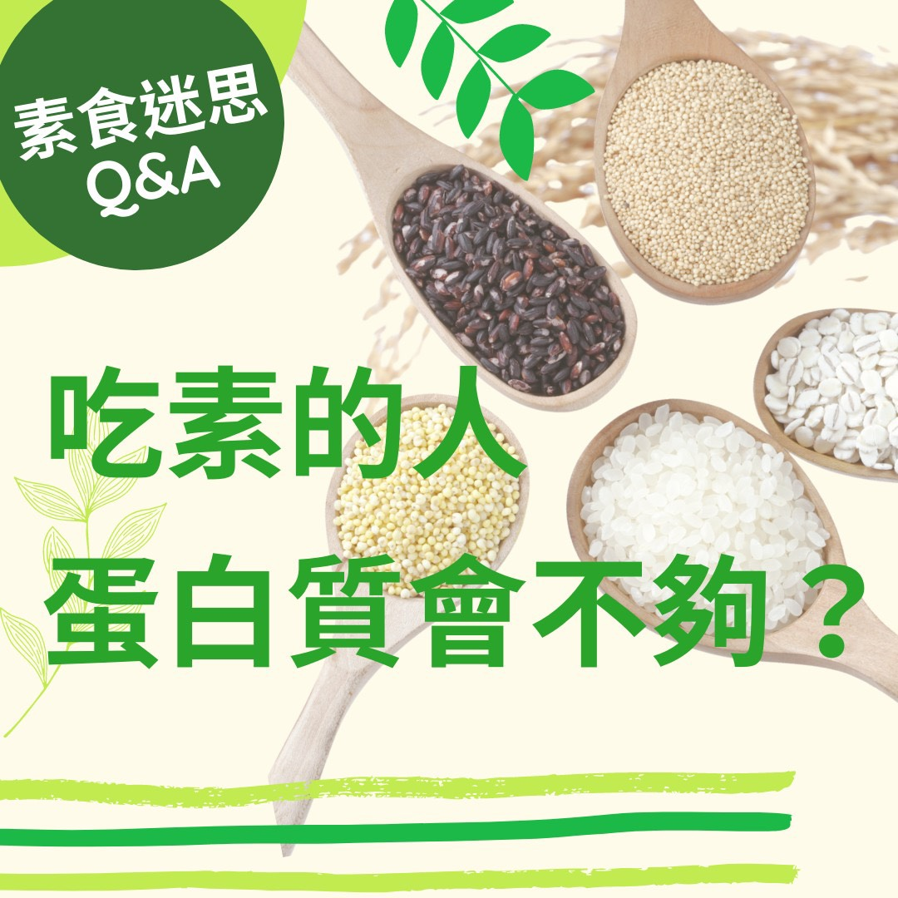

# 素食迷思Q＆A 吃素的人蛋白質會不夠❓

## 📋 基本資訊 / Recipe Overview
- **料理名稱**：素食迷思Q＆A 吃素的人蛋白質會不夠❓
- **原始標題**：【素食迷思Q＆A】吃素的人蛋白質會不夠❓
- **素食流派 / Diet**：全素 Vegan
- **來源平台 / Source**：[觀音山 · 素食料理簡單做](https://vegan.gys.org.tw/protein20210809/)

## 📖 食譜圖文詳情 (中英雙語對照)

【素食迷思Q＆A】吃素的人蛋白質會不夠❓​
答：蛋白質普遍存在於豆類、蛋類、肉類、奶類食品，是人體在發育成長，修復過程中，重要的營養素。​
​
一般人「最佳的蛋白質攝取來源」，主要是豆類而非肉類，豆類的蛋白質品質，與肉類一樣好，卻沒有肉類的缺點，因其不含膽固醇。​
​
在植物性飲食當中，不但含有豐富的蛋白質，也包含所有人體所需要的胺基酸，舉例來說，黃豆是植物性蛋白質中，必需胺基酸含量最齊全的食材，因此豆漿、豆腐、豆乾等豆類製品，都是很好的蛋白質來源。​
​
研究顯示將「豆類」與「穀類」一起食用，胺基酸將相互補充，可以提昇?「完全蛋白質」的質與量，例如:五穀飯內同時含米飯及豆類、黃豆飯內含黃豆及米飯，不僅提供完整蛋白質，更含有豐富的礦物質。​
​
素食者不但蛋白質不會不夠，還能慈悲護生、環保救護地球，邀請你一同延續這份善行！​
​
​
✨慈悲的 龍德上師成立「觀音山蔬食館」提倡健康素食、慈悲護生，以”觀音山素食料理簡單做”的理念，提供多款素食食譜，讓您一學就會！?​
​
​
★8月9日 禪定勝王佛節日：善惡業增長1百倍​
​
✨殊勝功德增長日✨​
觀音山邀請您於8月9日 響應素食、廣修供養、戒殺護生、誦經修法、行持諸種善行，獲福無量。​
​
​​
? 觀音山 素食料理簡單做 ?
◎Facebook ｜好文按讚​
https://www.facebook.com/GYSVegan​
​◎Instagram ｜料理追蹤​
https://www.instagram.com/gysvegan/​
​◎Youtube ​ ​ ​ ｜加入訂閱​
https://reurl.cc/q8VEqy​
​◎官方Blog ​ ｜網站推薦​
https://vegan.gys.org.tw/
—
? 歡迎轉載，請註明出處： 觀音山 素食料理簡單做 GYSVegan 素食環保愛地球，健康營養無負擔，慈悲護生一起來~?

---
*食譜歸檔時間：2026-08-20 · 來源：觀音山素食料理簡單做 (vegan.gys.org.tw)*