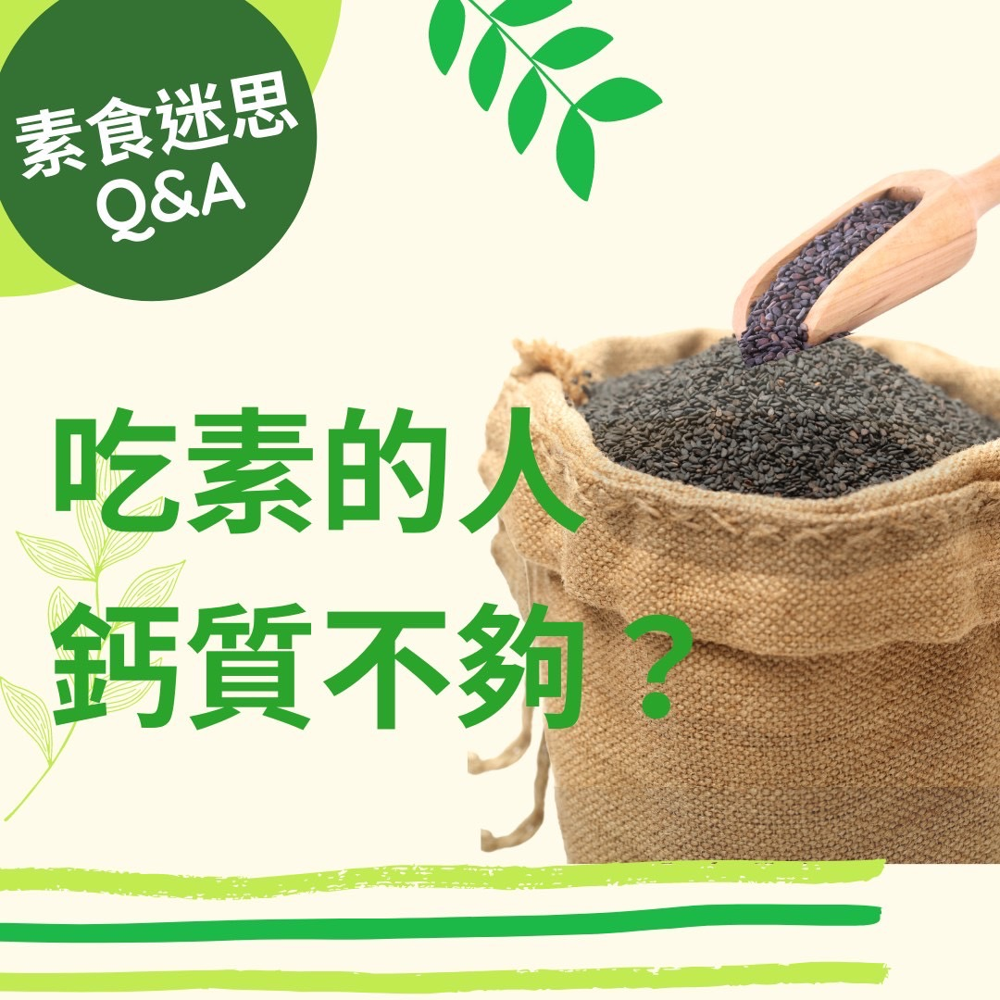

# 素食迷思Q＆A 吃素的人鈣質不夠_

## 📋 基本資訊 / Recipe Overview
- **料理名稱**：素食迷思Q＆A 吃素的人鈣質不夠_
- **原始標題**：【素食迷思Q＆A】吃素的人鈣質不夠?
- **素食流派 / Diet**：全素 Vegan
- **來源平台 / Source**：[觀音山 · 素食料理簡單做](https://vegan.gys.org.tw/calcium20211108/)

## 📖 食譜圖文詳情 (中英雙語對照)

【素食迷思Q＆A】吃素的人鈣質不夠❓​
​
答：植物性飲食含有豐富的鈣質，而且植物性來源的鈣質大多有比牛奶更好的吸收率，許多研究報告發現，消費乳製品及動物性食品較多的國家，如：美國、芬蘭、瑞典、英國，骨質疏鬆症發生率反而比較高⬆️；而素食者，罹患骨質疏鬆症的卻較低。​
​
有調查顯示，牛奶及動物性蛋白攝取越多的人們，愈飽受骨質疏鬆症及股骨頸骨折的威脅，並且因為攝入動物性蛋白而大量排出的鈣和草酸結合，是造成腎結石的重要原因⚠️，而植物性蛋白沒有此種情況。​
​
鈣質可從純植物性不同種類的食物中得到，如：深綠色蔬菜?、無花果、豆類、豆腐、杏仁、芝麻、紫菜等，再加上適量的運動與日曬☀️，可與幫人體合成維他命D，可促進鈣吸收，這是攝取鈣質與強韌骨骼的最佳之道。​
​
素食者只要均衡飲食，鈣質不但不會不夠，亦能環保愛護地球！​
​
✨慈悲的 龍德上師成立「觀音山蔬食館」提倡健康素食、慈悲護生，以”觀音山素食料理簡單做”的理念，提供多款素食食譜，讓您一學就會！?​
​
​
★10月7日~12月4日 ​ 佛陀天降月：善惡業增長10億倍​
​
✨殊勝功德增長日✨​
觀音山邀請您於10月7日~12月4日，響應素食、廣修供養、戒殺護生、誦經修法、行持諸種善行，獲福無量。​
​
​
? 觀音山 素食料理簡單做 ?​
◎Facebook ｜好文按讚​
http://www.facebook.com/GYSVegan​
​
◎lnstagram ｜料理追蹤​
http://www.instagram.com/gysvegan/​
​
◎Youtube ｜加入訂閱​
https://reurl.cc/q8VEqy​
​
◎Telegram ｜頻道推薦​
https://t.me/GYSVegan​
​
​
—​
? 歡迎轉載，請註明出處： 觀音山 素食料理簡單做 GYSVegan 素食環保愛地球，健康營養無負擔，慈悲護生一起來~?​

---
*食譜歸檔時間：2026-08-20 · 來源：觀音山素食料理簡單做 (vegan.gys.org.tw)*