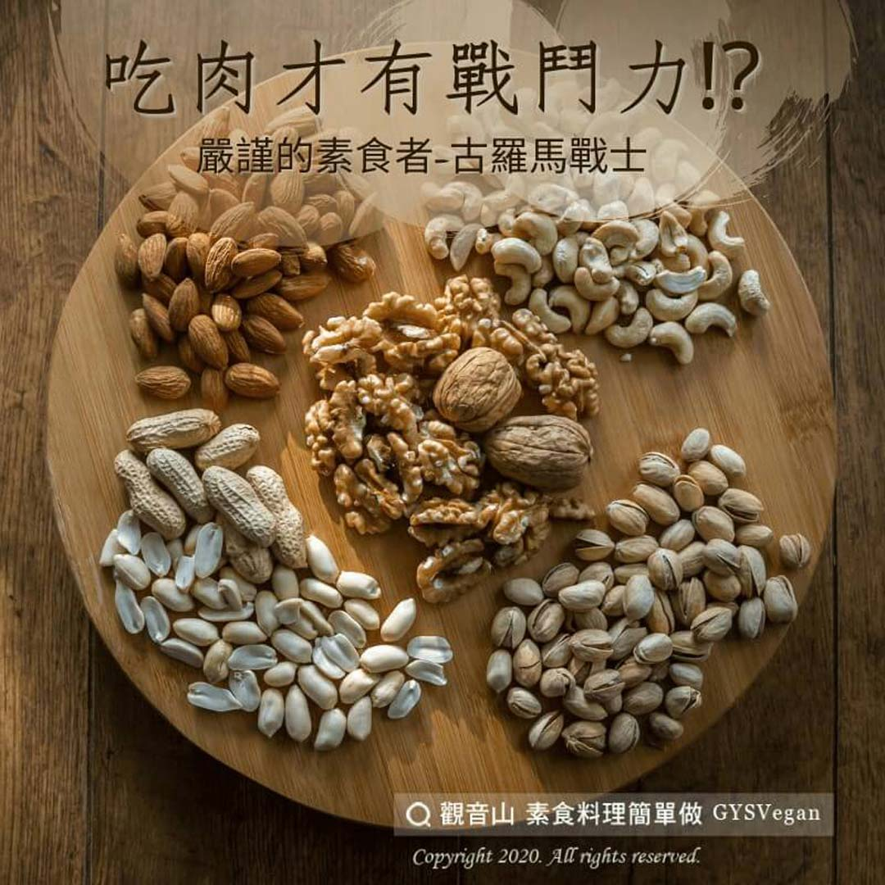

# 素食迷思Q＆A 吃肉才有戰鬥力!

## 📋 基本資訊 / Recipe Overview
- **料理名稱**：素食迷思Q＆A 吃肉才有戰鬥力!
- **原始標題**：【素食迷思Q＆A】吃肉才有戰鬥力!
- **素食流派 / Diet**：全素 Vegan
- **來源平台 / Source**：[觀音山 · 素食料理簡單做](https://vegan.gys.org.tw/%e5%90%83%e8%82%89%e6%89%8d%e6%9c%89%e6%88%b0%e9%ac%a5%e5%8a%9b/)

## 📖 食譜圖文詳情 (中英雙語對照)

嚴謹的素食者-古羅馬戰士​
​
近期考古學家，在土耳其的古羅馬戰士墓地，挖掘出68具古羅馬戰士的遺骸，考古學家分析超過五千根骨頭，結果發現古羅馬戰士的骨骼密度遠遠超過?現代人。​
​
骨頭的截面有非常高的骨密度，顯示他們經過密集的訓練和高質量的飲食習慣，來建立強壯的肌肉和骨頭，這種嚴謹的飲食習慣，讓古羅馬戰士多了一個外號，叫做大麥食客「 Hordearii 」，也就是專吃大麥和豆類的人??。​
​
臨床證實，鍶可以增加骨骼密度，不同的食物來源能為骨頭提供不同分量的鍶，素食者能擁有大量的鍶，吃肉的人只能獲得少量的鍶，而這些出色的格鬥家，接受古羅馬帝國最艱苦的訓練，他們都是素食者??。​
​
人類沒有任何特別的基因結構或生理適應進食肉品。反之，人類有許多適應特性去食用蔬食；吃肉不代表力量，吃素反能獲得更多能量，甚至讓你更強壯！?​
​
✔內文截取於：茹素的力量​
​
✨慈悲的 龍德上師成立「觀音山蔬食館」提倡健康素食、慈悲護生，以”觀音山素食料理簡單做”的理念，提供多款素食食譜，讓您一學就會！?​
​
​
?觀音山 素食料理簡單做 Follow us?
Facebook ｜好文按讚
http://www.facebook.com/GYSVegan​
Instagram ｜料理追蹤
http://www.instagram.com/gysvegan/​
Youtube ｜加入訂閱
https://reurl.cc/q8VEqy​
Telegram ｜頻道推薦
https://t.me/GYSVegan​
​
​
—​
?歡迎轉載，請註明出處： 觀音山 素食料理簡單做 GYSVegan 素食環保愛地球，健康營養無負擔，慈悲護生一起來~?

---
*食譜歸檔時間：2026-08-20 · 來源：觀音山素食料理簡單做 (vegan.gys.org.tw)*