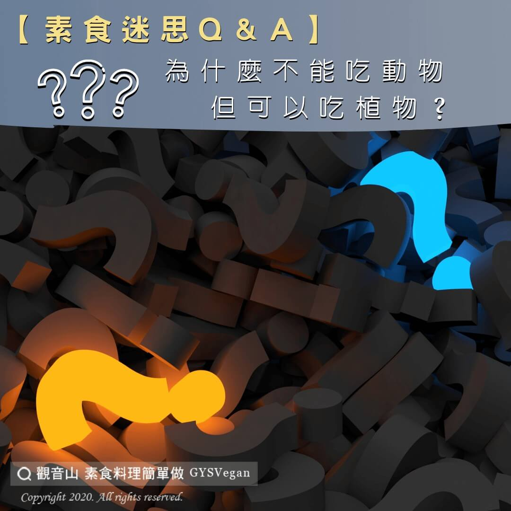

# 素食迷思Q＆A 為什麼不能吃動物，但可以吃植物呢？

## 📋 基本資訊 / Recipe Overview
- **料理名稱**：素食迷思Q＆A 為什麼不能吃動物，但可以吃植物呢？
- **原始標題**：【素食迷思Q＆A】為什麼不能吃動物，但可以吃植物呢？
- **素食流派 / Diet**：全素 Vegan
- **來源平台 / Source**：[觀音山 · 素食料理簡單做](https://vegan.gys.org.tw/857-2/)

## 📖 食譜圖文詳情 (中英雙語對照)

【素食迷思Q＆A】為什麼不能吃動物，但可以吃植物呢？?​
​
動物性食品必須經過不人道的方法，來殺害生命取得我們需要的部分，因此動物被宰殺的過程中，會生出許多的恐懼感以及疼痛感。?​
​
動物是具有高意識的生命，當被宰殺的時候腎上腺素會大量分泌。在痛苦恐懼的狀態下被我們吃進體內，當然會大大影響我們的健康。?​
​
如果有殺生的因，就會有殺生的果報！我們心中身體健康的願望當然就無法長久。​
​
反觀來看，植物性食品?卻可以透過播撒植物種子、無性繁殖來延續它們的生命來賦予人們食物。​
​
植物賦予人食物，人幫助植物繁殖後代，這種密不可分的關係,讓我們更懂得以感恩的心去珍惜身邊的一切? ，也不用殺害有感情的生物來滿足我們的口腹之欲。​
​
吃素不但能夠長養我們的慈悲心、愛護生命??????，更可以落實環保愛地球?、減少二氧化碳排放量。​
​
讓眾生遠離恐懼、怖畏,這個世界就會因我們的一念善念，而有更多更正向的改變。​
​
✨慈悲的 龍德上師成立「觀音山蔬食館」提倡健康素食、慈悲護生，以”觀音山素食料理簡單做”的理念，提供多款素食食譜，讓您一學就會！?​
​
​
?觀音山 素食料理簡單做 Follow us?​
Facebook ｜好文按讚
http://www.facebook.com/GYSVegan​
Instagram ｜料理追蹤
http://www.instagram.com/gysvegan/​
Youtube ｜加入訂閱
https://reurl.cc/q8VEqy​
Telegram ｜頻道推薦
https://t.me/GYSVegan​
​
​
—​
?歡迎轉載，請註明出處： 觀音山 素食料理簡單做 GYSVegan 素食環保愛地球，健康營養無負擔，慈悲護生一起來~?

---
*食譜歸檔時間：2026-08-20 · 來源：觀音山素食料理簡單做 (vegan.gys.org.tw)*