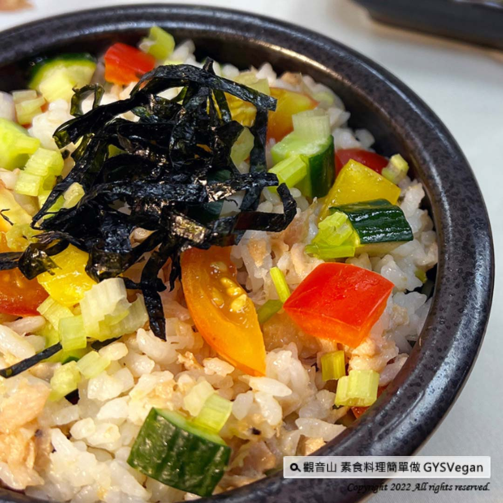

# 素鮪魚散壽司

## 📋 基本資訊 / Recipe Overview
- **料理名稱**：素鮪魚散壽司
- **原始標題**：日式料理 ｜素鮪魚散壽司｜全素
- **素食流派 / Diet**：全素 Vegan
- **料理分類 / Category**：主食種類
- **來源平台 / Source**：[觀音山 · 素食料理簡單做](https://vegan.gys.org.tw/vegetarian-tuna-loose-sushi20221209/)

## 📖 食譜圖文詳情 (中英雙語對照)

「日本傳統家庭料理」-素鮪魚散壽司，壽司飯上鋪滿素鮪魚、紅黃椒、小黃瓜、番茄丁、中芹、海苔絲等顏色豐富的食材，配上美乃滋、壽司醋的提味與點綴，讓全家人胃口大開，每一口都可以嚐到新鮮與美味，想變化家中菜色嗎？快跟著觀音山主廚，一起素食料理簡單做吧！
​
​
❒食材及佐料〔Ingredients〕：(3人份)
▪️素鮪魚 ​ 80克 ​ ​ ​ ​ ​ ​ ​
▪️紅黃甜椒、小黃瓜、番茄 ​ 各 50克
▪️中芹 ​ 30克
▪️熱白飯 ​ 500克
▪️純素美乃滋、海苔絲、壽司醋 ​ 適量
​
❒烹飪步驟：
【刀工/前處理】
1.紅黃甜椒、小黃瓜切0.5公分丁。
2.番茄去籽切丁。
3.中芹切末。
​
【調理作法】
1.將熱白飯加入適量的壽司醋，輕輕攪拌均勻，放涼備用。
2.將製作好的壽司飯放入容器中，擠上美乃滋，平均鋪上配料:素鮪魚、紅黃甜椒、小黃瓜、番茄丁、中芹、海苔絲，即可享用!
​
本食譜提供：澎湖觀音山蔬食館
​
​
✼慈悲的龍德上師 成立「觀音山蔬食館」提倡健康素食、慈悲護生，以”觀音山素食料理簡單做”的理念，提供多款素食食譜，讓您一學就會！
​
觀音山相關連結
➠
https://www.fazang.org/link/
​
​
▌觀音山近期活動 ▌
12月10日 阿彌陀佛聖誕 薈供法會
①登記「除障祿位」、「超薦蓮位」
►
http://bit.ly/3GQXXu2
②護持「薈供供品」供養三寶·愛心公益
►
http/bi:/t.ly/3AJ4qU5
​
觀音山 2022秋季保育放流
➠
tps://bit.ly/3AhtcPMVC
​
​
—
♛ 歡迎轉載，請註明出處： 觀音山素食料理簡單做 GYSVegan 素食環保愛地球，健康營養無負擔，慈悲護生一起來~[/vc_column_text]
[/vc_column][/vc_row]

---
*食譜歸檔時間：2026-08-20 · 來源：觀音山素食料理簡單做 (vegan.gys.org.tw)*