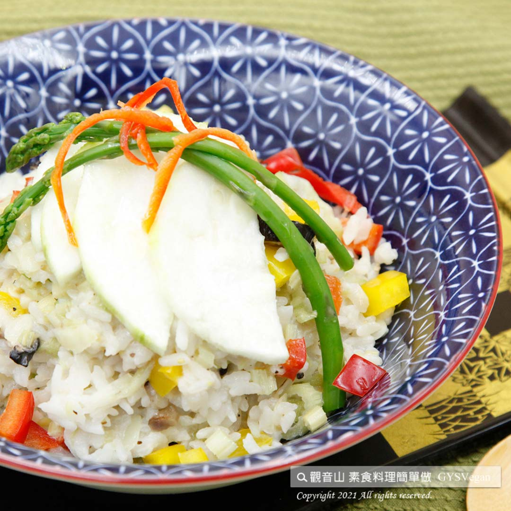

# 絲瓜燉飯

## 📋 基本資訊 / Recipe Overview
- **料理名稱**：絲瓜燉飯
- **原始標題**：絲瓜燉飯｜全素
- **素食流派 / Diet**：全素 Vegan
- **料理分類 / Category**：主食種類 / 米麵主食 (Staple Food)
- **來源平台 / Source**：[觀音山 · 素食料理簡單做](https://vegan.gys.org.tw/loofah20210716/)

## 📖 食譜圖文詳情 (中英雙語對照)

夏天瓜果富含炎夏所需的水分及養分，絲瓜就是最好的食材，絲瓜的甘甜、豆漿的香氣，融入軟Q米飯之中，吃起來濃郁香噴，征服所有人的味蕾，聽起來很費工夫的燉飯，讓你快速上手，快跟著觀音山主廚，一起素食料理簡單做吧！​
​
?食材及佐料〔Ingredients〕：（5人份）​
▪絲瓜、白飯 ​ 各500克​
▪乾香菇 ​ 30克​
▪中芹末 ​ 100克​
▪紅甜椒、黃甜椒、薑末 ​ 各50克​
▪鹽、砂糖、黑胡椒粒 ​ 適量​
▪無糖豆漿 ​ 500 C.C​
▪香油 ​ 少許​
​
?烹飪步驟：​
【刀工/前處理】​
1.絲瓜剖半切薄片。​
2.乾香菇泡軟，切細絲。​
3.甜椒切0.8公分丁。​
​
【調理作法】​
1.油爆香乾香菇、薑末加入絲瓜拌炒至軟化加入紅、黃甜椒略炒。​
2.加入水、鹽、砂糖、黑胡椒粒調味，煮滾後加入白飯、豆漿拌勻，小火燉煮收汁即可。​
3.撒上中芹末、淋少許香油提味。​
​
【特別說明】​
奶素者豆漿可改牛奶，香油可改奶油取代。​
​
​
??本食譜提供：台中  觀音山蔬食館 主廚 淨雅​
​⭐️慈悲的 龍德上師成立「觀音山蔬食館」提倡健康素食、慈悲護生，以”觀音山素食料理簡單做”的理念，提供多款素食食譜，讓您一學就會！?
​
★7月17日 「明淨月．藥師佛節日」：善惡業增長1000萬x1000倍​
​
✨殊勝功德增長日✨​
觀音山邀請您於7月17日 響應素食、廣修供養、戒殺護生、誦經修法、行持諸種善行，獲福無量。​
​
​
【recipe】​
​
? Summer melons retain juiciness and nutrients needed for hot summer. Loofah is one of the best summer ingredients. In this recipe, the mild sweetness of loofah and the aroma of soy milk are melded into rice. It tastes rich, fragrant, and al dented conquering everyone’s taste buds. Risotto ​ always assummed to be the harder-to-master Italian dishes, however, this recipe is beginner friendly and a good kick-start. Let’s follow the chef of Guanyinshan and cook simple vegetarian dishes together! ​ ​ ​
​
?Instructions: ​
【Cutting/PRE Ahead】 ​
1. Half the loofah and slice. ​
2. Soak the dried shiitake mushrooms until soft and cut into thin strips. ​
3. Cut the bell pepper into 0.8 cm cubes. ​ 【Cooking Steps】​
1. Saute the shiitake mushrooms. Add ginger powder into the loofah, stir fry until softened, and then add red and yellow bell peppers and fry slightly. ​
2. Add water, and seasoning with salt, sugar, and black pepper. After boiling, add rice and soy milk, mix well, simmer over low heat until the rice is fully coated in the sauce.​
3. Sprinkle with minced celery and drizzle a little sesame oil to enhance the flavor.​
​
[Special notes] ​
For vegetarian, the soy milk can be replaced by milk, and the sesame oil can be adapted to butter. ​ ​ ​
​
??This recipe is provided by Chef Jing Ya, Taichung # Guanyinshan Green Restaurant.
?  觀音山 素食料理簡單做 Follow us ?
Facebook ｜好文按讚
http://www.facebook.com/GYSVegan​
Instagram ｜料理追蹤
http://www.instagram.com/gysvegan/​
Youtube ​ ​ ​ ｜加入訂閱
https://reurl.cc/q8VEqy​
Telegram ​ ｜頻道推薦
https://t.me/GYSVegan​
​
​
? 歡迎轉載，請註明出處： ​ ​ 觀音山 素食料理簡單做 GYSVegan 素食環保愛地球，健康營養無負擔，慈悲護生一起來~?

---
*食譜歸檔時間：2026-08-20 · 來源：觀音山素食料理簡單做 (vegan.gys.org.tw)*